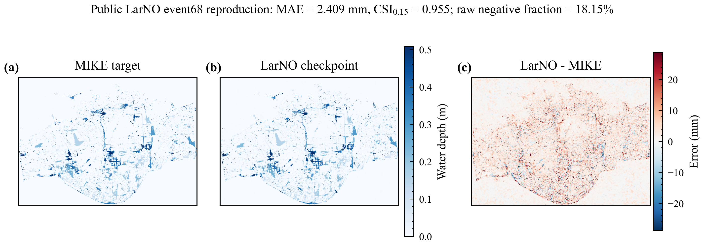

# DrainLite: leakage-controlled learning of conceptual sewer effects for urban flood prediction

## Highlights

- Matched surface controls separate sewer coupling from an inlet-neighbourhood roughness change.
- A gravity-consistent conceptual network connects 2,276 junctions to 221 receiving interfaces.
- Eight native Itzï-SWMM simulations meet pre-defined topology, continuity and mass-balance checks.
- A lightweight hybrid reduces held-event error from 3.226 to 2.130 mm.
- Static network descriptors improve every held event, although their incremental contribution is small.

## Abstract

Urban flood emulators can reproduce water-depth fields generated by a coupled hydrodynamic model without exposing the drainage system as a controllable input. This limits their use for testing sewer layouts or transferring a forecast to a city with different drainage infrastructure. We examine whether the effect of a specified drainage network can instead be learned as a lightweight residual correction to a surface-only prediction. A road-aligned conceptual sewer network was constructed over the 20 m Shenzhen urban-flood benchmark. The network was conditioned to give every junction a directed route to a receiving boundary, and was coupled to the two-dimensional Itzï solver through its native Storm Water Management Model interface. Eight six-hour rainfall events were simulated under three matched configurations: an original surface control (A), a surface control with the same inlet-neighbourhood roughness used during coupling (B), and the native bidirectional Itzï-SWMM calculation (C). The learning target was the signed drainage residual C-B.

DrainLite combines a training-event spatiotemporal residual prior with current rainfall, surface depth, terrain and rasterised network descriptors. Each event was held out in turn. The prior for a held event was calculated from the other seven events, and the prior attached to every fitting sample excluded that sample's event. Across 60,783,552 held-out active cell-times, the matched surface field differed from the coupled label by 9.266 mm mean absolute error. A prior-only estimate achieved 3.226 mm, adding dynamic predictors reduced this to 2.184 mm, and the complete hybrid reached 2.130 mm. The network descriptors improved all eight held events, but only by 0.054 mm on average (event-bootstrap 95% interval 0.026-0.083 mm). This modest increment, together with high inter-event residual-map correlations, indicates that a fixed spatial response dominates the present single-network dataset.

The coupled calculations had a mean SWMM routing continuity error of -0.091% and 0.011% non-converging routing steps. Coupling reduced end-of-event surface storage and produced a mean signed depth change of -7.860 mm. Comparison with public MIKE fields was metric dependent: coupling substantially reduced final-volume error but increased full-sequence pixel-time error. MIKE was therefore treated as an external plausibility reference rather than a training target. The public LarNO checkpoint was reproduced independently for event68 (unclamped mean absolute error 2.409 mm), but DrainLite was not directly added to that checkpoint because its MIKE supervision may already contain drainage effects. Within these limits, the study establishes a reproducible low-compute method for learning the event-varying effect of one explicit conceptual network while retaining a clear physical and statistical audit trail.

**Keywords:** urban pluvial flooding; drainage network; Itzï; Storm Water Management Model; residual learning; neural operator; leakage control

## 1. Introduction

Short-duration urban floods emerge from the interaction of rainfall, microtopography, buildings, surface conveyance and underground drainage. Surface water is commonly represented by a two-dimensional shallow-water model, whereas storm sewers are represented by a one-dimensional network model. Their exchange through inlets and junctions changes not only total water storage but also the timing and location of inundation. A surface-only model can therefore give a physically coherent answer and still omit an intervention that matters operationally.

High-resolution coupled calculations remain expensive. The public LarNO study addressed a related computational problem by learning a continuous-space mapping from rainfall and static urban attributes to MIKE water depths, enabling rapid prediction and zero-shot evaluation at finer grids (Cao et al., 2026). Its released 20 m benchmark provides rainfall, terrain and water-depth arrays, but not the municipal drainage inventory used in the MIKE setup. Consequently, the trained model can imitate a reference field in which drainage may be implicit, but the user cannot alter pipe position, diameter or connectivity as an explicit condition.

Two responses are possible. The first is to expand and retrain the complete neural operator with drainage channels. This is attractive when hundreds of coupled simulations and suitable graphics-processing hardware are available. The second is to preserve an upstream flood prediction and estimate only the depth change attributable to a specified drainage system. The latter decomposition is less ambitious, but it is data-efficient and directly testable. It also permits a matched experiment in which the effect of the pipe exchange is distinguished from incidental changes made near inlets.

Residual correction has its own failure modes. A fixed network over a fixed terrain can generate a repeatable spatial template. A learner may exploit that template without understanding how drainage varies with rainfall. Pixel-wise train-test splitting would make this problem worse because neighbouring cells and times from the same event would occur in both sets. Explicit coordinates, distance to synthetic outlets, and target-derived sewer states can also become surrogates for location or label leakage. A defensible experiment must therefore include whole-event holdout, a strong spatiotemporal climatology, and controls that displace or shuffle the network fields.

This study develops DrainLite as a lightweight residual layer for drainage-free upstream predictions. It addresses three questions. First, can a connected conceptual network produce numerically stable and visible drainage responses under native Itzï-SWMM coupling? Second, do current rainfall and surface states explain event-to-event departures from the fixed response? Third, do static network descriptors add information after both the spatiotemporal prior and dynamic state are known? MIKE arrays are used only to examine external plausibility, and the public LarNO checkpoint is reproduced separately to establish compatibility with the source benchmark. Figure 1 summarises the resulting evidence chain.

**Figure 1. Physical and learning workflow. A and B are surface-only controls; C adds native bidirectional sewer exchange. The target C-B therefore excludes the roughness effect B-A. The lower pathway shows the three predictor families used by the final hybrid. MIKE and the public LarNO reproduction remain outside the residual-training path.**

## 2. Data and methods

### 2.1 Study domain and public inputs

The study uses the complete 400 x 560 grid of the public `region1_20m` benchmark. At 20 m spacing, the rectangular calculation domain spans 8.0 x 11.2 km. The active mask contains 105,527 cells, equivalent to 42.21 km2; high building or wall cells remain in the hydraulic grid but are excluded from reported active-cell metrics. Each event contains 72 five-minute intervals covering six hours. Water depth is stored in metres and rainfall in millimetres per interval.

Eight events were selected because complete MIKE, rainfall and locally generated coupled arrays were available: events 1, 20, 65, 66, 67, 68, 69 and 70. These are eight forcing realisations over one terrain and one conceptual sewer layout, not eight independent cities or networks. Event holdout therefore evaluates transfer between rainfall events on a fixed grid.

### 2.2 Conceptual drainage network

No surveyed sewer inventory was available. Road-aligned candidate lines were converted into a directed graph and conditioned for hydraulic use. Parallel endpoint duplicates, isolated fragments and junctions outside the largest connected component were removed. Each retained junction was assigned exactly one downstream conduit following a terrain-informed potential. Distributed receiving interfaces were inserted where required to cap excessive cover and maintain positive conduit slope. The accepted network contains 2,276 junctions, 2,276 conduits and 221 NORMAL receiving interfaces. All junctions have a directed route to an outfall; no directed cycle, isolated junction, duplicate endpoint pair, reverse-slope conduit or pipe crown above the junction rim remains.

Conduit diameters range from 0.8 to 1.2 m. Slopes range from 0.000499 to 0.100 m m-1, and cover ranges from 1.50 to 7.49 m. These values describe a controlled conceptual system. They should not be interpreted as recovered attributes of Shenzhen's municipal sewer network.

**Figure 2. Conceptual-network audit. Panel (a) overlays the retained network on terrain using the verified array orientation. Panel (b) shows pipe diameters and junction degree. Panel (c) confirms the positive-slope constraint on a logarithmic axis. Panel (d) relates conduit length, cover and diameter. The figure establishes internal geometric consistency, not agreement with surveyed assets.**

### 2.3 Matched physical simulations

Surface flow was solved with Itzï 25.4, which uses a damped partial-inertia form of the shallow-water equations (Courty et al., 2017). The calculation used a 0.001 m minimum depth, Courant number 0.7, partial-inertia coefficient 0.9 and maximum surface-flow step of 1 s. The outer edge of the rectangular domain was closed. Active cells used Manning's n = 0.015, while building cells were represented as high terrain barriers. Rain falling on building cells was redistributed globally to active cells to preserve rainfall volume. A uniform effective loss of 1 mm h-1 represented unresolved initial and continuing losses; it is a modelling assumption rather than a field-calibrated infiltration parameter.

SWMM 5.2.4 was run through PySWMM 2.1.0 using Dynamic Wave routing. The accepted configuration used a 0.5 s maximum routing step, variable-step factor 0.2, 0.05 s minimum observed step, 50 maximum trials, slot surcharge representation, 0.0015 m head tolerance and no SWMM surface ponding. Surface storage and surcharge exchange were represented by Itzï, avoiding a second unobserved ponding store at the one-dimensional nodes. Coupling relaxation was 0.8 and temporal damping was 0.5.

Three simulations were made for each event. Scenario A was surface-only with n = 0.015. Scenario B remained surface-only but changed n to 0.012 in the same 3 x 3 inlet neighbourhoods used by the coupled workflow. Scenario C used the B roughness field and activated Itzï's native `DrainageSimulation`, which exchanges water bidirectionally with SWMM junctions. Thus B-A measures the roughness perturbation and C-B measures the sewer-coupling response. The signed residual is

<i>r</i>(t,x) = <i>h</i>C(t,x) - <i>h</i>B(t,x). &nbsp;&nbsp; (1)

Negative r denotes a shallower coupled surface at that cell and time. Positive r is retained because routing and local return flow can increase depth even when the domain-integrated sewer effect is drainage.

### 2.4 Numerical acceptance and water balance

The physical label was accepted only when topology checks passed, all output arrays were finite and had shape 72 x 400 x 560, the SWMM report contained no warnings or errors, flooding loss was zero, and routing continuity and combined surface-network mass balance were within the study thresholds. Continuity error is a signed accounting residual and should be read by magnitude; a small negative value does not indicate negative water.

| Event | Rain volume (10^6 m3) | \|B-A\| MAE (mm) | \|C-B\| MAE (mm) | Mean C-B (mm) | SWMM continuity (%) | Non-converging (%) | Combined mass error (% rain) | Status |
| --- | --- | --- | --- | --- | --- | --- | --- | --- |
| event1 | 2.079 | 0.168 | 7.200 | -5.952 | -0.083 | 0.02 | -0.100 | Accepted |
| event20 | 1.673 | 0.101 | 3.322 | -2.673 | -0.178 | 0.00 | -0.032 | Accepted |
| event65 | 2.166 | 0.170 | 7.696 | -6.403 | -0.111 | 0.00 | -0.017 | Accepted |
| event66 | 2.305 | 0.181 | 8.431 | -7.086 | -0.101 | 0.00 | -0.015 | Accepted |
| event67 | 2.670 | 0.255 | 12.631 | -10.928 | -0.066 | 0.01 | -0.111 | Accepted |
| event68 | 2.552 | 0.236 | 11.914 | -10.101 | -0.060 | 0.04 | -0.097 | Accepted |
| event69 | 2.422 | 0.224 | 10.912 | -9.420 | -0.068 | 0.01 | -0.101 | Accepted |
| event70 | 2.578 | 0.240 | 12.023 | -10.319 | -0.063 | 0.01 | -0.098 | Accepted |

**Figure 3. Numerical and physical quality across eight events. Panel (a) reports signed routing continuity error and the fraction of routing steps that did not converge. Panel (b) compares the confounding roughness response B-A with the intended sewer response C-B. Panel (c) shows the reduction in final surface storage under coupling. Panel (d) compares final-volume errors against MIKE, which is an external descriptive reference.**

### 2.5 Drainage descriptors and learning target

The accepted SWMM input was rasterised on exactly the same 20 m grid. Primitive descriptors comprise inlet and pipe masks, inlet and segment counts, junction degree, diameter, design slope, Manning full-flow capacity and approximate cover. Local 3 x 3 and 7 x 7 pipe densities, 7 x 7 inlet density and 7 x 7 capacity density provide neighbourhood context. Synthetic outfall masks and distance-to-outfall fields were excluded from the principal models because they could encode fixed position more strongly than transferable hydraulic information. Explicit row and column coordinates were also excluded.

The non-network dynamic predictors are current surface depth, current interval rainfall, cumulative rainfall, elevation, terrain slope, normalised time, sine and cosine time encodings, and 3 x 3 and 7 x 7 mean surface depth. The target is r in millimetres. The corrected depth is

<i>h</i>DL(t,x) = max[<i>h</i>B(t,x) + <i>r</i>theta(t,x), 0]. &nbsp;&nbsp; (2)

Unlike the earlier non-negative sink formulation, Eq. (2) permits both drainage reduction and local positive residuals. This is required to emulate a bidirectional coupled label.

### 2.6 Leakage-controlled event validation

All evaluations use leave-one-event-out cross-validation. One complete event is excluded as the outer test event. A different complete event within the remaining seven is used to select 80, 140 or 220 boosting iterations. The six remaining events form the inner fitting set. No pixel or time from the held event enters fitting, hyperparameter selection or construction of its prior.

The strongest non-parametric baseline is a spatiotemporal residual prior: for each time and cell, r is averaged across the seven outer-training events. To prevent target encoding within model fitting, a training row never receives a prior containing its own event. During final refitting, each of the seven training events uses the mean of the other six; the held event uses the mean of all seven. During inner selection, each fitting event uses the mean of the other five inner-training events, and the validation event uses the six-event mean.

DrainLite uses `HistGradientBoostingRegressor` with squared-error loss, learning rate 0.05, 31 leaves and L2 regularisation 0.01. Uniform sampling selects 450 active cells per time and event, giving 226,800 fitting rows in each final outer fold. Three variants are central: prior only; prior plus ten dynamic and terrain predictors; and prior plus dynamic predictors and thirteen static network descriptors. An earlier ablation without the prior compares dynamic-only, mask, hydraulic and complete static groups. All models predict the full active domain for all 72 times.

### 2.7 Metrics and spatial controls

Mean absolute error (MAE) and root-mean-square error (RMSE) measure depth error. Critical success index (CSI) is reported at 0.03 and 0.15 m. Peak-map MAE compares the maximum depth attained at each cell, whereas global-peak error compares only the single deepest cell and is therefore more sensitive to an isolated depression. Final-volume error sums active-cell depth times 400 m2. Macro-averages give each event equal weight.

To test whether drainage descriptors act through their correct spatial alignment, the static network fields were shifted by 20, 40, 80 and 160 m in four directions. Fifty block-shuffle replicates permuted 20 x 20-cell drainage blocks and regenerated all density descriptors. The target, surface state, rainfall and terrain were unchanged. Permutation importance was calculated on held-event samples and is interpreted as predictive dependence, not causality.

## 3. Results

### 3.1 The connected network produced a distinct drainage response

All eight coupled runs passed the acceptance checks. Mean routing continuity error was -0.091% and mean non-converging-step frequency was 0.011%; no SWMM flooding loss, warning or error was reported. The mean magnitude of C-B was 9.266 mm, whereas B-A was only 0.197 mm. The approximately 47.1-fold separation shows that the reported sewer response is not an artefact of the inlet-neighbourhood roughness change.

Coupling reduced the six-hour surface-water volume in every event. The mean signed C-B depth was -7.860 mm. Event68 illustrates the temporal mechanism: B continued to store water after the main rainfall pulse, while C reached a broad maximum and then declined as water entered the connected network and left through distributed receiving interfaces. Domain maximum depth may continue to rise at an isolated low cell even while integrated volume falls; those two curves answer different questions.

**Figure 4. Six-hour active-cell surface-water volume for all events. Grey denotes matched surface control B, orange denotes coupled label C and black denotes MIKE. Pale blue hyetographs use a reversed right axis so rainfall bars descend from the top. Each rainfall axis is scaled to its event; line magnitudes can be compared using the common left-axis units.**

Peak maps confirm that drainage effects are spatially structured. In event68, coupling reduces depth along connected low-lying routes and around several dense inlet groups. The roughness-only map is much weaker and has a different pattern. Display scales are percentile-clipped for legibility; saturated cells remain in every statistic.

**Figure 5. Event68 peak-depth fields and matched differences. Panels (a-d) show MIKE, A, B and C. Panel (e) is the drainage effect C-B; panel (f) is the roughness effect B-A. The different diverging ranges are intentional because the roughness perturbation is much smaller.**

### 3.2 A fixed response is strong, but dynamic predictors add information

The matched surface field differed from C by 9.266 mm MAE. A model using dynamic and terrain predictors without drainage fields reduced this to 5.387 mm, and the complete static model without a prior reached 4.631 mm. However, the seven-event spatiotemporal prior was stronger at 3.226 mm. The high-performing prior exposes the repeatability of drainage response on one fixed network; it is not evidence of a universally transferable sewer model.

Adding current surface and rainfall information to the prior reduced MAE to 2.184 mm. The complete hybrid reached 2.130 mm and RMSE 9.245 mm. Relative to B, the MAE reduction was 77.0%. Relative to the prior, the mean paired improvement was 1.096 mm (event-bootstrap 95% interval 0.642-1.566 mm). This result establishes that the model does more than replay a fixed mean map.

| Model | MAE (mm) | RMSE (mm) | CSI 0.03 m | CSI 0.15 m | Peak-map MAE (mm) | Final-volume error (10^3 m3) |
| --- | --- | --- | --- | --- | --- | --- |
| Matched surface B | 9.266 | 41.421 | 0.889 | 0.633 | 16.835 | 699.5 |
| Dynamic base | 5.387 | 18.669 | 0.898 | 0.735 | 8.258 | 24.2 |
| Dynamic + all static network | 4.631 | 15.296 | 0.907 | 0.791 | 7.090 | 30.8 |
| Spatiotemporal prior | 3.226 | 13.621 | 0.898 | 0.867 | 5.403 | 129.7 |
| Prior + dynamic | 2.184 | 9.537 | 0.926 | 0.906 | 3.493 | 29.6 |
| Prior + dynamic + network (DrainLite hybrid) | 2.130 | 9.245 | 0.931 | 0.907 | 3.451 | 27.1 |

**Figure 7. Held-event performance. Panel (a) shows MAE and joins the three prior-based results for each event. Panel (b) reports RMSE, which weights large errors more heavily. Panel (c) reports CSI at 0.15 m, where larger values are better. Bars are eight-event macro-averages.**

### 3.3 Static network information gives a small, consistent increment

Adding all static network descriptors to the prior-plus-dynamic model improved every held event. The paired gain ranged from 0.00009 mm for event68 to 0.103 mm for event20 and averaged 0.054 mm (event-bootstrap 95% interval 0.026-0.083 mm). This is statistically consistent across the eight available forcing realisations but small in practical magnitude. Most predictive skill comes from the training-event prior and the current surface state, not from the static pipe attributes alone.

| Held event | ST prior MAE | Prior + dynamic MAE | Hybrid MAE | Gain vs prior | Network increment |
| --- | --- | --- | --- | --- | --- |
| event1 | 2.498 | 2.295 | 2.197 | 0.301 | 0.098 |
| event20 | 3.365 | 2.150 | 2.047 | 1.318 | 0.103 |
| event65 | 2.702 | 2.251 | 2.171 | 0.531 | 0.080 |
| event66 | 2.537 | 2.328 | 2.233 | 0.305 | 0.096 |
| event67 | 4.617 | 2.520 | 2.495 | 2.122 | 0.025 |
| event68 | 3.637 | 2.006 | 2.006 | 1.631 | 0.000 |
| event69 | 2.669 | 1.950 | 1.922 | 0.747 | 0.028 |
| event70 | 3.779 | 1.972 | 1.968 | 1.810 | 0.003 |

The maps in Figure 6 show why a small domain-average error can coexist with visible local differences. Drainage residuals occupy a limited fraction of the active grid and are predominantly negative. DrainLite recovers the connected negative structures and their event-varying amplitude, while remaining errors are concentrated around sharp transitions and local positive patches.

**Figure 6. True, predicted and error residuals for four held events at the time of maximum coupled surface volume. Each row has its own symmetric 99.5th-percentile colour scale. Blue means C or DrainLite is shallower than B; red means locally deeper. Comparisons of pattern are valid across columns within a row, while colour magnitude should not be compared between rows.**

Spatial controls support, but do not prove, a network contribution. A 20 m displacement increased held-event MAE by about 0.6 mm on average and the penalty grew with displacement. Block shuffling caused a larger increase. Current surface depth and its neighbourhood means dominated permutation importance; inlet and pipe densities were the highest-ranked drainage fields. Correlated predictors mean that these importances cannot be read as hydraulic sensitivities.

**Figure 8. Network-location controls and predictive dependence. Panel (a) gives the MAE penalty after directional displacement and block shuffling of drainage fields. Panel (b) gives mean permutation importance for the earlier all-static model; error bars show variation across held events. The controls preserve rainfall, target and terrain.**

### 3.4 External comparison with MIKE is metric dependent

MIKE is not a target for DrainLite and its undistributed drainage configuration is not equivalent to the conceptual network. The comparison nevertheless tests whether the calculated magnitudes are implausible. B has the smallest pixel-time MAE to MIKE (18.023 mm). C increases this to 21.258 mm, and the hybrid remains close to C at 21.024 mm because that is its training objective.

The volume metric gives the opposite ordering. Mean absolute final-volume error decreases from 982.1 x 10^3 m3 for B to 310.6 x 10^3 m3 for C. The conceptual network therefore corrects excessive retained volume but does not reproduce MIKE's complete space-time field. It would be incorrect to describe either model as universally closer without naming the metric.

| Field | MAE (mm) | RMSE (mm) | CSI 0.15 m | Peak-map MAE (mm) | Final-volume error (10^3 m3) |
| --- | --- | --- | --- | --- | --- |
| Matched surface B | 18.023 | 50.905 | 0.467 | 27.083 | 982.1 |
| Coupled label C | 21.258 | 62.509 | 0.311 | 34.608 | 310.6 |
| DrainLite hybrid | 21.024 | 61.836 | 0.306 | 33.556 | 297.7 |

**Figure 9. Event-wise comparison with MIKE. Panel (a) shows full-sequence pixel-time MAE, for which B is usually closest. Panel (b) shows final-volume error, for which C and DrainLite are much closer. MIKE is an external descriptive reference and was never used in residual fitting or hyperparameter selection.**

### 3.5 Reproduction of the public LarNO checkpoint

The released LarNO checkpoint was evaluated independently on event68 using the public 20 m arrays. Its raw output had MAE 2.409 mm, RMSE 5.119 mm, R2 0.9945 and CSI at 0.15 m of 0.955. Clamping negative values reduced MAE to 2.325 mm. The raw negative fraction was 18.15%, so both values are reported rather than silently replacing the reproduced output.

**Figure 10. Independent event68 checkpoint reproduction. Panels (a) and (b) share a water-depth scale; panel (c) shows signed error in millimetres. Colour limits are percentile-clipped for viewing only. Metrics use the complete unmodified arrays.**

DrainLite was not numerically stacked onto this checkpoint in the principal experiment. LarNO was trained against MIKE, whose fields may already include drainage. Adding C-B to that output could therefore count drainage twice and would lack a defensible target. The present evidence supports DrainLite for an explicitly drainage-free upstream field such as B. Extension to LarNO requires either a surface-only LarNO checkpoint or paired LarNO targets generated under matched no-network and network configurations.

### 3.6 Computational cost

The complete eight-fold hybrid experiment ran on the local central processing unit with a recorded peak resident memory of 3.41 GB and total wall time of 12.8 min. The earlier all-static serialized models averaged approximately 0.82 MB. A six-hour coupled physical event required roughly one hour, whereas full-domain DrainLite inference required tens of seconds on the same workstation. These timings are observed workflow measurements, not hardware-normalised speed claims.

**Figure 11. Observed computational cost. Panel (a) separates physical simulation, model fitting and dense inference on a logarithmic time axis. Panel (b) reports serialized model size in MB. Panel (c) reports peak process memory for the complete hybrid experiment in GB; unlike the superseded figure, the two units are not placed on one axis.**

## 4. Discussion

### 4.1 What the experiment establishes

The physical experiment establishes that the revised conceptual network is connected, numerically stable under the accepted settings, and capable of producing a drainage signal that is much larger than the roughness perturbation required by the coupling workflow. This resolves the earlier ambiguity in which weak sewer effects could be caused by disconnected pipes, hydraulic loss from SWMM flooding, or an unmatched surface control.

The learning experiment establishes two levels of predictability. A large fraction of C-B is repeatable in space and time across rainfall events. Dynamic predictors then explain a substantial part of the departure from this fixed prior. Static network descriptors add a smaller but consistently positive increment. The result is scientifically more informative than reporting only the final 2.130 mm MAE because it identifies where the apparent skill originates.

### 4.2 Why the static-network increment is small

The static fields do not contain node head, conduit flow, filling ratio or surcharge state. Those variables govern the time-varying capacity of a drainage system, whereas diameter and slope remain constant throughout an event. The spatiotemporal prior also already encodes the average response of the same network at every cell and time. Once that strong predictor is present, a small incremental contribution from static fields is expected. This does not show that pipe properties are unimportant physically; it shows that the present experiment has limited information for identifying their separate statistical effect.

### 4.3 Interpretation of MIKE disagreement

The conceptual and MIKE drainage systems are not matched. Their inlet densities, capacities, outlets, boundary conditions and loss formulations may differ. Pixel-time MAE penalises spatial displacement and timing differences, while final volume measures aggregate storage. The improved volume and degraded pixel-time fit are therefore compatible. They indicate that the conceptual network removes a plausible quantity of water but does not reproduce the undistributed reference system. MIKE should remain a plausibility comparator, not a calibration certificate.

### 4.4 Scope and limitations

Four restrictions define the scope. First, the network is road-derived and conceptual. Second, all eight events share one terrain and network; no claim of transfer to another layout is supported. Third, the closed rectangular surface boundary and global redistribution of building rainfall are assumptions that can affect storage. Fourth, DrainLite receives the full surface-only state, so it is a correction layer rather than an end-to-end rainfall-to-flood model.

The bootstrap intervals describe variation among only eight events and are not population guarantees. The spatial-shift and shuffle controls show dependence on alignment but cannot separate causal pipe effects from correlated terrain and land-form patterns. Finally, the LarNO reproduction is limited to one locally available public checkpoint and event. It demonstrates source-model execution, not a new LarNO benchmark result.

### 4.5 Next experiments

The most useful extension is not a larger tree ensemble. It is a factorial physical dataset that varies rainfall and network configuration independently. At minimum, pipe diameter, inlet density and outlet availability should be perturbed across several plausible networks. This would break the fixed-template shortcut and allow a true held-network test. Rasterised dynamic SWMM states could then be added, provided that they are available at forecast time or predicted by a separate causal module. A surface-only LarNO checkpoint would permit a clean neural-operator-plus-DrainLite experiment without double counting.

## 5. Conclusions

A connected, gravity-consistent conceptual sewer network was coupled through the native Itzï-SWMM interface and evaluated with matched surface controls. Across eight six-hour events, the sewer response C-B averaged 9.266 mm in absolute magnitude and was clearly separated from the 0.197 mm roughness effect. Numerical continuity, convergence and combined mass balance met the pre-defined acceptance conditions for every event.

The leakage-controlled DrainLite hybrid reduced held-event MAE from 9.266 mm for the matched surface field to 2.130 mm. A spatiotemporal training-event prior alone achieved 3.226 mm, and dynamic predictors reduced the error to 2.184 mm. Static network descriptors improved all eight events by a further 0.054 mm on average. The principal conclusion is therefore qualified: lightweight residual learning can reproduce the event-varying effect of this fixed conceptual network, but most skill derives from its repeatable spatiotemporal response and current surface dynamics.

The conceptual network substantially improved agreement with MIKE in final stored volume but not in full space-time depth. The public LarNO checkpoint was reproduced independently, yet no drainage residual was added to it because MIKE supervision may already encode drainage. A publishable extension to network-aware neural operators requires matched surface-only and coupled targets, or multiple network interventions that permit held-network validation.

## Data availability

The public LarNO rainfall, terrain and MIKE arrays are retained under `LarNO-main/benchmark/urbanflood`. New V3 physical labels are under `LarNO-main/benchmark/urbanflood/flood/region1_20m_drainage_v3_full`; static descriptors are under the corresponding `geodata` directory. Distribution must follow the licences of the source benchmark and OpenStreetMap-derived inputs.

## Code availability

Network construction, physical simulation, dataset assembly, DrainLite evaluation, figures and document generation are implemented in `extended_study`. The exact execution order and SHA-256 evidence manifest accompany the report.

## Declaration of competing interests

The authors declare no known competing financial interests or personal relationships that could have appeared to influence the work.

## Acknowledgements

Author names, affiliations, funding statements and formal contributions are **to be supplied** before submission.

## References

Bates, P.D., Horritt, M.S., Fewtrell, T.J., 2010. A simple inertial formulation of the shallow water equations for efficient two-dimensional flood inundation modelling. Journal of Hydrology 387, 33-45.

Cao, X., Yao, Y., Wang, Z., Zhao, Z., Borthwick, A.G.L., Qin, H., 2026. Large-scale urban flood modeling and zero-shot high-resolution generalization with LarNO. Journal of Hydrology, 135686. https://doi.org/10.1016/j.jhydrol.2026.135686.

Courty, L.G., Pedrozo-Acuna, A., Bates, P.D., 2017. Itzi (version 17.1): an open-source, distributed GIS model for dynamic flood simulation. Geoscientific Model Development 10, 1835-1847. https://doi.org/10.5194/gmd-10-1835-2017.

Friedman, J.H., 2001. Greedy function approximation: a gradient boosting machine. Annals of Statistics 29, 1189-1232.

Kovachki, N., Li, Z., Liu, B., Azizzadenesheli, K., Bhattacharya, K., Stuart, A., Anandkumar, A., 2023. Neural operator: learning maps between function spaces with applications to PDEs. Journal of Machine Learning Research 24, 1-97.

Li, Z., Kovachki, N., Azizzadenesheli, K., Liu, B., Bhattacharya, K., Stuart, A., Anandkumar, A., 2021. Fourier neural operator for parametric partial differential equations. International Conference on Learning Representations.

Rossman, L.A., Simon, M.A., 2022. Storm Water Management Model User's Manual Version 5.2. U.S. Environmental Protection Agency, Washington, DC.

## Appendix A. Predictor groups

The principal hybrid contains one leakage-controlled spatiotemporal prior, ten dynamic or terrain predictors, and thirteen static network predictors. The predictor count is 24. Outfall location and explicit coordinates are excluded. The response is signed C-B in millimetres; predicted depth is clipped only at zero after the residual is added to B.

## Appendix B. Reproducibility boundaries

The formal dataset contains eight rainfall events but one conceptual network. The outer split is event-wise, not spatial or network-wise. Public MIKE fields are never used for fitting, prior construction, sample weighting or hyperparameter selection. Public LarNO metrics are calculated from the locally executed checkpoint output and are not copied from the reference article.
