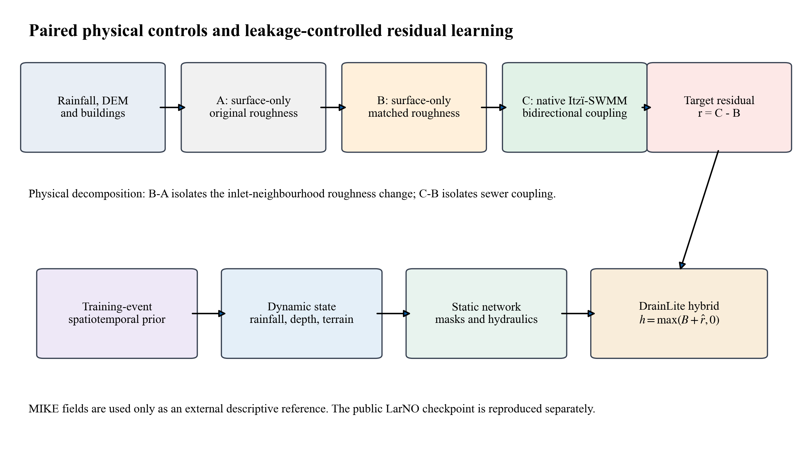
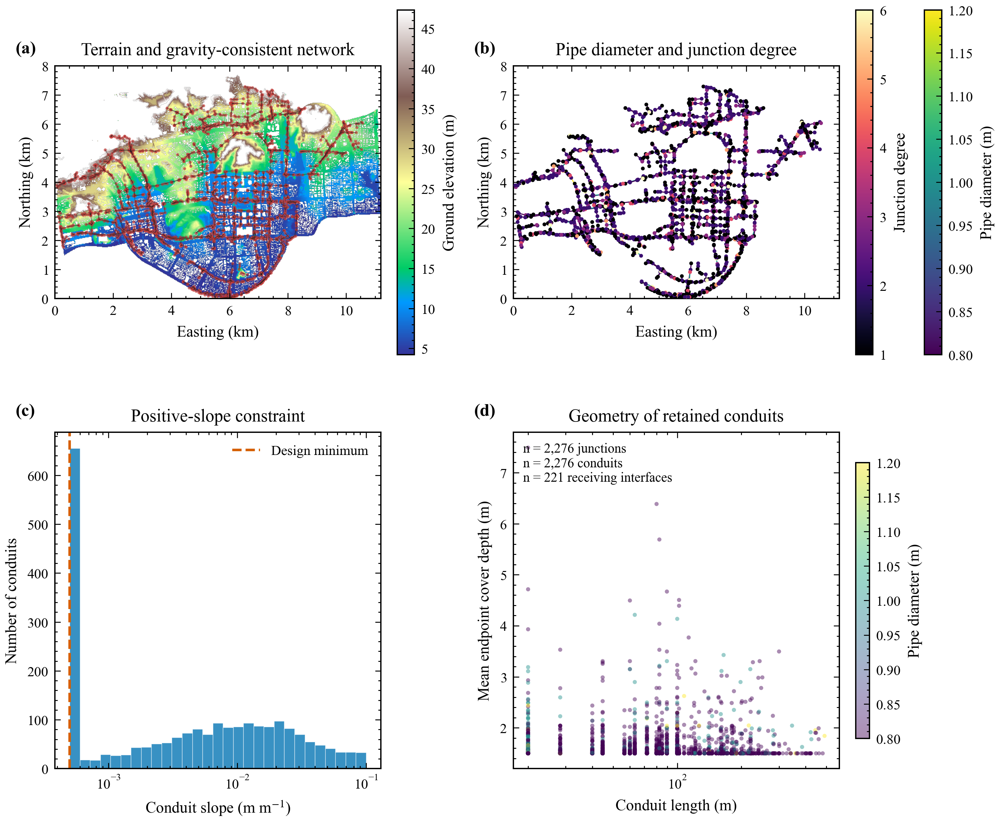
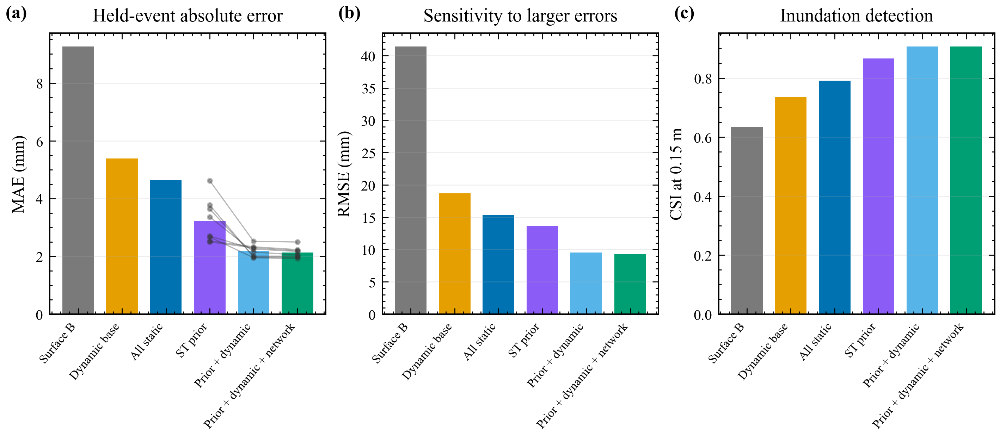
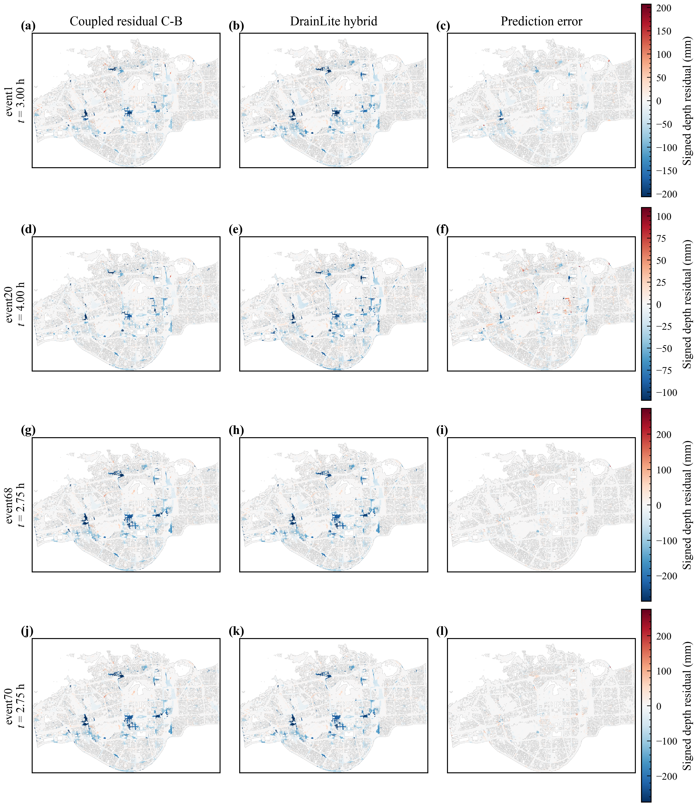
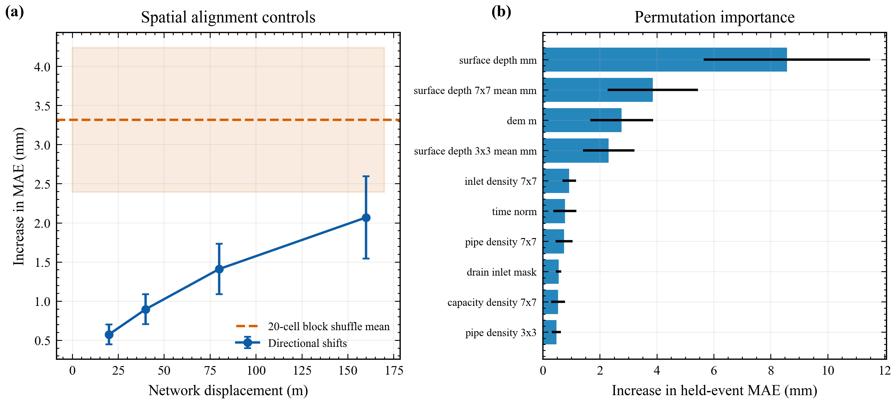
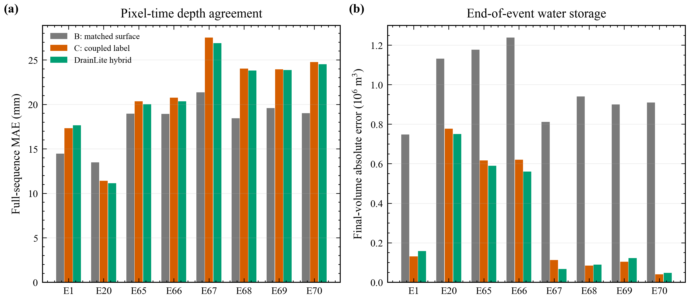
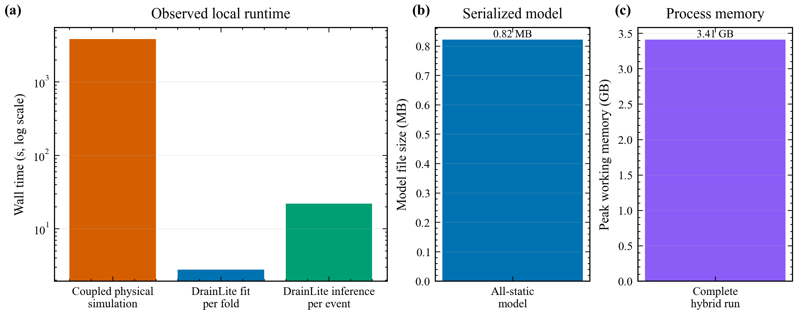

# 概化排水管网影响的轻量残差学习：正式科研报告

**研究对象：** 深圳 20 米城市洪涝基准区域的 Itzï-SWMM 双向耦合与 DrainLite 轻量修正  
**报告版本：** Reviewer Major Revision V3  
**证据范围：** 八个 6 小时事件、72 个五分钟时刻、一个固定概化管网  
**生成日期：** 2026-09-05

## 目录

1. 摘要  
2. 研究背景与问题来源  
3. 数据、计算区域与管网  
4. 物理模型和三组匹配试验  
5. DrainLite 轻量模型  
6. 结果及逐图解读  
7. MIKE 与 LarNO 的角色  
8. 结论、局限与后续工作  
9. 可复现性说明

## 摘要

本研究要解决的问题并不是重新训练完整的 LarNO（Latent Autoregressive Neural Operator，潜在自回归神经算子），而是在本机条件下，将明确的排水管网效应加入一个不含管网的地表洪水结果。为此，本研究先把道路对齐线网整理成连通、正坡、可排向边界的概化管网，再调用 Itzï 内置的 `DrainageSimulation` 与 SWMM（Storm Water Management Model，暴雨洪水管理模型）Dynamic Wave（动力波）求解器进行双向交换。八个事件均计算了 A、B、C 三种条件：A 是原始粗糙度地表模型，B 是匹配入口邻域粗糙度的地表模型，C 是在 B 基础上加入原生 Itzï-SWMM 耦合。正式学习标签是 C-B，而不是容易混入粗糙度影响的 C-A。

八个事件的管网作用平均绝对幅度为 9.266 毫米，粗糙度扰动仅为 0.197 毫米。严格留一事件验证中，未修正的 B 对耦合标签平均绝对误差为 9.266 毫米；仅使用其他训练事件平均残差的时空先验达到 3.226 毫米；加入当前水深、降雨和地形后降至 2.184 毫米；再加入静态管网特征后为 2.130 毫米。静态管网特征在八个事件中都带来改善，但平均仅 0.054 毫米，说明当前结果以固定管网的重复空间响应和地表动态状态为主。

## 1. 研究背景与问题来源

LarNO 的公开模型学习的是“降雨、地形等输入到 MIKE 水深”的映射。公开水深可能已经隐含原 MIKE 管网作用，但公开数据没有给出那套管网，因此不能直接改变管径、入口或出口并观察预测变化。本研究采用较窄但可验证的路线：先用明确的概化管网生成一对“无管网/有管网”物理结果，再学习二者的有符号差值。

这里的“有符号残差”是 C-B。负值表示耦合后该位置水深降低，正值表示局部水深增加。正值不一定代表严重倒灌，也可能来自流路改变、管网暂存后回流或峰值时刻错位。保留正值可以避免把双向耦合误写成只会抽水的单向 sink（汇项）模型。

**Figure 1. 研究流程。上排用于构造无混杂物理标签，下排用于构造轻量学习模型。**

### 图 1 的来龙去脉与读图方法

图 1 首先回答“训练标签到底是什么”。上排从同一场降雨和地形出发。A 与 B 都没有启动管网，区别只在入口周围 3 x 3 网格的曼宁糙率；C 与 B 使用相同糙率，但 C 打开原生 Itzï-SWMM 双向交换。因此，读者应把 B-A 看成数值配置扰动，把 C-B 看成真正用于学习的管网效应。下排说明模型不是从零预测洪水，而是从其他训练事件形成一个时空先验，再结合当前降雨、水深、地形和静态管网参数，估计新的 C-B。

这张图在全文中的作用是防止三个常见误解：第一，DrainLite 不是完整 LarNO 重训；第二，MIKE 没有进入模型训练；第三，管网残差没有与入口粗糙度变化混在一起。

## 2. 数据、计算区域与概化管网

完整计算区域为 400 x 560 个 20 米网格，即 8.0 x 11.2 千米的矩形。72 帧分别表示每个五分钟区间末端的状态，总时长 6 小时。有效分析区域有 105,527 个网格，面积约 42.21 平方千米。其余高程墙体和建筑单元保留在水动力网格中，但不计入主要统计。

本地没有实测地下管网。概化管网来源于已经与 DEM（Digital Elevation Model，数字高程模型）对齐的道路线网。构建过程删除孤立片段和重复平行连接，按地形势能确定下游方向，并在必要位置设置分布式受纳边界。最终网络有 2,276 个 junction（检查井或管网节点）、2,276 条 conduit（管段）和 221 个 receiving interface（受纳接口）。所有节点都能沿有向管段到达出口，且不存在有向环、孤立节点、反坡管段或管顶高于井口的情况。

**Figure 2. 地形、管网位置、管径、节点度、管坡和覆土的综合审查。**

### 图 2 的来龙去脉与读图方法

图 2(a) 用颜色表示地面高程，用线和点表示管段与节点。读图时应先看道路状管线是否落在建筑间的开放通道，再看北部高地与南部低地之间是否形成合理连接。该图采用已经核实的数组方向，没有再次翻转 DEM 或管网。图 2(b) 的管段颜色代表直径，节点颜色代表连接度；连接度较高的点是多条支路汇合的位置。图 2(c) 的横轴为对数坡度，虚线是设计下限，所有柱都位于正坡范围。图 2(d) 同时展示管长、平均覆土和管径，可用于识别异常深埋或超长管段。

这张图能证明的是“概化网络内部一致且与当前网格对齐”，不能证明它等同于深圳真实地下管网。真实井位、管径、泵站和河道口仍属待补充资料。

## 3. 物理计算方法

地表模型使用 Itzï 25.4 的动力学求解器，而不是洼地填充或静态平衡算法。Itzï 采用浅水方程的阻尼部分惯性形式，按地形坡度、水深、摩阻和相邻网格水位差推进地表流。SWMM 5.2.4 使用 Dynamic Wave 路由，即在一维管段上求解 Saint-Venant（圣维南）连续方程和动量方程，并允许满管、回水和流向反转。Itzï 的耦合接口根据地表水位与节点水头计算双向交换。

统一设置包括：1 毫米/小时的有效损失、封闭矩形地表边界、建筑降雨向有效网格全域重分配、地表最大步长 1 秒、SWMM 最大路由步长 0.5 秒、耦合松弛 0.8 和阻尼 0.5。有效损失是对未解析截留和入渗的综合近似，不应写成经过现场率定的土壤参数。

| Event | Rain volume (10^6 m3) | \|B-A\| MAE (mm) | \|C-B\| MAE (mm) | Mean C-B (mm) | SWMM continuity (%) | Non-converging (%) | Combined mass error (% rain) | Status |
| --- | --- | --- | --- | --- | --- | --- | --- | --- |
| event1 | 2.079 | 0.168 | 7.200 | -5.952 | -0.083 | 0.02 | -0.100 | Accepted |
| event20 | 1.673 | 0.101 | 3.322 | -2.673 | -0.178 | 0.00 | -0.032 | Accepted |
| event65 | 2.166 | 0.170 | 7.696 | -6.403 | -0.111 | 0.00 | -0.017 | Accepted |
| event66 | 2.305 | 0.181 | 8.431 | -7.086 | -0.101 | 0.00 | -0.015 | Accepted |
| event67 | 2.670 | 0.255 | 12.631 | -10.928 | -0.066 | 0.01 | -0.111 | Accepted |
| event68 | 2.552 | 0.236 | 11.914 | -10.101 | -0.060 | 0.04 | -0.097 | Accepted |
| event69 | 2.422 | 0.224 | 10.912 | -9.420 | -0.068 | 0.01 | -0.101 | Accepted |
| event70 | 2.578 | 0.240 | 12.023 | -10.319 | -0.063 | 0.01 | -0.098 | Accepted |

**Figure 3. 八事件 SWMM 数值质量、A/B/C 分解和 MIKE 体积参照。**

### 图 3 的来龙去脉与读图方法

图 3(a) 是计算能否作为标签的第一道检查。蓝柱是 SWMM 流量连续性误差，它允许正负号，判断时看绝对值；绿色柱是未收敛路由步的比例。八个事件均远小于早期断裂网络产生的异常值。图 3(b) 使用对数纵轴，因为粗糙度效应与管网效应相差一个以上数量级。绿色柱在每个事件都显著高于蓝柱，说明现在看到的削减主要来自管网交换，而不是入口附近糙率变化。

图 3(c) 的蓝线是 B 在第 6 小时仍留在地表的体积，绿线是 C。两线之间的垂直距离就是管网排出或暂存在管内后带来的地表存量差。图 3(d) 则把 B 和 C 的最终体积与 MIKE 比较。绿色柱普遍较低，说明加入概化管网后，最终水量更接近 MIKE；但这并不自动意味着每个时刻、每个像元都更接近，后文图 9 会显示这类指标冲突。

**Figure 4. 八事件降雨与区域地表水体积全过程。**

### 图 4 的来龙去脉与读图方法

每个子图对应一个事件，左轴是区域有效网格的总地表水体积，右轴是平均降雨强度。降雨轴倒置，所以浅蓝色降雨从图顶向下延伸。黑线为 MIKE，灰线为无管网 B，橙线为耦合 C。读图时不要只看单个最深网格，而应先看总水量何时增加、何时下降。

八个事件中，B 在主要降雨结束后仍保持高位甚至缓慢上升；C 的体积更低，并在事件后期出现更明显下降。这正是连接管网能够持续排水的证据。MIKE 通常更早出现峰值和退水，说明两套模型的边界、损失、真实管网能力或河道联系仍不同。图中各事件雨轴独立缩放，用于阅读本事件降雨节奏；跨事件比较降雨大小应使用原始数值表，而不是比较浅蓝填色高度。

**Figure 5. 事件 68 的峰值空间图和管网/粗糙度差值。**

### 图 5 的来龙去脉与读图方法

图 5(a-d) 都是每个网格在六小时内出现过的最大水深。颜色越深表示峰值越大。统一色标经过百分位截断，少数超过 0.73 米的极深网格会呈饱和深蓝，但统计仍使用其真实值。对比 B 与 C 可以看到耦合后若干道路状和低洼连通区域变浅。

图 5(e) 是 C 峰值图减 B 峰值图。蓝色表示管网使峰值降低，红色表示局部峰值增加。图 5(f) 是 B-A，色标范围只有约正负 0.01 米，比图 5(e) 小得多。两个差值图不能只凭颜色深浅比较，必须同时看各自色标。这一设计正是为了避免把视觉放大后的微小糙率差异误认为强管网效应。

## 4. DrainLite 轻量残差模型

DrainLite 的输出不是绝对水深，而是预测残差 `r_hat`。最终水深为 `max(B + r_hat, 0)`。模型使用直方图梯度提升回归树，学习率 0.05，最多 31 个叶节点，候选迭代次数为 80、140 和 220。每个时间、每个训练事件均匀抽取 450 个有效网格；最终每折拟合 226,800 行。模型不用显式行列坐标，也不用到概化出口的距离。

验证按完整事件划分。每次留下一个事件测试，另留一个训练事件选择迭代次数。时空先验对测试事件只由其他七个事件计算；对任何训练样本，先验都排除该样本所属事件。这种处理防止模型在输入中看到自己的目标平均值。

| Model | MAE (mm) | RMSE (mm) | CSI 0.03 m | CSI 0.15 m | Peak-map MAE (mm) | Final-volume error (10^3 m3) |
| --- | --- | --- | --- | --- | --- | --- |
| Matched surface B | 9.266 | 41.421 | 0.889 | 0.633 | 16.835 | 699.5 |
| Dynamic base | 5.387 | 18.669 | 0.898 | 0.735 | 8.258 | 24.2 |
| Dynamic + all static network | 4.631 | 15.296 | 0.907 | 0.791 | 7.090 | 30.8 |
| Spatiotemporal prior | 3.226 | 13.621 | 0.898 | 0.867 | 5.403 | 129.7 |
| Prior + dynamic | 2.184 | 9.537 | 0.926 | 0.906 | 3.493 | 29.6 |
| Prior + dynamic + network (DrainLite hybrid) | 2.130 | 9.245 | 0.931 | 0.907 | 3.451 | 27.1 |

**Figure 7. 由地表基线、动态模型、时空先验到完整混合模型的逐层比较。**

### 图 7 的来龙去脉与读图方法

图 7(a) 的纵轴是平均绝对误差，越低越好。最左侧 B 的误差最高；动态模型和静态管网模型依次下降；时空先验进一步下降。浅蓝和绿色是本文最终的两步混合模型，灰色细线连接同一测试事件，显示管网特征是否对每个事件都改善。八条线从浅蓝到绿色都略向下，但幅度很小。

图 7(b) 使用均方根误差，它对少数大误差更敏感。最终模型从 B 的 41.421 毫米降至 9.245 毫米。图 7(c) 是 0.15 米阈值的临界成功指数，越高越好；最终模型为 0.907。三张子图共同说明改善不仅来自大量干区的小误差，也涉及较深积水范围。

| Held event | ST prior MAE | Prior + dynamic MAE | Hybrid MAE | Gain vs prior | Network increment |
| --- | --- | --- | --- | --- | --- |
| event1 | 2.498 | 2.295 | 2.197 | 0.301 | 0.098 |
| event20 | 3.365 | 2.150 | 2.047 | 1.318 | 0.103 |
| event65 | 2.702 | 2.251 | 2.171 | 0.531 | 0.080 |
| event66 | 2.537 | 2.328 | 2.233 | 0.305 | 0.096 |
| event67 | 4.617 | 2.520 | 2.495 | 2.122 | 0.025 |
| event68 | 3.637 | 2.006 | 2.006 | 1.631 | 0.000 |
| event69 | 2.669 | 1.950 | 1.922 | 0.747 | 0.028 |
| event70 | 3.779 | 1.972 | 1.968 | 1.810 | 0.003 |

**Figure 6. 四个完整留出事件的真实残差、预测残差和误差。**

### 图 6 的来龙去脉与读图方法

每一行是一个从未进入该折训练的事件。第一列是真实 C-B，第二列是 DrainLite 预测，第三列是预测减真实。蓝色代表耦合后变浅，红色代表局部变深。每行色标按该事件的 99.5 百分位设置，因此适合比较同一行三幅图的空间位置，不适合直接比较不同行颜色深浅。

第一、二列都出现相似的道路状蓝色结构，说明模型恢复了主要削减区域。第三列整体颜色较浅，但在湿干边界、局部正残差和深洼地附近仍有成片误差。Domain-average（全域平均）为毫米级并不意味着每个局部都准确；图 6 专门用于揭示平均指标掩盖的空间偏差。

**Figure 8. 管网错位对照与特征置乱重要性。**

### 图 8 的来龙去脉与读图方法

图 8(a) 把管网栅格整体平移，同时保持地形、降雨和标签不动。横轴从 20 米增加到 160 米，纵轴是相对正确对齐模型增加的误差。曲线随偏移距离上升，说明正确位置确实重要。橙色虚线和阴影是 50 次块状随机打乱的均值和离散范围，惩罚更大。该实验排除了“只要给模型任意一些管网数值就会改善”的解释。

图 8(b) 将单个特征打乱，观察误差增加。当前水深、局部平均水深和地形最重要；管网中以入口密度和管线密度较高。黑色误差线表示不同留出事件之间的变化。这是预测依赖，不是因果敏感性：地形和管网本来就空间相关，不能据此断言某个变量单独造成了多少排水。

## 5. MIKE 外部参照与 LarNO 复现

MIKE 只承担合理性参照。它没有进入 DrainLite 的训练、先验、调参或抽样。由于公开资料没有给出原 MIKE 管网，MIKE 与当前概化网络不是同一工程系统。

| Field | MAE (mm) | RMSE (mm) | CSI 0.15 m | Peak-map MAE (mm) | Final-volume error (10^3 m3) |
| --- | --- | --- | --- | --- | --- |
| Matched surface B | 18.023 | 50.905 | 0.467 | 27.083 | 982.1 |
| Coupled label C | 21.258 | 62.509 | 0.311 | 34.608 | 310.6 |
| DrainLite hybrid | 21.024 | 61.836 | 0.306 | 33.556 | 297.7 |

**Figure 9. MIKE 对照在全时序像元误差和最终体积误差上的不同排序。**

### 图 9 的来龙去脉与读图方法

图 9(a) 对 72 帧的所有有效像元计算误差。灰色 B 通常最低，说明无管网 Itzï 的空间时间水深更接近 MIKE；橙色 C 和绿色 DrainLite 更高。图 9(b) 只比较第 6 小时的总地表水量，结果相反：C 和 DrainLite 显著接近 MIKE。原因是像元误差同时惩罚积水位置和退水时间，体积误差只问“还剩多少水”。当前概化管网排水总量较合理，但位置和时间过程并未复制原 MIKE 管网。

因此，报告的正确结论是“管网改善最终水量一致性，但降低完整空间时间水深的一致性”，而不是简单说“加入管网更接近 MIKE”。

**Figure 10. 公开 LarNO 检查点在 event68 上的本地复现。**

### 图 10 的来龙去脉与读图方法

图 10(a) 是 MIKE 目标，图 10(b) 是本地载入公开 epoch 992 权重后的 LarNO 结果，两图共享水深色标。图 10(c) 是 LarNO 减 MIKE，红色为高估、蓝色为低估。未截断结果 MAE 为 2.409 毫米，0.15 米 CSI 为 0.955。原始输出中 18.15% 数值小于零；将其截为零后 MAE 为 2.325 毫米。

这张图证明代码、权重和公开数据能在本地完成一次独立推理。它不等于已经把 DrainLite 安全叠加到 LarNO。由于 LarNO 的 MIKE 标签可能已含管网效应，再加 C-B 可能重复计算排水。正式论文因此使用明确不含管网的 B 作为上游输入。要直接形成 LarNO-DrainLite，需要训练一个 surface-only LarNO，或生成同一配置下成对的 LarNO 无管网和有管网标签。

## 6. 计算代价

**Figure 11. 物理计算、轻量模型拟合、推理、模型文件和内存占用。**

### 图 11 的来龙去脉与读图方法

图 11(a) 为对数时间轴。单事件耦合物理模拟以千秒计，单折树模型拟合为数秒，完整区域 72 帧推理为数十秒。图 11(b) 只使用兆字节单位表示模型文件，平均约 0.82 MB。图 11(c) 单独使用吉字节表示完整混合实验的峰值工作内存，为 3.41 GB。这里特意分开单位，避免早期图件把 MB 与 GB 放在同一纵轴造成错误视觉比较。

## 7. 主要结论

1. 当前固定模拟方式是原生 Itzï SurfaceFlowSimulation 与 DrainageSimulation 调用 SWMM Dynamic Wave 的双向耦合，不是另行运行后再扣除的独立 SWMM，也不是静态洼地填充。
2. 修正后的概化网络全部节点可达出口，八事件无 SWMM flooding loss，连续性与综合水量误差均在预设阈值内。
3. C-B 的管网信号明显大于 B-A 的糙率信号，因此当前“有管网/无管网”差异是真正的耦合响应。
4. 最终 DrainLite 混合模型对耦合标签 MAE 为 2.130 毫米，相比 B 改善 77.0%。
5. 时空先验很强，动态变量提供主要新增改进；静态管网特征平均只再改善 0.054 毫米，但八个事件方向一致。
6. MIKE 比较具有指标依赖性，不能作为当前概化管网已经真实率定的证据。

## 8. 不足与下一阶段

最大的科学限制是“八场雨、一个管网”。留一事件只证明对新降雨的泛化，不能证明对新管网、新城市或新分辨率的泛化。下一步最有价值的是对管径、入口密度和出口条件做成组扰动，生成多个网络版本，并留出完整网络测试。若能保存 SWMM 动态节点水头、流量、满管率和回流状态，可进一步解释事件差异，但必须确保这些变量在预测时可获得，不能把目标时刻的真实管网状态作为输入造成泄漏。

其他待补充内容包括：真实管网或独立积水观测、开放河道边界、建筑降雨处理敏感性、更多事件、5 米真实 MIKE 参考，以及 surface-only LarNO 权重。现阶段不得声称已经验证真实市政管网、完成 5 米耦合验证或实现跨网络零样本泛化。

## 9. 可复现性说明

正式数据集目录为 `region1_20m_drainage_v3_full`。物理输出、机器学习输出和投稿图均位于 `extended_study/output/reviewer_major_revision_v3`。伴随的 `scientific_integrity_audit.md` 和 `evidence_manifest.json` 记录数组形状、文件哈希、模型版本、被否决的旧结果以及每项结论的证据边界。
