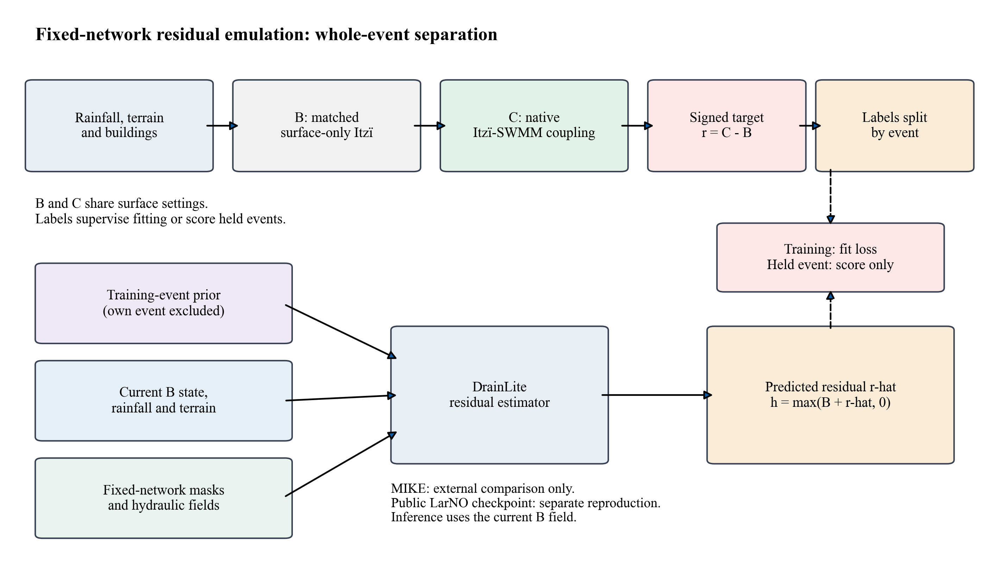
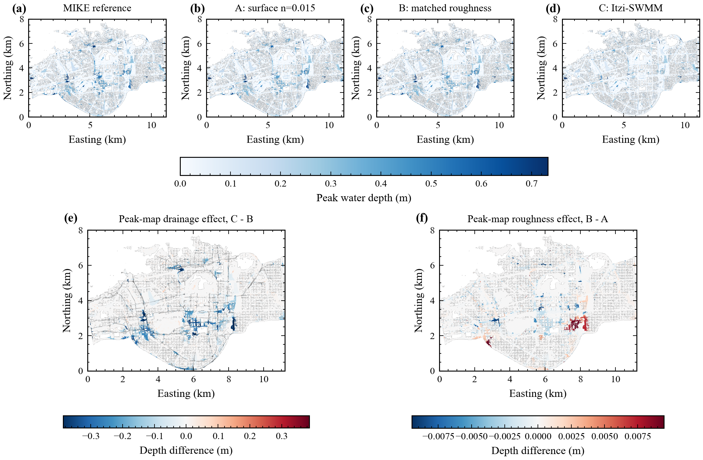
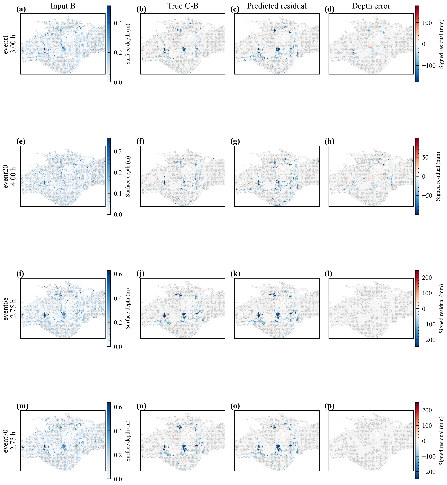
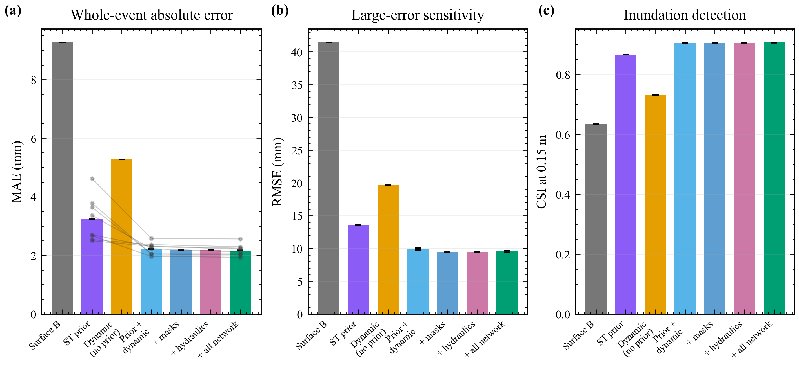
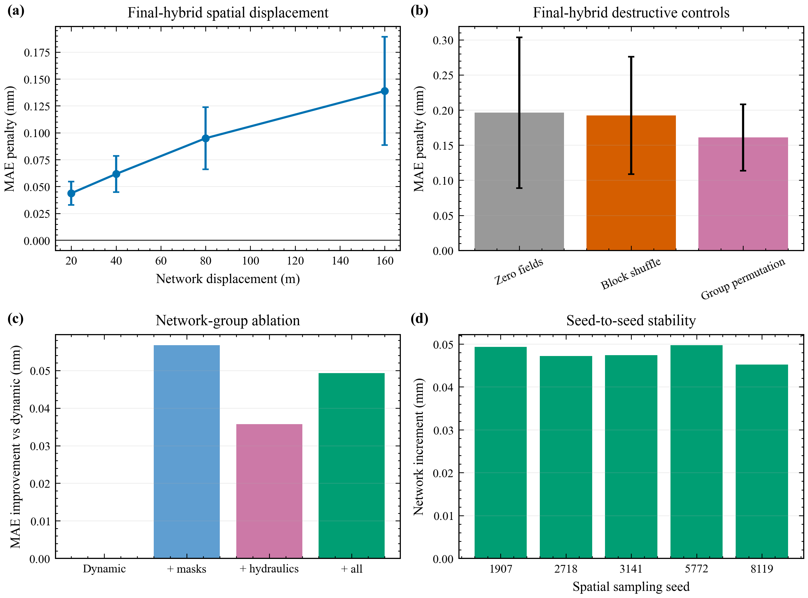
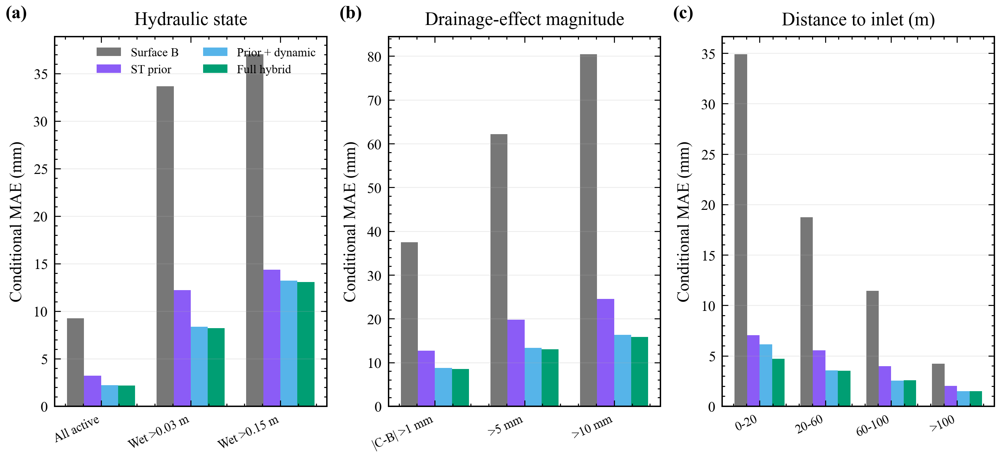
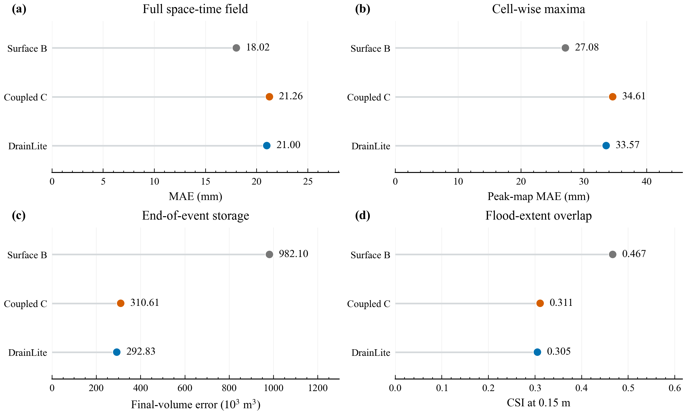
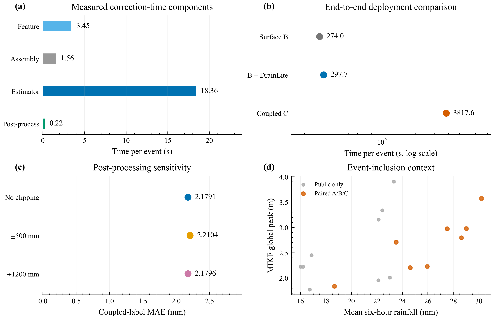
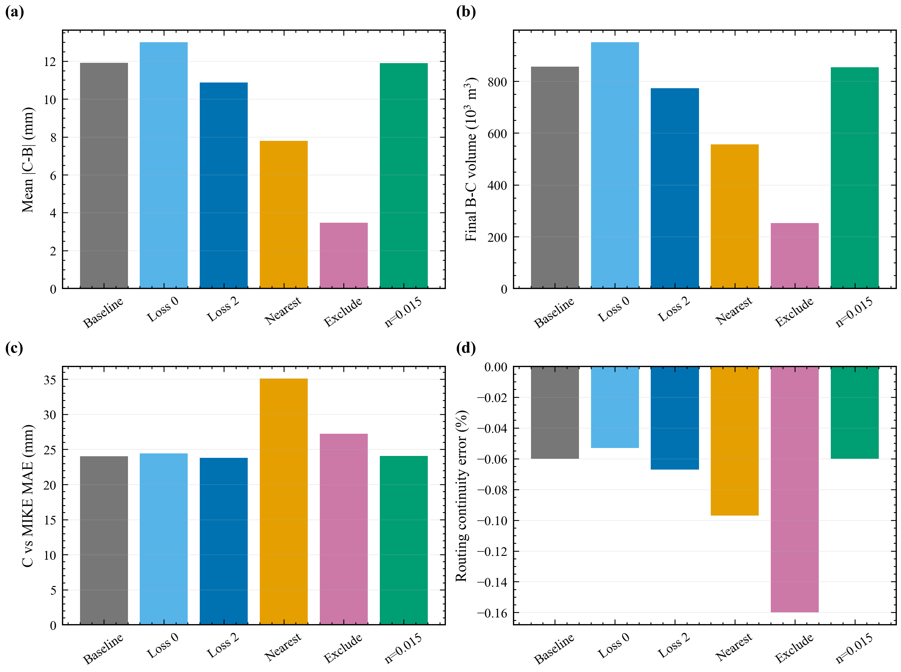

# 固定概化排水管网影响的轻量残差模拟科研报告

## 目录

1. 摘要  
2. 研究背景与问题界定  
3. 数据、物理模型与质量控制  
4. DrainLite 方法与验证设计  
5. 结果及逐图解读  
6. 讨论、结论与下一步工作  

## 摘要

本报告记录一条可审计的研究链：先用匹配的地表对照和 Itzï-SWMM 双向耦合计算得到“同一场降雨、同一地形下，管网使水深发生了多少变化”，再用轻量梯度提升模型模拟这一有符号变化。这里的 DrainLite 不是从降雨直接生成洪水图的独立预报器；它接收当前时刻的无管网 Itzï 水深 B，并预测耦合水深 C 与 B 的差值。八场六小时事件均在 20 米、72 时步、400 x 560 全域网格上计算。

物理结果表明，管网效应 |C-B| 平均为 9.266 毫米，而为匹配耦合设置引入的局部糙率效应 |B-A| 仅为 0.197 毫米。留一事件验证中，B 相对 C 的平均绝对误差为 9.266 毫米；事件排除的时空先验将其降到 3.226 毫米，加入当前水深和降雨后降到 2.217 毫米，完整静态管网模型为 2.169 毫米。五个空间采样种子下，静态管网字段的平均增量为 0.048 +/- 0.002 毫米。该增量较小，但最终模型的错位、块打乱和整组置换均使误差上升，说明正确空间位置确实提供了信息。

## 1. 研究背景与问题界定

城市暴雨积水由地表汇流和地下排水共同决定。地表二维模型回答“雨水如何沿地形和道路传播”，一维管网模型回答“雨水如何经检查井和管道输送并排出”。原 LarNO 工作解决的是大范围、高分辨率洪水场的快速学习问题；本研究关注更具体的缺口：当上游模型没有把可修改的管网作为显式条件时，能否用一个本机可训练的小模型补充指定管网的影响。

这一问题必须严格限定。当前模型使用一个由道路对齐、地形约束和水力规则构造的概化网络，而不是真实城市管网；八场事件共享同一网络；DrainLite 还需要同一时刻的 B 水深。因此本研究证明的是“固定网络上的跨降雨事件残差模拟”，不是“对任意城市管网都能泛化”，也不是已经完成的“降雨到洪水的端到端 LarNO-DrainLite”。

**Figure 1. 研究流程。上排先生成匹配的物理对照：B 和 C 的地表参数相同，二者只相差是否开启 Itzï 原生的 SWMM 双向交换。下排把训练事件先验、当前地表状态和静态管网字段依次加入残差模型。读图时应注意，MIKE 和公共 LarNO 复现没有进入模型训练。**

**图 1 逐项解释。** 左上输入框代表降雨、地形和建筑物。B 框是没有地下管网交换的地表动力学结果；C 框在相同地表设置下开启管网，因此 C-B 才能解释为管网效应。下方紫色框是由其余事件计算的平均时空响应，蓝色框代表当前事件已经发生到该时刻的降雨和地表水深，绿色框代表管网位置、密度、管径、坡度、能力和覆土等静态信息。最后的水深不允许小于零。图中没有从 MIKE 或测试事件把答案直接送入模型的箭头，这是泄漏控制的核心。

## 2. 数据、物理模型与质量控制

### 2.1 计算区域和事件

完整区域为 400 x 560 个 20 米网格，即约 8.0 x 11.2 千米。评价掩膜含 105,527 个活动网格，面积约 42.21 平方千米。每场事件有 72 幅五分钟水深图，总时长六小时。八场配对事件为 event1、event20 和 event65-event70。选择依据是本地存在完整的 A/B/C 匹配计算，而不是根据 DrainLite 表现挑选。完整公共事件严重度背景见图 11d 和附表。

### 2.2 概化网络

网络沿 OpenStreetMap 道路几何布置，并使用地形高程设置管底和坡向。最终网络含 2,276 个节点、2,276 条管段和 221 个接收边界。所有节点都有有向路径通往排放口；没有孤立节点、回路、重复端点管段、反坡管段或管顶高于节点地面的情况。这些检查说明网络内部可运行，但不能把它写成深圳真实管网。

**Figure 2. 概化网络审计。子图 (a) 检查管网与地形的相对位置和方向；子图 (b) 观察管径和节点连接度；子图 (c) 在对数坐标中检查管坡是否为正；子图 (d) 同时查看管长、覆土和管径，防止几何参数互相矛盾。道路几何来源应标注“© OpenStreetMap contributors”。**

**图 2 逐项解释。** 子图 (a) 的底图是高程，线和点是管线及节点。它用于回答早期最容易出错的问题：管网是否上下翻转、整体偏移或落到建筑墙体上。子图 (b) 用颜色或尺寸显示管径和连接度，主干位置应形成连续结构，而不能只剩零散点。子图 (c) 的横轴和纵轴用于检查坡度分布；对数轴把很小的正坡度展开，所有值位于零以上。子图 (d) 检查较长管段是否出现不合理的覆土或直径组合。图只能证明规则一致，不能证明参数经过现场校准。

### 2.3 A/B/C 物理对照

A 是原始地表方案；B 在入口附近采用与耦合运行相同的局部糙率，但不开启管网；C 在 B 的基础上启用 Itzï 25.4 内置的 DrainageSimulation，并由 SWMM 5.2.4 动力波求解管网。这样，B-A 是糙率改变造成的差异，C-B 才是地下管网交换造成的差异。C-B 允许为正，因为满管或局部回流可能让某些地表网格变深。

### 2.4 验收阈值

每场运行必须同时满足：数组为 72 x 400 x 560 且无 NaN/Inf；所有节点可达排放口；SWMM 流量连续性误差绝对值不超过 2%；不收敛步比例不超过 2%；地表-管网合并水量误差绝对值不超过降雨量的 0.5%；SWMM flooding loss、warning 和 error 均为零。

**Table 1. Physical quality of the eight paired events.**

| Event | Rain volume (10^6 m3) | \|B-A\| MAE (mm) | \|C-B\| MAE (mm) | Mean C-B (mm) | Routing continuity (%) | Non-converging (%) | Combined mass error (% rain) | Status |
| --- | --- | --- | --- | --- | --- | --- | --- | --- |
| event1 | 2.079 | 0.168 | 7.200 | -5.952 | -0.083 | 0.020 | -0.100 | Accepted |
| event20 | 1.673 | 0.101 | 3.322 | -2.673 | -0.178 | 0.000 | -0.032 | Accepted |
| event65 | 2.166 | 0.170 | 7.696 | -6.403 | -0.111 | 0.000 | -0.017 | Accepted |
| event66 | 2.305 | 0.181 | 8.431 | -7.086 | -0.101 | 0.000 | -0.015 | Accepted |
| event67 | 2.670 | 0.255 | 12.631 | -10.928 | -0.066 | 0.010 | -0.111 | Accepted |
| event68 | 2.552 | 0.236 | 11.914 | -10.101 | -0.060 | 0.040 | -0.097 | Accepted |
| event69 | 2.422 | 0.224 | 10.912 | -9.420 | -0.068 | 0.010 | -0.101 | Accepted |
| event70 | 2.578 | 0.240 | 12.023 | -10.319 | -0.063 | 0.010 | -0.098 | Accepted |

**Figure 3. 八场物理标签质量。子图 (a) 是数值连续性和不收敛步；子图 (b) 比较管网效应与糙率效应；子图 (c) 比较六小时地表存水量；子图 (d) 把最终水量与 MIKE 参照比较。**

**图 3 逐项解释。** 子图 (a) 的柱越接近零越好；连续性误差有正负号，但验收看绝对值。子图 (b) 用对数纵轴，管网效应柱普遍远高于糙率效应柱，说明结果不是靠入口附近降低糙率“制造”出来的。子图 (c) 中 C 低于 B 表示管网把一部分水从地表系统中输送出去。子图 (d) 只比较最终总体水量，不能替代空间水深检验。

**Figure 4. 八场事件的地表水量过程。灰线为 B，橙线为 C，黑线为 MIKE，蓝色阴影为降雨。**

**图 4 逐项解释。** 每个子图是一场独立降雨，横轴为小时，左轴为活动网格上的地表水量。灰线和橙线之间的垂直距离就是管网对总体存水的影响。降雨停止后，如果橙线下降而灰线继续维持或上升，说明管网正在排空地表。黑线来自 MIKE，但其管网和边界细节不公开，因此只用于判断量级和峰现时间是否明显异常。单个最低点的最大水深可能仍上升，这与全域水量下降并不矛盾。

**Figure 5. Event68 的峰值空间图及差值图。前四幅是 MIKE、A、B、C，后两幅分别是 C-B 和 B-A。**

**图 5 逐项解释。** 前四个子图要看积水热点是否沿相似低地出现，而不是只看最大值。C-B 图中蓝色表示耦合后变浅，红色表示局部变深；连续的蓝色带通常对应入口密集区和排水路径。B-A 使用更窄的色标，因为糙率效应远小于管网效应。色标采用百分位裁剪只是为了看清纹理，统计量仍使用完整值。

## 3. DrainLite 方法与验证设计

模型预测的是有符号残差 r=C-B，再把它加回 B。时空先验由训练事件逐时逐格平均得到；测试事件从先验中完全排除，训练样本自己的事件也从该样本先验中排除。动态特征包括当前 B 水深、降雨、累积降雨、地形、时间和掩膜感知的 3 x 3、7 x 7 邻域水深。静态特征包括入口、管线、密度、管径、坡度、满流能力和覆土。坐标、排放口距离和目标侧 SWMM 动态状态均不使用。

验证采用八折留一事件法。完整模型与“先验+动态”模型分别用五个随机空间采样种子训练，以检查 0.1 毫米量级的管网增量是否只是抽样偶然性。树数量固定为 140，不再用某一个内部事件挑选。最终模型还要接受网络平移、块打乱、整组置换和静态字段清零。

## 4. 结果及逐图解读

### 4.1 总体精度和模型组成

**Table 2. Whole-event model comparison; uncertainties refer to sampling seeds.**

| Model | Seeds | MAE (mm) | Seed SD | RMSE (mm) | CSI 0.03 m | CSI 0.15 m | Peak-map MAE (mm) | Final-volume error (10^3 m3) |
| --- | --- | --- | --- | --- | --- | --- | --- | --- |
| Matched surface B | 5 | 9.266 | 0.000 | 41.421 | 0.889 | 0.633 | 16.835 | 699.5 |
| Spatiotemporal prior | 5 | 3.226 | 0.000 | 13.621 | 0.898 | 0.867 | 5.403 | 129.7 |
| Dynamic predictors, no prior | 1 | 5.273 | Not estimated | 19.635 | 0.896 | 0.731 | 8.284 | 40.5 |
| Prior + dynamic | 5 | 2.217 | 0.007 | 9.907 | 0.925 | 0.905 | 3.567 | 32.0 |
| Prior + dynamic + masks | 1 | 2.172 | Not estimated | 9.429 | 0.929 | 0.906 | 3.538 | 27.3 |
| Prior + dynamic + hydraulics | 1 | 2.193 | Not estimated | 9.477 | 0.927 | 0.905 | 3.553 | 27.3 |
| Prior + dynamic + all network fields | 5 | 2.169 | 0.008 | 9.558 | 0.929 | 0.906 | 3.516 | 29.1 |

**Figure 6. 四场留出事件的空间残差。每行依次为 B 输入、真实 C-B、预测残差和最终深度误差。**

**图 6 逐项解释。** 第一列帮助读者把残差放回原积水背景：深水区不一定是排水变化最大的区。第二列蓝色为真实削减、红色为真实局部增水。第三列若能恢复第二列的连续条带和热点，说明模型不仅降低了平均误差，也恢复了位置。第四列接近白色代表预测与 C 接近；蓝红边缘说明模型对陡峭残差边界存在平滑或错位。每行色标按本事件设置，不能拿不同事件的颜色深浅直接比较数值。

**Figure 7. 完整事件留出结果。三个子图依次是平均绝对误差、均方根误差和 0.15 米阈值的临界成功指数。**

**图 7 逐项解释。** 子图 (a) 柱越低越好。Surface B 是完全不修正的起点；ST prior 表示只重复其他事件的平均响应；Dynamic (no prior) 检验没有固定模板时动态变量能学到多少；后续三组逐步加入管网信息。子图 (b) 对少量大误差更敏感，因此数值通常高于子图 (a)。子图 (c) 越高越好，表示超过 0.15 米的淹没区域是否重合。误差棒只出现在做了五随机种子的关键模型上，不能把规范种子单次消融误读成无随机波动。

先验从 9.266 毫米降到 3.226 毫米，说明同一地形和网络产生了很强的重复空间模板。动态变量进一步降到 2.217 毫米，说明事件降雨强度和当时地表状态仍然必要。完整模型为 2.169 毫米；因此管网静态字段有贡献，但不是主要精度来源。

### 4.2 管网信息是否真的被使用

**Table 3. Canonical-seed held-event errors and network increments (mm).**

| Held event | Prior MAE | Prior + dynamic | Full hybrid | Gain over prior | Network increment |
| --- | --- | --- | --- | --- | --- |
| event1 | 2.498 | 2.307 | 2.246 | 0.252 | 0.061663 |
| event20 | 3.365 | 2.227 | 2.121 | 1.244 | 0.106210 |
| event65 | 2.702 | 2.299 | 2.218 | 0.484 | 0.081149 |
| event66 | 2.537 | 2.367 | 2.293 | 0.245 | 0.073993 |
| event67 | 4.617 | 2.574 | 2.559 | 2.058 | 0.014278 |
| event68 | 3.637 | 2.048 | 2.048 | 1.590 | 0.000250 |
| event69 | 2.669 | 1.961 | 1.936 | 0.733 | 0.024358 |
| event70 | 3.779 | 2.045 | 2.013 | 1.766 | 0.032667 |

**Figure 8. 最终 hybrid 的管网空间对照。子图 (a) 为平移距离，(b) 为清零、块打乱和整组置换，(c) 为管网特征分组，(d) 为五随机种子的静态增量。**

**图 8 逐项解释。** 子图 (a) 的纵轴是“错位模型 MAE 减去正确对齐模型 MAE”，高于零表示错位有害。随距离增大而上升，比单独一个 20 米对照更能说明模型依赖正确位置。子图 (b) 中，清零测试的是显式静态字段的增量，但时空先验仍保留原网络平均效应；块打乱保留局部数值分布却破坏大片空间组织；整组置换同时破坏位置。子图 (c) 比较入口/管线掩膜与管径/坡度等水力组。子图 (d) 每根柱对应一个采样种子，若都在零以上，说明小增量不是单一种子的偶然结果；若接近或跨过零，则必须降低结论强度。

正确静态字段相对先验+动态的五种子增量为 0.048 +/- 0.002 毫米。清零、块打乱和整组置换的平均惩罚分别为 0.196、0.192 和 0.161 毫米。它们支持“正确对齐有用”，但由于先验仍编码固定网络，不能据此声称可泛化到新管网。

### 4.3 排水真正发生的区域

**Table 4. Conditional depth MAE (mm), macro-averaged over events.**

| Evaluation subset | Surface B | ST prior | Prior + dynamic | Full hybrid |
| --- | --- | --- | --- | --- |
| All active cell-times | 9.266 | 3.226 | 2.228 | 2.179 |
| Coupled depth >= 0.03 m | 33.676 | 12.218 | 8.372 | 8.214 |
| \|C-B\| > 5 mm | 62.153 | 19.765 | 13.372 | 13.008 |
| C-B < -5 mm | 78.864 | 24.109 | 15.602 | 15.122 |
| C-B > 5 mm | 14.544 | 7.131 | 6.845 | 6.838 |
| Within 20 m of inlet | 34.893 | 7.029 | 6.139 | 4.713 |
| Within 20 m of pipe | 25.716 | 6.414 | 4.598 | 4.182 |

**Figure 9. 条件误差：湿区、强管网效应区和不同入口距离。**

**图 9 逐项解释。** 子图 (a) 说明把评价限制到 3 厘米或 15 厘米以上积水后，误差会高于全域平均，因为干网格不再稀释结果。子图 (b) 逐步筛选 |C-B| 大于 1、5、10 毫米的网格，阈值越高表示管网改变越强，也越难预测。子图 (c) 按入口距离分组，0-20 米是交换最集中的区域。关键不是完整模型在每组都只有 2 毫米，而是它相对 B 是否持续降低误差，以及在哪些组仍然偏高。

### 4.4 与 MIKE 的外部对照

**Table 5. External comparison with MIKE.**

| Field | MAE (mm) | RMSE (mm) | CSI 0.15 m | Peak-map MAE (mm) | Final-volume error (10^3 m3) |
| --- | --- | --- | --- | --- | --- |
| Matched surface B | 18.023 | 50.905 | 0.467 | 27.083 | 982.1 |
| Coupled label C | 21.258 | 62.509 | 0.311 | 34.608 | 310.6 |
| DrainLite full hybrid | 20.994 | 61.708 | 0.306 | 33.563 | 290.4 |

**Figure 10. B、C 和 DrainLite 相对 MIKE 的四类指标。**

**图 10 逐项解释。** 四个子图采用相同的模型行顺序和颜色，圆点的横坐标表示指标数值，旁边直接标注该数值；浅灰引导线仅帮助读数。子图 (a) 和 (b) 衡量逐格逐时水深与逐格峰值误差，圆点越靠左越好；B 在这些指标上可能更接近 MIKE。子图 (c) 衡量六小时后总体存水量误差，圆点越靠左越好，C 和 DrainLite 通常更接近，说明排水纠正了过多存水。子图 (d) 是 0.15 米淹没范围重合度，圆点越靠右越好。四图排序不一致不是统计错误，而是说明概化管网修正了总体水量，却没有复制 MIKE 中未公开的真实管网空间分配。报告因此不把 MIKE 称为独立验证真值。

### 4.5 时间、裁剪和事件覆盖

**Figure 11. 运行时间、后处理敏感性和事件覆盖。**

**图 11 逐项解释。** 子图 (a) 用细横条把特征生成、矩阵组装、树模型预测和非负处理分别计时，横条长度表示秒数，防止只报告最快的 `predict()`。子图 (b) 用圆点在对数横轴上比较 B、B+DrainLite 和 C，越靠左表示耗时越短，真正部署时间是 B 与完整修正之和。子图 (c) 用横向点图比较不裁剪、正负 500 毫米和正负 1200 毫米残差，横坐标为平均绝对误差，越靠左越好；主结果不做残差裁剪。数值标注用于辨认很小的差异，不放大坐标范围来夸大差别。子图 (d) 横轴为平均六小时降雨，纵轴为 MIKE 全域峰值，橙点是有完整 A/B/C 的八场事件，灰点是只有公共强迫和参照的事件。它直观展示样本覆盖，而不是把八场事件说成全部公开数据。

### 4.6 与 LarNO 的关系

**Figure 12. 公共 LarNO checkpoint 的 event68 独立复现。**

**图 12 逐项解释。** 第一幅是真实 MIKE 水深，第二幅是 LarNO 输出，二者共用色标；第三幅是有符号误差。原始输出有 18.15% 的负值，因此报告同时保留未截断和截断指标。DrainLite 没有直接叠加到这个 checkpoint 上，因为该 LarNO 已用可能包含排水的 MIKE 标签训练，再加 C-B 可能重复计算排水。当前论文的主结果来自 B 到 C，而不是 LarNO 到 C。

### 4.7 物理假设的配对敏感性

这一补充实验回答“管网效应是否依赖降雨施加和局部糙率设置”。在 event68 中分别改变有效损失、建筑降雨处理或入口糙率，每种设置都重新计算 B 和 C。八事件训练数据保持原设置，本实验没有重新训练模型，因此不能据此推断模型可适应新的物理参数。

**Table 6. Event68 paired physical sensitivities.**

| Case | Mean \|C-B\| (mm) | Final B-C volume (m3) | C vs MIKE MAE (mm) | Routing error (%) |
| --- | --- | --- | --- | --- |
| baseline | 11.914 | 856686 | 24.023 | -0.06 |
| loss_0mmh | 12.993 | 950270 | 24.423 | -0.053 |
| loss_2mmh | 10.874 | 773714 | 23.796 | -0.067 |
| building_nearest | 7.799 | 556868 | 35.080 | -0.097 |
| building_exclude | 3.465 | 252345 | 27.255 | -0.16 |
| inlet_manning_0p015 | 11.894 | 854512 | 24.054 | -0.06 |

**Figure 13. Event68 配对物理敏感性：管网响应、水量削减、MIKE 差异和管网连续性。**

**图 13 逐项解释。** 子图 (a) 的柱高表示整个事件中耦合造成的平均绝对水深变化，越高表示管网影响越强，不代表预测越准确。子图 (b) 是六小时末 B 减 C 的存水体积，正值表示耦合后地表存水更少。子图 (c) 表示 C 与 MIKE 的逐格逐时差异，越低越接近外部参照。子图 (d) 是 SWMM 水量记账误差，接近零说明数值连续性较好，但不能证明真实管网被准确重建。

基准平均管网效应为 11.914 毫米；有效损失改为 0 或 2 毫米每小时后分别为 12.993 和 10.874 毫米。最近活动网格接收建筑降雨时为 7.799 毫米，排除建筑降雨时为 3.465 毫米；后者同时减少总降雨输入，不能解释为单纯空间分配差异。入口糙率改成 0.015 后为 11.894 毫米，变化很小。最近邻方案相对 MIKE 的误差升至 35.080 毫米，说明更局地的施雨方式不一定在当前概化地形上更接近 MIKE。这些结果揭示了不确定性来源，不能用来反向挑选参数并声称已经完成校准。

## 5. 讨论、结论与下一步工作

本研究最稳妥的结论是：在一个固定、已检查连通性的概化管网上，管网效应可以用低算力残差模型跨降雨事件模拟；主要信息来自其他训练事件的固定时空响应和当前地表状态，静态管网字段提供小而可检测的附加信息。条件指标证明改进并非只来自大量干网格，最终模型空间破坏对照证明这部分小增量依赖正确位置。

限制同样明确。网络不是真实管网，只有八场事件和一个网络；闭边界、建筑降雨全域重分配和 1 毫米每小时有效损失都是假设；现有物理敏感性还不足以证明 C-B 对这些假设完全稳健；模型需要当前 B 场。下一阶段最有价值的工作不是继续堆叠静态特征，而是构造多套管径、入口密度和排放口布局，做“留一管网”验证，并在没有目标网络时空先验的条件下检验可干预性。随后才能使用无排水标签训练 LarNO 上游模型，形成真正端到端的 LarNO-DrainLite。

## 附录：公共事件覆盖表

**Table 7. Locally readable public event inventory.**

| Event | Paired A/B/C | Mean 6 h rain (mm) | Maximum local 6 h rain (mm) | MIKE global peak (m) |
| --- | --- | --- | --- | --- |
| event1 | True | 23.52 | 30.00 | 2.708 |
| event20 | True | 18.68 | 26.16 | 1.837 |
| event65 | True | 24.62 | 32.45 | 2.204 |
| event66 | True | 25.95 | 28.69 | 2.228 |
| event67 | True | 30.20 | 38.53 | 3.573 |
| event68 | True | 28.64 | 32.72 | 2.795 |
| event69 | True | 27.53 | 36.29 | 2.971 |
| event70 | True | 29.01 | 32.09 | 2.976 |
| event71 | False | 16.88 | 21.53 | 2.450 |
| event72 | False | 16.00 | 18.28 | 2.223 |
| event73 | False | 16.21 | 17.93 | 2.221 |
| event74 | False | 23.02 | 26.30 | 2.010 |
| event75 | False | 16.73 | 21.35 | 1.773 |
| event76 | False | 22.12 | 29.16 | 1.953 |
| event77 | False | 23.33 | 29.77 | 3.905 |
| event78 | False | 22.13 | 25.28 | 3.154 |
| event80 | False | 22.42 | 24.79 | 3.337 |

## Supplement. Complete metric disclosure

All metrics use equal event weights. Repeated-seed variability is not an event-population confidence interval. Deterministic B and prior baselines are repeated identically across seeds. Single-seed subgroup results cannot establish a seed-averaged ranking.

**Table 8. Complete calculated metrics.**

| Reference | Model | Metric (unit in name) | Mean | Seed SD |
| --- | --- | --- | --- | --- |
| coupled_label | surface_matched | mae_mm | 9.26593 | 0 |
| coupled_label | surface_matched | rmse_mm | 41.4214 | 0 |
| coupled_label | surface_matched | csi_0p03 | 0.889172 | 0 |
| coupled_label | surface_matched | csi_0p15 | 0.633089 | 0 |
| coupled_label | surface_matched | peak_map_mae_mm | 16.8351 | 0 |
| coupled_label | surface_matched | global_peak_bias_mm | 5.83929 | 0 |
| coupled_label | surface_matched | global_peak_abs_error_mm | 5.83929 | 0 |
| coupled_label | surface_matched | top0p1_peak_map_mae_mm | 81.4476 | 0 |
| coupled_label | surface_matched | final_volume_bias_m3 | 699525 | 0 |
| coupled_label | surface_matched | final_volume_abs_error_m3 | 699525 | 0 |
| coupled_label | surface_matched | mean_abs_volume_error_m3 | 331783 | 0 |
| coupled_label | surface_matched | max_abs_volume_error_m3 | 699525 | 0 |
| coupled_label | surface_matched | mean_abs_area_error_0p03_m2 | 665574 | 0 |
| coupled_label | surface_matched | mean_abs_area_error_0p15_m2 | 1.02613e+06 | 0 |
| coupled_label | surface_matched | global_peak_time_error_min | 1.25 | 0 |
| coupled_label | surface_matched | residual_mae_mm | 9.26593 | 0 |
| mike_external | surface_matched | mae_mm | 18.0229 | 0 |
| mike_external | surface_matched | rmse_mm | 50.9055 | 0 |
| mike_external | surface_matched | csi_0p03 | 0.630448 | 0 |
| mike_external | surface_matched | csi_0p15 | 0.46697 | 6.20634e-17 |
| mike_external | surface_matched | peak_map_mae_mm | 27.0826 | 0 |
| mike_external | surface_matched | global_peak_bias_mm | 929.911 | 0 |
| mike_external | surface_matched | global_peak_abs_error_mm | 929.911 | 0 |
| mike_external | surface_matched | top0p1_peak_map_mae_mm | 331.047 | 0 |
| mike_external | surface_matched | final_volume_bias_m3 | 982098 | 0 |
| mike_external | surface_matched | final_volume_abs_error_m3 | 982098 | 0 |
| mike_external | surface_matched | mean_abs_volume_error_m3 | 379414 | 0 |
| mike_external | surface_matched | max_abs_volume_error_m3 | 982098 | 0 |
| mike_external | surface_matched | mean_abs_area_error_0p03_m2 | 2.47473e+06 | 0 |
| mike_external | surface_matched | mean_abs_area_error_0p15_m2 | 898556 | 0 |
| mike_external | surface_matched | global_peak_time_error_min | 166.875 | 0 |
| mike_external | surface_matched | residual_mae_mm | 18.0229 | 0 |
| coupled_label | prior_only | mae_mm | 3.22551 | 0 |
| coupled_label | prior_only | rmse_mm | 13.6212 | 0 |
| coupled_label | prior_only | csi_0p03 | 0.897883 | 0 |
| coupled_label | prior_only | csi_0p15 | 0.866708 | 0 |
| coupled_label | prior_only | peak_map_mae_mm | 5.40299 | 0 |
| coupled_label | prior_only | global_peak_bias_mm | -2.98023e-05 | 0 |
| coupled_label | prior_only | global_peak_abs_error_mm | 3.56314 | 0 |
| coupled_label | prior_only | top0p1_peak_map_mae_mm | 51.9807 | 0 |
| coupled_label | prior_only | final_volume_bias_m3 | 58237.2 | 8.13477e-12 |
| coupled_label | prior_only | final_volume_abs_error_m3 | 129733 | 0 |
| coupled_label | prior_only | mean_abs_volume_error_m3 | 84947.9 | 0 |
| coupled_label | prior_only | max_abs_volume_error_m3 | 156017 | 0 |
| coupled_label | prior_only | mean_abs_area_error_0p03_m2 | 602466 | 0 |
| coupled_label | prior_only | mean_abs_area_error_0p15_m2 | 204622 | 0 |
| coupled_label | prior_only | global_peak_time_error_min | 0 | 0 |
| coupled_label | prior_only | residual_mae_mm | 3.22551 | 0 |
| mike_external | prior_only | mae_mm | 20.0495 | 0 |
| mike_external | prior_only | rmse_mm | 58.2834 | 0 |
| mike_external | prior_only | csi_0p03 | 0.594847 | 0 |
| mike_external | prior_only | csi_0p15 | 0.348403 | 0 |
| mike_external | prior_only | peak_map_mae_mm | 31.8815 | 0 |
| mike_external | prior_only | global_peak_bias_mm | 924.071 | 0 |
| mike_external | prior_only | global_peak_abs_error_mm | 924.071 | 0 |
| mike_external | prior_only | top0p1_peak_map_mae_mm | 521.183 | 0 |
| mike_external | prior_only | final_volume_bias_m3 | 340810 | 0 |
| mike_external | prior_only | final_volume_abs_error_m3 | 340810 | 0 |
| mike_external | prior_only | mean_abs_volume_error_m3 | 201036 | 0 |
| mike_external | prior_only | max_abs_volume_error_m3 | 497865 | 6.50781e-11 |
| mike_external | prior_only | mean_abs_area_error_0p03_m2 | 1.80129e+06 | 0 |
| mike_external | prior_only | mean_abs_area_error_0p15_m2 | 507679 | 0 |
| mike_external | prior_only | global_peak_time_error_min | 168.125 | 0 |
| mike_external | prior_only | residual_mae_mm | 20.0495 | 0 |
| coupled_label | dynamic_no_prior | mae_mm | 5.2731 | Not estimated |
| coupled_label | dynamic_no_prior | rmse_mm | 19.6354 | Not estimated |
| coupled_label | dynamic_no_prior | csi_0p03 | 0.896304 | Not estimated |
| coupled_label | dynamic_no_prior | csi_0p15 | 0.731109 | Not estimated |
| coupled_label | dynamic_no_prior | peak_map_mae_mm | 8.28399 | Not estimated |
| coupled_label | dynamic_no_prior | global_peak_bias_mm | -13.7837 | Not estimated |
| coupled_label | dynamic_no_prior | global_peak_abs_error_mm | 13.7837 | Not estimated |
| coupled_label | dynamic_no_prior | top0p1_peak_map_mae_mm | 98.9838 | Not estimated |
| coupled_label | dynamic_no_prior | final_volume_bias_m3 | 40525.9 | Not estimated |
| coupled_label | dynamic_no_prior | final_volume_abs_error_m3 | 40525.9 | Not estimated |
| coupled_label | dynamic_no_prior | mean_abs_volume_error_m3 | 28118.2 | Not estimated |
| coupled_label | dynamic_no_prior | max_abs_volume_error_m3 | 74175.3 | Not estimated |
| coupled_label | dynamic_no_prior | mean_abs_area_error_0p03_m2 | 458853 | Not estimated |
| coupled_label | dynamic_no_prior | mean_abs_area_error_0p15_m2 | 166219 | Not estimated |
| coupled_label | dynamic_no_prior | global_peak_time_error_min | 6.875 | Not estimated |
| coupled_label | dynamic_no_prior | residual_mae_mm | 5.2731 | Not estimated |
| mike_external | dynamic_no_prior | mae_mm | 19.9415 | Not estimated |
| mike_external | dynamic_no_prior | rmse_mm | 58.4645 | Not estimated |
| mike_external | dynamic_no_prior | csi_0p03 | 0.622872 | Not estimated |
| mike_external | dynamic_no_prior | csi_0p15 | 0.323108 | Not estimated |
| mike_external | dynamic_no_prior | peak_map_mae_mm | 32.5008 | Not estimated |
| mike_external | dynamic_no_prior | global_peak_bias_mm | 910.288 | Not estimated |
| mike_external | dynamic_no_prior | global_peak_abs_error_mm | 910.288 | Not estimated |
| mike_external | dynamic_no_prior | top0p1_peak_map_mae_mm | 542.949 | Not estimated |
| mike_external | dynamic_no_prior | final_volume_bias_m3 | 323099 | Not estimated |
| mike_external | dynamic_no_prior | final_volume_abs_error_m3 | 335568 | Not estimated |
| mike_external | dynamic_no_prior | mean_abs_volume_error_m3 | 268802 | Not estimated |
| mike_external | dynamic_no_prior | max_abs_volume_error_m3 | 594428 | Not estimated |
| mike_external | dynamic_no_prior | mean_abs_area_error_0p03_m2 | 2.27827e+06 | Not estimated |
| mike_external | dynamic_no_prior | mean_abs_area_error_0p15_m2 | 774093 | Not estimated |
| mike_external | dynamic_no_prior | global_peak_time_error_min | 161.25 | Not estimated |
| mike_external | dynamic_no_prior | residual_mae_mm | 19.9415 | Not estimated |
| coupled_label | hybrid_dynamic | mae_mm | 2.21681 | 0.00742009 |
| coupled_label | hybrid_dynamic | rmse_mm | 9.90684 | 0.140526 |
| coupled_label | hybrid_dynamic | csi_0p03 | 0.924667 | 0.000681433 |
| coupled_label | hybrid_dynamic | csi_0p15 | 0.905264 | 0.000374287 |
| coupled_label | hybrid_dynamic | peak_map_mae_mm | 3.5671 | 0.015373 |
| coupled_label | hybrid_dynamic | global_peak_bias_mm | -0.659359 | 0.861521 |
| coupled_label | hybrid_dynamic | global_peak_abs_error_mm | 4.63431 | 0.635414 |
| coupled_label | hybrid_dynamic | top0p1_peak_map_mae_mm | 48.387 | 1.33281 |
| coupled_label | hybrid_dynamic | final_volume_bias_m3 | -12677.1 | 4740.27 |
| coupled_label | hybrid_dynamic | final_volume_abs_error_m3 | 31967.1 | 1292.89 |
| coupled_label | hybrid_dynamic | mean_abs_volume_error_m3 | 20238.2 | 551.527 |
| coupled_label | hybrid_dynamic | max_abs_volume_error_m3 | 56937.5 | 3514.27 |
| coupled_label | hybrid_dynamic | mean_abs_area_error_0p03_m2 | 284498 | 11143 |
| coupled_label | hybrid_dynamic | mean_abs_area_error_0p15_m2 | 68763.8 | 1409 |
| coupled_label | hybrid_dynamic | global_peak_time_error_min | 1.125 | 0.279508 |
| coupled_label | hybrid_dynamic | residual_mae_mm | 2.21681 | 0.0074201 |
| mike_external | hybrid_dynamic | mae_mm | 20.9919 | 0.0103367 |
| mike_external | hybrid_dynamic | rmse_mm | 61.7205 | 0.0517232 |
| mike_external | hybrid_dynamic | csi_0p03 | 0.603618 | 0.00060361 |
| mike_external | hybrid_dynamic | csi_0p15 | 0.305034 | 0.000489771 |
| mike_external | hybrid_dynamic | peak_map_mae_mm | 33.5181 | 0.0288058 |
| mike_external | hybrid_dynamic | global_peak_bias_mm | 923.412 | 0.861521 |
| mike_external | hybrid_dynamic | global_peak_abs_error_mm | 923.412 | 0.861521 |
| mike_external | hybrid_dynamic | top0p1_peak_map_mae_mm | 535.001 | 3.31014 |
| mike_external | hybrid_dynamic | final_volume_bias_m3 | 269896 | 4740.27 |
| mike_external | hybrid_dynamic | final_volume_abs_error_m3 | 286709 | 3787.79 |
| mike_external | hybrid_dynamic | mean_abs_volume_error_m3 | 248244 | 763.366 |
| mike_external | hybrid_dynamic | max_abs_volume_error_m3 | 549376 | 2033.87 |
| mike_external | hybrid_dynamic | mean_abs_area_error_0p03_m2 | 1.94959e+06 | 14379.4 |
| mike_external | hybrid_dynamic | mean_abs_area_error_0p15_m2 | 706655 | 2350.18 |
| mike_external | hybrid_dynamic | global_peak_time_error_min | 167 | 0.279508 |
| mike_external | hybrid_dynamic | residual_mae_mm | 20.9919 | 0.0103366 |
| coupled_label | hybrid_mask | mae_mm | 2.17178 | Not estimated |
| coupled_label | hybrid_mask | rmse_mm | 9.42876 | Not estimated |
| coupled_label | hybrid_mask | csi_0p03 | 0.928757 | Not estimated |
| coupled_label | hybrid_mask | csi_0p15 | 0.906041 | Not estimated |
| coupled_label | hybrid_mask | peak_map_mae_mm | 3.53834 | Not estimated |
| coupled_label | hybrid_mask | global_peak_bias_mm | -0.784814 | Not estimated |
| coupled_label | hybrid_mask | global_peak_abs_error_mm | 4.45163 | Not estimated |
| coupled_label | hybrid_mask | top0p1_peak_map_mae_mm | 53.6794 | Not estimated |
| coupled_label | hybrid_mask | final_volume_bias_m3 | -6005.98 | Not estimated |
| coupled_label | hybrid_mask | final_volume_abs_error_m3 | 27339.1 | Not estimated |
| coupled_label | hybrid_mask | mean_abs_volume_error_m3 | 19538 | Not estimated |
| coupled_label | hybrid_mask | max_abs_volume_error_m3 | 50977.5 | Not estimated |
| coupled_label | hybrid_mask | mean_abs_area_error_0p03_m2 | 260146 | Not estimated |
| coupled_label | hybrid_mask | mean_abs_area_error_0p15_m2 | 64204.2 | Not estimated |
| coupled_label | hybrid_mask | global_peak_time_error_min | 0.625 | Not estimated |
| coupled_label | hybrid_mask | residual_mae_mm | 2.17178 | Not estimated |
| mike_external | hybrid_mask | mae_mm | 20.9981 | Not estimated |
| mike_external | hybrid_mask | rmse_mm | 61.7902 | Not estimated |
| mike_external | hybrid_mask | csi_0p03 | 0.602454 | Not estimated |
| mike_external | hybrid_mask | csi_0p15 | 0.30538 | Not estimated |
| mike_external | hybrid_mask | peak_map_mae_mm | 33.5639 | Not estimated |
| mike_external | hybrid_mask | global_peak_bias_mm | 923.286 | Not estimated |
| mike_external | hybrid_mask | global_peak_abs_error_mm | 923.286 | Not estimated |
| mike_external | hybrid_mask | top0p1_peak_map_mae_mm | 546.455 | Not estimated |
| mike_external | hybrid_mask | final_volume_bias_m3 | 276567 | Not estimated |
| mike_external | hybrid_mask | final_volume_abs_error_m3 | 292447 | Not estimated |
| mike_external | hybrid_mask | mean_abs_volume_error_m3 | 247733 | Not estimated |
| mike_external | hybrid_mask | max_abs_volume_error_m3 | 550123 | Not estimated |
| mike_external | hybrid_mask | mean_abs_area_error_0p03_m2 | 1.94505e+06 | Not estimated |
| mike_external | hybrid_mask | mean_abs_area_error_0p15_m2 | 701012 | Not estimated |
| mike_external | hybrid_mask | global_peak_time_error_min | 167.5 | Not estimated |
| mike_external | hybrid_mask | residual_mae_mm | 20.9981 | Not estimated |
| coupled_label | hybrid_hydraulic | mae_mm | 2.19271 | Not estimated |
| coupled_label | hybrid_hydraulic | rmse_mm | 9.47748 | Not estimated |
| coupled_label | hybrid_hydraulic | csi_0p03 | 0.927269 | Not estimated |
| coupled_label | hybrid_hydraulic | csi_0p15 | 0.905321 | Not estimated |
| coupled_label | hybrid_hydraulic | peak_map_mae_mm | 3.55321 | Not estimated |
| coupled_label | hybrid_hydraulic | global_peak_bias_mm | 0.278711 | Not estimated |
| coupled_label | hybrid_hydraulic | global_peak_abs_error_mm | 3.47567 | Not estimated |
| coupled_label | hybrid_hydraulic | top0p1_peak_map_mae_mm | 52.3708 | Not estimated |
| coupled_label | hybrid_hydraulic | final_volume_bias_m3 | -6191.02 | Not estimated |
| coupled_label | hybrid_hydraulic | final_volume_abs_error_m3 | 27269.6 | Not estimated |
| coupled_label | hybrid_hydraulic | mean_abs_volume_error_m3 | 19664.8 | Not estimated |
| coupled_label | hybrid_hydraulic | max_abs_volume_error_m3 | 51731.5 | Not estimated |
| coupled_label | hybrid_hydraulic | mean_abs_area_error_0p03_m2 | 276219 | Not estimated |
| coupled_label | hybrid_hydraulic | mean_abs_area_error_0p15_m2 | 67095.1 | Not estimated |
| coupled_label | hybrid_hydraulic | global_peak_time_error_min | 1.25 | Not estimated |
| coupled_label | hybrid_hydraulic | residual_mae_mm | 2.19271 | Not estimated |
| mike_external | hybrid_hydraulic | mae_mm | 20.9967 | Not estimated |
| mike_external | hybrid_hydraulic | rmse_mm | 61.8028 | Not estimated |
| mike_external | hybrid_hydraulic | csi_0p03 | 0.603376 | Not estimated |
| mike_external | hybrid_hydraulic | csi_0p15 | 0.305122 | Not estimated |
| mike_external | hybrid_hydraulic | peak_map_mae_mm | 33.5442 | Not estimated |
| mike_external | hybrid_hydraulic | global_peak_bias_mm | 924.35 | Not estimated |
| mike_external | hybrid_hydraulic | global_peak_abs_error_mm | 924.35 | Not estimated |
| mike_external | hybrid_hydraulic | top0p1_peak_map_mae_mm | 547.537 | Not estimated |
| mike_external | hybrid_hydraulic | final_volume_bias_m3 | 276382 | Not estimated |
| mike_external | hybrid_hydraulic | final_volume_abs_error_m3 | 291943 | Not estimated |
| mike_external | hybrid_hydraulic | mean_abs_volume_error_m3 | 248133 | Not estimated |
| mike_external | hybrid_hydraulic | max_abs_volume_error_m3 | 550539 | Not estimated |
| mike_external | hybrid_hydraulic | mean_abs_area_error_0p03_m2 | 1.95999e+06 | Not estimated |
| mike_external | hybrid_hydraulic | mean_abs_area_error_0p15_m2 | 704167 | Not estimated |
| mike_external | hybrid_hydraulic | global_peak_time_error_min | 166.875 | Not estimated |
| mike_external | hybrid_hydraulic | residual_mae_mm | 20.9967 | Not estimated |
| coupled_label | hybrid_all | mae_mm | 2.16904 | 0.0075742 |
| coupled_label | hybrid_all | rmse_mm | 9.55794 | 0.127621 |
| coupled_label | hybrid_all | csi_0p03 | 0.928614 | 0.000381742 |
| coupled_label | hybrid_all | csi_0p15 | 0.906413 | 0.000390592 |
| coupled_label | hybrid_all | peak_map_mae_mm | 3.51563 | 0.0213327 |
| coupled_label | hybrid_all | global_peak_bias_mm | -1.42884 | 0.573357 |
| coupled_label | hybrid_all | global_peak_abs_error_mm | 5.17611 | 0.961956 |
| coupled_label | hybrid_all | top0p1_peak_map_mae_mm | 49.9754 | 2.27002 |
| coupled_label | hybrid_all | final_volume_bias_m3 | -8607.36 | 3711.69 |
| coupled_label | hybrid_all | final_volume_abs_error_m3 | 29050.3 | 2161.13 |
| coupled_label | hybrid_all | mean_abs_volume_error_m3 | 19793.9 | 527.95 |
| coupled_label | hybrid_all | max_abs_volume_error_m3 | 53050.6 | 1610.6 |
| coupled_label | hybrid_all | mean_abs_area_error_0p03_m2 | 264162 | 5784.47 |
| coupled_label | hybrid_all | mean_abs_area_error_0p15_m2 | 63905.1 | 1538.94 |
| coupled_label | hybrid_all | global_peak_time_error_min | 1.125 | 0.927025 |
| coupled_label | hybrid_all | residual_mae_mm | 2.16904 | 0.00757421 |
| mike_external | hybrid_all | mae_mm | 20.9936 | 0.00938279 |
| mike_external | hybrid_all | rmse_mm | 61.7082 | 0.0689164 |
| mike_external | hybrid_all | csi_0p03 | 0.602089 | 0.000306814 |
| mike_external | hybrid_all | csi_0p15 | 0.305971 | 0.000470568 |
| mike_external | hybrid_all | peak_map_mae_mm | 33.5627 | 0.027146 |
| mike_external | hybrid_all | global_peak_bias_mm | 922.642 | 0.573357 |
| mike_external | hybrid_all | global_peak_abs_error_mm | 922.642 | 0.573357 |
| mike_external | hybrid_all | top0p1_peak_map_mae_mm | 541.714 | 4.09353 |
| mike_external | hybrid_all | final_volume_bias_m3 | 273966 | 3711.69 |
| mike_external | hybrid_all | final_volume_abs_error_m3 | 290418 | 2936.28 |
| mike_external | hybrid_all | mean_abs_volume_error_m3 | 247714 | 689.745 |
| mike_external | hybrid_all | max_abs_volume_error_m3 | 547794 | 1391.58 |
| mike_external | hybrid_all | mean_abs_area_error_0p03_m2 | 1.92883e+06 | 12189.8 |
| mike_external | hybrid_all | mean_abs_area_error_0p15_m2 | 702500 | 2816.26 |
| mike_external | hybrid_all | global_peak_time_error_min | 167 | 0.927025 |
| mike_external | hybrid_all | residual_mae_mm | 20.9936 | 0.00938279 |
