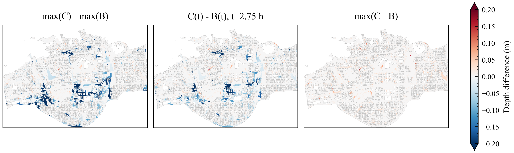
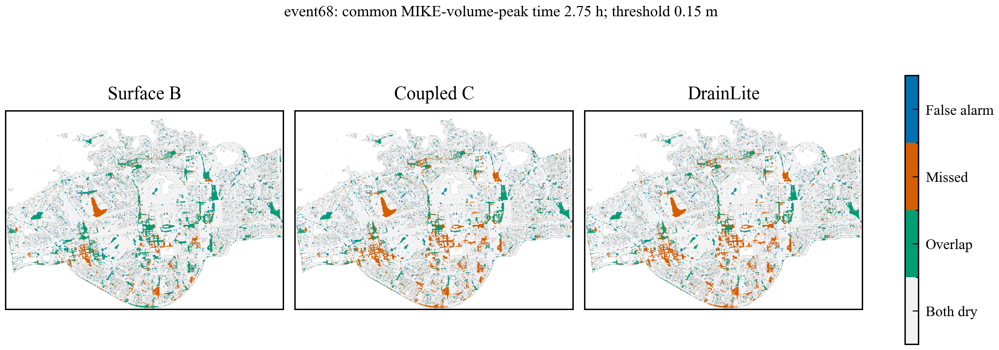

# DrainLite V5 evidence supplement

## Feature dictionary

| Feature | Unit | Calculation | Availability |
| --- | --- | --- | --- |
| surface_depth_mm | mm | 1000 B(t,x) | Contemporaneous surface-only field |
| rainfall_mm | mm/5 min | Released rainfall at t,x; not redistributed forcing | Current interval |
| cumulative_rainfall_mm | mm | Sum of released rainfall through t | Past and current rainfall |
| dem_m | m | Released DEM at x | Static |
| dem_slope | m/m | sqrt(gx^2+gy^2), numpy.gradient with 20 m spacing; wall gradients retained | Static |
| time_norm | 1 | (t+1)/72 for zero-based index t | Simulation clock |
| time_sin | 1 | sin(2 pi (t+1)/72) | Simulation clock |
| time_cos | 1 | cos(2 pi (t+1)/72) | Simulation clock |
| surface_depth_3x3_mean_mm | mm | 1000 K3*(B M)/(K3*M); zero if denominator is zero | Current B |
| surface_depth_7x7_mean_mm | mm | 1000 K7*(B M)/(K7*M) | Current B |
| drain_inlet_mask | 0/1 | One in active cells receiving a junction | Static |
| pipe_mask | 0/1 | One in active rasterised conduit cells | Static |
| drain_inlet_count | count | Number of junctions per active cell | Static |
| pipe_segment_count | count | Number of rasterised conduits visiting cell | Static |
| network_degree | count | Junction in-degree + out-degree; last junction wins if collocated | Static |
| pipe_density_3x3 | fraction | Uniform 3x3 pipe-mask mean; zero padding | Static |
| pipe_density_7x7 | fraction | Uniform 7x7 pipe-mask mean; zero padding | Static |
| inlet_density_7x7 | fraction | Uniform 7x7 inlet-mask mean; zero padding | Static |
| pipe_diameter | m | Maximum conduit diameter in cell | Static |
| pipe_slope | m/m | Arithmetic mean of slopes of visiting conduits, including offsets | Static |
| pipe_capacity | m3/s | Sum of Manning circular full-flow capacities: A(D/4)^(2/3) sqrt(S)/n | Static descriptor, not simulated flow |
| pipe_cover_depth | m | Mean endpoint cover for two-junction segments; node cover overwrites at junction cells | Static |
| capacity_density_7x7 | m3/s | Uniform 7x7 mean of summed capacity; zero padding | Static descriptor |

Conduits are sampled between endpoint grid indices using max(abs(delta row), abs(delta col))+1 linearly spaced points, rounded to nearest integer. Only in-bounds active cells are retained. Empty network cells are zero. Network inputs use numpy.nan_to_num with NaN mapped to zero; finite-array checks guard the published input. The surface mean uses mask normalisation, whereas static densities deliberately divide by the full kernel area. These descriptors are spatial summaries, not an alternative pipe solver. The current 2,276 coupled junctions occupy 2,276 distinct cells. The fitted prior is an additional predictor in mm, constructed from other events' C-B at the same cell and time.

## Rainfall reconciliation

| event | rectangle_km2 | active_km2 | inactive_proxy_km2 | nonfinite_dem_cells |
| --- | --- | --- | --- | --- |
| event1 | 89.60000000000001 | 42.2108 | 47.3892 | 0 |
| event20 | 89.60000000000001 | 42.2108 | 47.3892 | 0 |
| event65 | 89.60000000000001 | 42.2108 | 47.3892 | 0 |
| event66 | 89.60000000000001 | 42.2108 | 47.3892 | 0 |
| event67 | 89.60000000000001 | 42.2108 | 47.3892 | 0 |
| event68 | 89.60000000000001 | 42.2108 | 47.3892 | 0 |
| event69 | 89.60000000000001 | 42.2108 | 47.3892 | 0 |
| event70 | 89.60000000000001 | 42.2108 | 47.3892 | 0 |

| event | active_mean_total_mm | rectangle_mean_total_mm | raw_m3 | active_direct_m3 |
| --- | --- | --- | --- | --- |
| event1 | 23.516315495816148 | 23.204593295834325 | 2079131.5593067557 | 992642.4901307963 |
| event20 | 18.675267531081833 | 18.669881801719644 | 1672821.4094340801 | 788297.9827009891 |
| event65 | 24.615166811437362 | 24.171784052939206 | 2165791.8511433527 | 1039025.8832442202 |
| event66 | 25.947239044736296 | 25.730634950367467 | 2305464.891552925 | 1095253.7178695549 |
| event67 | 30.202772700273187 | 29.802417700099927 | 2670296.6259289533 | 1274883.1978966915 |
| event68 | 28.64342060733802 | 28.483451686874364 | 2552117.271143943 | 1209061.6985722238 |
| event69 | 27.525211785950273 | 27.029411604588468 | 2421835.279771127 | 1161861.2096543896 |
| event70 | 29.01476381097937 | 28.77255241394908 | 2578020.6962898374 | 1224736.392272488 |

| event | inactive_reassigned_m3 | injected_reconstructed_m3 | B_loss_m3 | C_loss_m3 |
| --- | --- | --- | --- | --- |
| event1 | 1086489.0691759593 | 2079131.5473588225 | 216591.17060327576 | 216366.78117551716 |
| event20 | 884523.4267330911 | 1672821.39928162 | 215209.63248080222 | 215018.28906270908 |
| event65 | 1126765.9678991304 | 2165791.864224041 | 243120.1110522032 | 243058.18999845837 |
| event66 | 1210211.1736833702 | 2305464.8872295674 | 244117.59013165397 | 244058.1379252334 |
| event67 | 1395413.428032262 | 2670296.623203429 | 247835.51332904352 | 247748.18573747046 |
| event68 | 1343055.5725717195 | 2552117.273145773 | 247232.47799703796 | 247142.75892084587 |
| event69 | 1259974.0701167372 | 2421835.291888452 | 246255.4364310414 | 246149.6843282382 |
| event70 | 1353284.3040173494 | 2578020.705474043 | 247379.13248048295 | 247285.1227998474 |

## Saved-time surface and exchange ledger

The archive contains cumulative values at 30-minute intervals, not every solver step. The table below gives six-hour totals. Positive forward exchange enters SWMM; positive return exchange leaves SWMM. Surface closure and the difference between independently accumulated exchange integrals must be read separately. No pipe-storage or terminal-discharge time series is invented. The complete saved-time ledger is water_ledger_saved_times.csv.

| event | scenario | rain_m3 | loss_m3 | surface_m3 | surface_closure_m3 |
| --- | --- | --- | --- | --- | --- |
| event1 | B | 2079131.5473588225 | 216591.17060327576 | 1862668.5947815287 | -128.21802598191425 |
| event1 | C | 2079131.5473588225 | 216366.78117551716 | 1245568.598860283 | -128.29953061812557 |
| event20 | B | 1672821.39928162 | 215209.63248080222 | 1457687.5705317194 | -75.80373090156354 |
| event20 | C | 1672821.39928162 | 215018.28906270908 | 1103083.2308029418 | -71.46177813620307 |
| event65 | B | 2165791.864224041 | 243120.1110522032 | 1922675.4512015388 | -3.6980297011323273 |
| event65 | C | 2165791.864224041 | 243058.18999845837 | 1362190.1329108102 | 0.6535983544308692 |
| event66 | B | 2305464.8872295674 | 244117.59013165397 | 2061350.3922647869 | -3.0951668734196573 |
| event66 | C | 2305464.8872295674 | 244058.1379252334 | 1442524.224113583 | 0.5876900493167341 |
| event67 | B | 2670296.623203429 | 247835.51332904352 | 2422462.282209962 | -1.1723355767317116 |
| event67 | C | 2670296.623203429 | 247748.18573747046 | 1499255.3198106063 | 0.07758186687715352 |
| event68 | B | 2552117.273145773 | 247232.47799703796 | 2304886.810986713 | -2.015837978105992 |
| event68 | C | 2552117.273145773 | 247142.75892084587 | 1448200.6791682236 | 1.1051976804155856 |
| event69 | B | 2421835.291888452 | 246255.4364310414 | 2175582.9065051666 | -3.051047755870968 |
| event69 | C | 2421835.291888452 | 246149.6843282382 | 1380076.9851031739 | 1.6861088073346764 |
| event70 | B | 2578020.705474043 | 247379.13248048295 | 2330642.7524804105 | -1.1794868507422507 |
| event70 | C | 2578020.705474043 | 247285.1227998474 | 1460853.7290347114 | 22.20162365026772 |

| event | scenario | surface_net_exchange_m3 | swmm_forward_exchange_m3 | swmm_return_exchange_m3 | exchange_integral_mismatch_m3 |
| --- | --- | --- | --- | --- | --- |
| event1 | B | 0.0 | 0.0 | 0.0 | 0.0 |
| event1 | C | 617324.4668536405 | 618893.8989374796 | 1648.6357824857114 | 79.20369864662644 |
| event20 | B | 0.0 | 0.0 | 0.0 | 0.0 |
| event20 | C | 354791.3411941054 | 354692.141892141 | -1.1641532182693481e-10 | 99.19930196425412 |
| event65 | B | 0.0 | 0.0 | 0.0 | 0.0 |
| event65 | C | 560542.887716418 | 560418.414221876 | 0.17786591104231775 | 124.65136045310646 |
| event66 | B | 0.0 | 0.0 | 0.0 | 0.0 |
| event66 | C | 618881.9375007016 | 618753.4444100781 | 4.851406619185582 | 133.34449724270962 |
| event67 | B | 0.0 | 0.0 | 0.0 | 0.0 |
| event67 | C | 923293.040073485 | 925897.3929708564 | 2696.0548885702156 | 91.70199119881727 |
| event68 | B | 0.0 | 0.0 | 0.0 | 0.0 |
| event68 | C | 856772.7298590228 | 858945.7825157277 | 2255.9257858428173 | 82.87312913790811 |
| event69 | B | 0.0 | 0.0 | 0.0 | 0.0 |
| event69 | C | 795606.936348233 | 797734.7710149152 | 2199.8739656984108 | 72.03929901623633 |
| event70 | B | 0.0 | 0.0 | 0.0 | 0.0 |
| event70 | C | 869859.6520158339 | 872112.1639667468 | 2334.677577877301 | 82.16562696441542 |

## Across-event and across-seed network gains

| event | seed_1907_gain_mm | seed_2718_gain_mm | seed_3141_gain_mm | seed_5772_gain_mm | seed_8119_gain_mm | seed_mean_gain_mm |
| --- | --- | --- | --- | --- | --- | --- |
| event1 | 0.061662912368774414 | 0.07502555847167969 | 0.06670951843261719 | 0.06858062744140625 | 0.07621407508850098 | 0.0696385383605957 |
| event20 | 0.10621047019958496 | 0.06816840171813965 | 0.10330891609191895 | 0.10230183601379395 | 0.08267855644226074 | 0.09253363609313965 |
| event65 | 0.08114886283874512 | 0.0934000015258789 | 0.08639407157897949 | 0.09473586082458496 | 0.08022761344909668 | 0.08718128204345703 |
| event66 | 0.07399272918701172 | 0.06335806846618652 | 0.08731555938720703 | 0.07303524017333984 | 0.07604694366455078 | 0.07474970817565918 |
| event67 | 0.01427769660949707 | 0.02427387237548828 | 0.02184581756591797 | 0.003887176513671875 | 0.0022933483123779297 | 0.013315582275390625 |
| event68 | 0.00024962425231933594 | 0.00042366981506347656 | -0.020188331604003906 | 0.01455068588256836 | -0.0004830360412597656 | -0.0010894775390625 |
| event69 | 0.024358153343200684 | 0.052443504333496094 | 0.039286017417907715 | 0.021840572357177734 | 0.024727821350097656 | 0.032531213760375974 |
| event70 | 0.03266716003417969 | 0.0005127191543579102 | -0.005211830139160156 | 0.0187680721282959 | 0.019881248474121094 | 0.013323473930358886 |

## Signed residual errors

Positive residual is not an independently identified surcharge flow. All counts are cell-times, not unique land area.

| event | subset | n_cell_times | active_cell_time_pct | mae_mm | bias_mm |
| --- | --- | --- | --- | --- | --- |
| event1 | net_negative_lt_minus5mm | 654260 | 8.61101371634221 | 17.63309097290039 | -4.115084171295166 |
| event1 | positive_gt5mm | 241789 | 3.1822951050968524 | 7.202901363372803 | -5.639542102813721 |
| event20 | net_negative_lt_minus5mm | 506889 | 6.6713968936859755 | 17.295278549194336 | -6.001902103424072 |
| event20 | positive_gt5mm | 119503 | 1.572833387558529 | 9.835638999938965 | -5.983149528503418 |
| event65 | net_negative_lt_minus5mm | 782047 | 10.292876599248428 | 14.73000717163086 | 3.6041407585144043 |
| event65 | positive_gt5mm | 262475 | 3.4545529685399106 | 7.566878318786621 | -4.707199573516846 |
| event66 | net_negative_lt_minus5mm | 817217 | 10.755764980631602 | 14.89147663116455 | 3.636434316635132 |
| event66 | positive_gt5mm | 275905 | 3.631311312639314 | 7.330359935760498 | -4.4908270835876465 |
| event67 | net_negative_lt_minus5mm | 901804 | 11.869052996442194 | 17.144874572753906 | 6.311272144317627 |
| event67 | positive_gt5mm | 327984 | 4.316746740960449 | 6.076767921447754 | -4.532792091369629 |
| event68 | net_negative_lt_minus5mm | 887449 | 11.680120306230211 | 12.832428932189941 | 1.0215444564819336 |
| event68 | positive_gt5mm | 342616 | 4.509325154278578 | 6.36810302734375 | -5.397876739501953 |
| event69 | net_negative_lt_minus5mm | 847254 | 11.1510956121814 | 13.484895706176758 | 1.2359528541564941 |
| event69 | positive_gt5mm | 290348 | 3.8214022109138996 | 4.670828819274902 | -2.586766242980957 |
| event70 | net_negative_lt_minus5mm | 888206 | 11.690083527859642 | 12.960941314697266 | 1.734512448310852 |
| event70 | positive_gt5mm | 326320 | 4.2948460794130625 | 5.650572299957275 | -4.421494007110596 |

| event | subset | max_abs_error_mm | wrong_sign_pct |
| --- | --- | --- | --- |
| event1 | net_negative_lt_minus5mm | 1004.3993530273438 | 3.8108702962125154 |
| event1 | positive_gt5mm | 234.61962890625 | 6.436190231979122 |
| event20 | net_negative_lt_minus5mm | 521.2002563476562 | 8.904119047759963 |
| event20 | positive_gt5mm | 266.02587890625 | 10.97461988401965 |
| event65 | net_negative_lt_minus5mm | 723.9044189453125 | 1.7134520048027804 |
| event65 | positive_gt5mm | 304.66009521484375 | 8.222116392037337 |
| event66 | net_negative_lt_minus5mm | 855.2701416015625 | 1.562008621944967 |
| event66 | positive_gt5mm | 277.0807800292969 | 7.8313187510193725 |
| event67 | net_negative_lt_minus5mm | 1346.8597412109375 | 0.8119280908046539 |
| event67 | positive_gt5mm | 265.5171203613281 | 4.561198107224743 |
| event68 | net_negative_lt_minus5mm | 1618.5247802734375 | 0.37647233812872627 |
| event68 | positive_gt5mm | 189.91741943359375 | 3.688093959418124 |
| event69 | net_negative_lt_minus5mm | 1082.66650390625 | 0.33956759130083775 |
| event69 | positive_gt5mm | 211.17453002929688 | 2.514224310138179 |
| event70 | net_negative_lt_minus5mm | 1072.0374755859375 | 0.3265008342659248 |
| event70 | positive_gt5mm | 201.27719116210938 | 3.190120127482226 |

## Volume trajectories and timing

Final-hour slope is a descriptive slope, not a calibrated recession constant. Rectangular five-minute integration is used for absolute volume-error integrals.

| event | model | volume_peak_h | mike_volume_peak_h | peak_time_difference_h | volume_rmse_vs_mike_m3 |
| --- | --- | --- | --- | --- | --- |
| event1 | B | 4.416666666666667 | 2.8333333333333335 | 1.5833333333333333 | 340416.1176191825 |
| event1 | C | 3.0 | 2.8333333333333335 | 0.16666666666666666 | 156872.57960840175 |
| event1 | DrainLite | 3.5 | 2.8333333333333335 | 0.6666666666666666 | 188298.29848544716 |
| event20 | B | 5.166666666666667 | 4.083333333333333 | 1.0833333333333333 | 644072.3545487972 |
| event20 | C | 4.0 | 4.083333333333333 | -0.08333333333333333 | 495222.1406713802 |
| event20 | DrainLite | 4.0 | 4.083333333333333 | -0.08333333333333333 | 461039.78734585305 |
| event65 | B | 6.0 | 1.0833333333333333 | 4.916666666666667 | 596600.361160304 |
| event65 | C | 5.25 | 1.0833333333333333 | 4.166666666666667 | 319328.62182566064 |
| event65 | DrainLite | 5.166666666666667 | 1.0833333333333333 | 4.083333333333333 | 309529.7327028922 |
| event66 | B | 6.0 | 1.0833333333333333 | 4.916666666666667 | 616656.7760013543 |
| event66 | C | 5.25 | 1.0833333333333333 | 4.166666666666667 | 324218.3018172328 |
| event66 | DrainLite | 5.166666666666667 | 1.0833333333333333 | 4.083333333333333 | 305581.44780928444 |
| event67 | B | 6.0 | 2.75 | 3.25 | 373913.17752543703 |
| event67 | C | 2.75 | 2.75 | 0.0 | 375816.6700015634 |
| event67 | DrainLite | 2.75 | 2.75 | 0.0 | 356752.56825873867 |
| event68 | B | 6.0 | 2.75 | 3.25 | 443360.3167875795 |
| event68 | C | 2.75 | 2.75 | 0.0 | 245934.28138848665 |
| event68 | DrainLite | 2.75 | 2.75 | 0.0 | 256247.8840741612 |
| event69 | B | 6.0 | 2.75 | 3.25 | 433628.1254075166 |
| event69 | C | 2.75 | 2.75 | 0.0 | 207927.21773436083 |
| event69 | DrainLite | 2.75 | 2.75 | 0.0 | 212398.05641569436 |
| event70 | B | 6.0 | 2.75 | 3.25 | 425098.43581838947 |
| event70 | C | 2.75 | 2.75 | 0.0 | 276086.5341237564 |
| event70 | DrainLite | 2.75 | 2.75 | 0.0 | 279181.73894799757 |

| event | model | last_hour_volume_slope_m3h | volume_bias_vs_C_mean_m3 | volume_error_vs_C_maxabs_m3 | volume_error_vs_C_integral_abs_m3h |
| --- | --- | --- | --- | --- | --- |
| event1 | B | -18086.462229268844 | 251246.2771034014 | 617099.9959212418 | 1507477.6626204085 |
| event1 | C | -96399.87440194123 | 0.0 | 0.0 | 0.0 |
| event1 | DrainLite | -62534.538895503 | -29528.224668664934 | 88547.9343951107 | 186311.51479413756 |
| event20 | B | -9801.25242055588 | 112813.6837465064 | 354604.33972877776 | 676882.1024790384 |
| event20 | C | -96880.9182374914 | 0.0 | 0.0 | 0.0 |
| event20 | DrainLite | -74484.98248049365 | -28847.677142284185 | 85121.45123184449 | 174420.48065232814 |
| event65 | B | 50615.34710817417 | 270267.30581327155 | 560485.3182907286 | 1621603.8348796293 |
| event65 | C | -56366.04642409821 | 0.0 | 0.0 | 0.0 |
| event65 | DrainLite | -67631.25861783544 | 5137.703835714013 | 38505.99169970909 | 98518.77982178055 |
| event66 | B | 56308.536889424555 | 299112.450954739 | 618826.1681512038 | 1794674.705728434 |
| event66 | C | -61030.08475269133 | 0.0 | 0.0 | 0.0 |
| event66 | DrainLite | -91094.73457050753 | 6664.114835048525 | 66564.74793108366 | 159232.95243476963 |
| event67 | B | 28257.362145613293 | 461265.23658821837 | 923206.9623993558 | 2767591.41952931 |
| event67 | C | -53094.69525489451 | 0.0 | 0.0 | 0.0 |
| event67 | DrainLite | -41439.890551325756 | 20994.526063506302 | 56802.64370036102 | 144920.31546042033 |
| event68 | B | 25276.908469112877 | 426383.56690574676 | 856686.1318184894 | 2558301.4014344807 |
| event68 | C | -49308.39275459697 | 0.0 | 0.0 | 0.0 |
| event68 | DrainLite | -47296.639797252385 | -8061.280133433713 | 26635.608098803554 | 58839.501167028844 |
| event69 | B | 22091.246880503775 | 397608.8413244845 | 795505.9214019927 | 2385653.047946907 |
| event69 | C | -47097.415580801775 | 0.0 | 0.0 | 0.0 |
| event69 | DrainLite | -48608.614513059125 | 311.6681296685564 | 26103.338357732166 | 55278.99417764332 |
| event70 | B | 25927.849185089235 | 435564.0102752852 | 869789.0234456991 | 2613384.0616517114 |
| event70 | C | -47078.758308088465 | 0.0 | 0.0 | 0.0 |
| event70 | DrainLite | -48951.05644033392 | -1287.5427786911273 | 16810.790495980764 | 36147.467888651896 |

## Display bounds and tails

Threshold columns apply to the named field; only rows named error describe prediction-error tails.

| event | field | time_h | display_abs_bound_m | clipped_pct | min_m |
| --- | --- | --- | --- | --- | --- |
| event1 | B | 3.0 | 0.5 | 0.528774626398931 | 6.428585766116157e-05 |
| event1 | C_minus_B | 3.0 | 0.2 | 0.35820216627024365 | -1.5987751483917236 |
| event1 | pred_minus_B | 3.0 | 0.2 | 0.6794469661792716 | -1.281444787979126 |
| event1 | error | 3.0 | 0.2 | 0.084338605285851 | -0.35164451599121094 |
| event20 | B | 4.0 | 0.5 | 0.2151108247178447 | 0.00021290325094014406 |
| event20 | C_minus_B | 4.0 | 0.2 | 0.14309134155239892 | -1.1150847673416138 |
| event20 | pred_minus_B | 4.0 | 0.2 | 0.17057246012868746 | -1.181192398071289 |
| event20 | error | 4.0 | 0.2 | 0.015161996455883328 | -0.4152621626853943 |
| event65 | B | 5.25 | 0.5 | 0.7685236953575862 | 2.0751773263327777e-05 |
| event65 | C_minus_B | 5.25 | 0.2 | 1.6564481128052537 | -1.750544786453247 |
| event65 | pred_minus_B | 5.25 | 0.2 | 1.7957489552436818 | -1.1740772724151611 |
| event65 | error | 5.25 | 0.2 | 0.00947624778492708 | -0.23511876165866852 |
| event66 | B | 5.25 | 0.5 | 0.8159049342822217 | 2.3660026272409596e-05 |
| event66 | C_minus_B | 5.25 | 0.2 | 1.995697783505643 | -1.7951658964157104 |
| event66 | pred_minus_B | 5.25 | 0.2 | 2.1662702436343304 | -1.2970112562179565 |
| event66 | error | 5.25 | 0.2 | 0.011371497341912496 | -0.2513996660709381 |
| event67 | B | 2.75 | 0.5 | 1.1068257412794829 | 9.28855879465118e-05 |
| event67 | C_minus_B | 2.75 | 0.2 | 1.5124091464743619 | -1.878380298614502 |
| event67 | pred_minus_B | 2.75 | 0.2 | 1.3721606792574412 | -1.2981373071670532 |
| event67 | error | 2.75 | 0.2 | 0.030323992911766656 | -0.3270007371902466 |
| event68 | B | 2.75 | 0.5 | 0.9106674121314924 | 8.870556484907866e-05 |
| event68 | C_minus_B | 2.75 | 0.2 | 1.349417684573616 | -1.793360948562622 |
| event68 | pred_minus_B | 2.75 | 0.2 | 1.3797416774853828 | -1.0836429595947266 |
| event68 | error | 2.75 | 0.2 | 0.020847745126839578 | -0.3186982572078705 |
| event69 | B | 2.75 | 0.5 | 0.8462289271939883 | 8.207270002458245e-05 |
| event69 | C_minus_B | 2.75 | 0.2 | 1.2925601978640537 | -1.7843581438064575 |
| event69 | pred_minus_B | 2.75 | 0.2 | 1.1504164810901476 | -1.342987298965454 |
| event69 | error | 2.75 | 0.2 | 0.011371497341912496 | -0.3389068841934204 |
| event70 | B | 2.75 | 0.5 | 0.9438342793787371 | 8.952220377977937e-05 |
| event70 | C_minus_B | 2.75 | 0.2 | 1.3901655500488026 | -1.8154338598251343 |
| event70 | pred_minus_B | 2.75 | 0.2 | 1.4091180456186567 | -1.3159208297729492 |
| event70 | error | 2.75 | 0.2 | 0.021795369905332287 | -0.31251060962677 |

| event | field | max_m | abs_gt_50mm_pct | abs_gt_100mm_pct | abs_gt_200mm_pct |
| --- | --- | --- | --- | --- | --- |
| event1 | B | 3.19879150390625 | 24.087674244506147 | 14.535616477299648 | 5.031887573796279 |
| event1 | C_minus_B | 0.15891188383102417 | 3.7601751210590653 | 1.5323092668227087 | 0.35820216627024365 |
| event1 | pred_minus_B | 0.05044245719909668 | 5.0934831843983055 | 2.2259706046793712 | 0.6794469661792716 |
| event1 | error | 0.4464743435382843 | 1.5076710225818986 | 0.3534640423777801 | 0.084338605285851 |
| event20 | B | 2.6056466102600098 | 21.452329735517925 | 9.956693547622884 | 2.5453201550314137 |
| event20 | C_minus_B | 0.07438862323760986 | 1.7862727074587545 | 0.4842362618097738 | 0.14309134155239892 |
| event20 | pred_minus_B | 0.030451133847236633 | 3.1072616486775892 | 0.8481241767509737 | 0.17057246012868746 |
| event20 | error | 0.34396207332611084 | 0.892662541340131 | 0.16393908667923848 | 0.015161996455883328 |
| event65 | B | 3.4067070484161377 | 23.348526917281834 | 15.89735328399367 | 6.473224861883689 |
| event65 | C_minus_B | 0.080777607858181 | 6.79920778568518 | 4.008452813024155 | 1.6564481128052537 |
| event65 | pred_minus_B | 0.03848540782928467 | 7.08633809356847 | 4.47563182882106 | 1.7957489552436818 |
| event65 | error | 0.6418855786323547 | 0.8888720422261601 | 0.19521070436949786 | 0.00947624778492708 |
| event66 | B | 3.4788103103637695 | 24.20897021615321 | 17.397443308347626 | 7.630274716423285 |
| event66 | C_minus_B | 0.09008249640464783 | 7.328930036862603 | 4.6111421721455175 | 1.995697783505643 |
| event66 | pred_minus_B | 0.04011571407318115 | 7.872866659717419 | 5.335127502913947 | 2.1662702436343304 |
| event66 | error | 0.6717064380645752 | 0.8291716811811196 | 0.19426307959100514 | 0.011371497341912496 |
| event67 | B | 3.743831157684326 | 26.3032209766221 | 19.143915775109686 | 8.594009116150369 |
| event67 | C_minus_B | 0.15973486006259918 | 7.059804599770675 | 4.021719559923053 | 1.5124091464743619 |
| event67 | pred_minus_B | 0.05499058961868286 | 6.299809527419523 | 3.7431178750461966 | 1.3721606792574412 |
| event67 | error | 0.6303362846374512 | 0.9589962758346205 | 0.19331545481251244 | 0.030323992911766656 |
| event68 | B | 3.562718629837036 | 25.997138173168956 | 18.611350649596787 | 8.07660598709335 |
| event68 | C_minus_B | 0.16452491283416748 | 6.741402674197125 | 3.6568840202033606 | 1.349417684573616 |
| event68 | pred_minus_B | 0.054155826568603516 | 6.267590284950771 | 3.7033176343495033 | 1.3797416774853828 |
| event68 | error | 0.7835773229598999 | 0.5401461237408436 | 0.14972471500184786 | 0.020847745126839578 |
| event69 | B | 3.5369489192962646 | 25.011608403536535 | 17.207918352649084 | 7.256910553697159 |
| event69 | C_minus_B | 0.16504907608032227 | 6.038265088555535 | 3.3422725937437816 | 1.2925601978640537 |
| event69 | pred_minus_B | 0.05481690168380737 | 5.539814455068371 | 3.3470107176362442 | 1.1504164810901476 |
| event69 | error | 0.44443440437316895 | 0.5031887573796279 | 0.07580998227941664 | 0.011371497341912496 |
| event70 | B | 3.611003875732422 | 26.061576658106457 | 18.63030314516664 | 8.170420840164129 |
| event70 | C_minus_B | 0.1691642701625824 | 6.837112776824888 | 3.7563846219450947 | 1.3901655500488026 |
| event70 | pred_minus_B | 0.05429753661155701 | 6.2401091663744825 | 3.6559363954248676 | 1.4091180456186567 |
| event70 | error | 0.5006462931632996 | 0.6472277237105196 | 0.15541046367280412 | 0.021795369905332287 |

## Conditional subset support

| Event | Subset | Cell-times | Active % | MAE mm |
| --- | --- | --- | --- | --- |
| event1 | all_active | 7597944 | 100.0 | 2.245790958404541 |
| event1 | target_wet_0p03m | 1291340 | 16.995913631371856 | 10.129962921142578 |
| event1 | target_wet_0p15m | 304579 | 4.008702880674035 | 15.476371765136719 |
| event1 | wet_either_0p03m | 1409968 | 18.557230745580647 | 10.653377532958984 |
| event1 | effect_abs_over_1mm | 1570071 | 20.66441921656701 | 9.755302429199219 |
| event1 | net_drainage_over_1mm | 963819 | 12.685260644195324 | 13.203367233276367 |
| event1 | positive_residual_over_1mm | 606252 | 7.979158572371683 | 4.273573398590088 |
| event1 | effect_abs_over_5mm | 896049 | 11.793308821439062 | 14.818618774414062 |
| event1 | net_drainage_over_5mm | 654260 | 8.61101371634221 | 17.63309097290039 |
| event1 | positive_residual_over_5mm | 241789 | 3.1822951050968524 | 7.202901363372803 |
| event1 | effect_abs_over_10mm | 661920 | 8.71183046360963 | 18.044424057006836 |
| event1 | net_drainage_over_10mm | 539221 | 7.096933065050229 | 19.863191604614258 |
| event1 | positive_residual_over_10mm | 122699 | 1.6148973985593997 | 10.051538467407227 |
| event1 | near_inlet_0_20m | 163872 | 2.1567939958494033 | 4.218630313873291 |
| event1 | near_inlet_20_60m | 1650312 | 21.72050754783136 | 3.5119645595550537 |
| event1 | near_inlet_60_100m | 1296936 | 17.06956513498915 | 2.6845054626464844 |
| event1 | near_inlet_100_infm | 4486824 | 59.05313332133009 | 1.5812097787857056 |
| event1 | near_pipe_0_20m | 589536 | 7.759151686298293 | 4.043787479400635 |
| event1 | near_pipe_20_60m | 1712232 | 22.53546485733509 | 3.1739261150360107 |
| event1 | near_pipe_60_100m | 1041552 | 13.708340045675515 | 2.487098217010498 |
| event1 | near_pipe_100_infm | 4254624 | 55.997043410691106 | 1.5640619993209839 |
| event20 | all_active | 7597944 | 100.0 | 2.1207780838012695 |
| event20 | target_wet_0p03m | 1099047 | 14.465057915667712 | 10.777276992797852 |
| event20 | target_wet_0p15m | 157302 | 2.070323234811944 | 19.107192993164062 |
| event20 | wet_either_0p03m | 1222127 | 16.08496982867997 | 10.792914390563965 |
| event20 | effect_abs_over_1mm | 1298061 | 17.084371772153098 | 10.179698944091797 |
| event20 | net_drainage_over_1mm | 868164 | 11.426301641601992 | 12.469077110290527 |
| event20 | positive_residual_over_1mm | 429897 | 5.658070130551107 | 5.556365013122559 |
| event20 | effect_abs_over_5mm | 626392 | 8.244230281244505 | 15.8721284866333 |
| event20 | net_drainage_over_5mm | 506889 | 6.671396893685976 | 17.295278549194336 |
| event20 | positive_residual_over_5mm | 119503 | 1.572833387558529 | 9.835639953613281 |
| event20 | effect_abs_over_10mm | 424374 | 5.585379413167562 | 18.81374740600586 |
| event20 | net_drainage_over_10mm | 373891 | 4.920949667436348 | 19.534961700439453 |
| event20 | positive_residual_over_10mm | 50483 | 0.6644297457312136 | 13.472233772277832 |
| event20 | near_inlet_0_20m | 163872 | 2.1567939958494033 | 3.256046772003174 |
| event20 | near_inlet_20_60m | 1650312 | 21.72050754783136 | 3.1542341709136963 |
| event20 | near_inlet_60_100m | 1296936 | 17.06956513498915 | 2.5145928859710693 |
| event20 | near_inlet_100_infm | 4486824 | 59.05313332133009 | 1.585362434387207 |
| event20 | near_pipe_0_20m | 589536 | 7.759151686298293 | 3.407017469406128 |
| event20 | near_pipe_20_60m | 1712232 | 22.53546485733509 | 2.931978702545166 |
| event20 | near_pipe_60_100m | 1041552 | 13.708340045675515 | 2.3243672847747803 |
| event20 | near_pipe_100_infm | 4254624 | 55.997043410691106 | 1.5662530660629272 |
| event65 | all_active | 7597944 | 100.0 | 2.217952013015747 |
| event65 | target_wet_0p03m | 1588505 | 20.907037482771656 | 7.78990364074707 |
| event65 | target_wet_0p15m | 313220 | 4.1224310155484165 | 13.411247253417969 |
| event65 | wet_either_0p03m | 1735210 | 22.837888776226833 | 8.691130638122559 |
| event65 | effect_abs_over_1mm | 1880287 | 24.747313220523868 | 8.272703170776367 |
| event65 | net_drainage_over_1mm | 1169781 | 15.396020291805257 | 10.730280876159668 |
| event65 | positive_residual_over_1mm | 710506 | 9.35129292871861 | 4.226531028747559 |
| event65 | effect_abs_over_5mm | 1044522 | 13.74742956778834 | 12.930004119873047 |
| event65 | net_drainage_over_5mm | 782047 | 10.292876599248428 | 14.730008125305176 |
| event65 | positive_residual_over_5mm | 262475 | 3.45455296853991 | 7.566878795623779 |
| event65 | effect_abs_over_10mm | 768200 | 10.11062992830692 | 15.872427940368652 |
| event65 | net_drainage_over_10mm | 648117 | 8.530162896699423 | 16.735530853271484 |
| event65 | positive_residual_over_10mm | 120083 | 1.580467031607498 | 11.214061737060547 |
| event65 | near_inlet_0_20m | 163872 | 2.1567939958494033 | 4.857062339782715 |
| event65 | near_inlet_20_60m | 1650312 | 21.72050754783136 | 3.5494747161865234 |
| event65 | near_inlet_60_100m | 1296936 | 17.06956513498915 | 2.602726936340332 |
| event65 | near_inlet_100_infm | 4486824 | 59.05313332133009 | 1.5205916166305542 |
| event65 | near_pipe_0_20m | 589536 | 7.759151686298293 | 4.210177898406982 |
| event65 | near_pipe_20_60m | 1712232 | 22.53546485733509 | 3.161874294281006 |
| event65 | near_pipe_60_100m | 1041552 | 13.708340045675515 | 2.4683852195739746 |
| event65 | near_pipe_100_infm | 4254624 | 55.997043410691106 | 1.5007226467132568 |
| event66 | all_active | 7597944 | 100.0 | 2.292654037475586 |
| event66 | target_wet_0p03m | 1642467 | 21.617255931341425 | 7.86324405670166 |
| event66 | target_wet_0p15m | 345695 | 4.549849275014399 | 12.230406761169434 |
| event66 | wet_either_0p03m | 1788417 | 23.538170326077687 | 8.747039794921875 |
| event66 | effect_abs_over_1mm | 1938104 | 25.508269079108768 | 8.342324256896973 |
| event66 | net_drainage_over_1mm | 1206081 | 15.873781117628663 | 10.917603492736816 |
| event66 | positive_residual_over_1mm | 732023 | 9.634487961480106 | 4.0992937088012695 |
| event66 | effect_abs_over_5mm | 1093122 | 14.387076293270917 | 12.983043670654297 |
| event66 | net_drainage_over_5mm | 817217 | 10.755764980631602 | 14.89147663116455 |
| event66 | positive_residual_over_5mm | 275905 | 3.631311312639314 | 7.3303608894348145 |
| event66 | effect_abs_over_10mm | 810077 | 10.661792190097742 | 15.922419548034668 |
| event66 | net_drainage_over_10mm | 682107 | 8.977520760879521 | 16.879789352416992 |
| event66 | positive_residual_over_10mm | 127970 | 1.6842714292182202 | 10.819449424743652 |
| event66 | near_inlet_0_20m | 163872 | 2.1567939958494033 | 5.258212566375732 |
| event66 | near_inlet_20_60m | 1650312 | 21.72050754783136 | 3.6900722980499268 |
| event66 | near_inlet_60_100m | 1296936 | 17.06956513498915 | 2.7230303287506104 |
| event66 | near_inlet_100_infm | 4486824 | 59.05313332133009 | 1.5459524393081665 |
| event66 | near_pipe_0_20m | 589536 | 7.759151686298293 | 4.502488613128662 |
| event66 | near_pipe_20_60m | 1712232 | 22.53546485733509 | 3.2666893005371094 |
| event66 | near_pipe_60_100m | 1041552 | 13.708340045675515 | 2.584455728530884 |
| event66 | near_pipe_100_infm | 4254624 | 55.997043410691106 | 1.5230257511138916 |
| event67 | all_active | 7597944 | 100.0 | 2.559483528137207 |
| event67 | target_wet_0p03m | 1636952 | 21.544670505599935 | 8.47226619720459 |
| event67 | target_wet_0p15m | 487406 | 6.414972260916901 | 12.936527252197266 |
| event67 | wet_either_0p03m | 1811312 | 23.83950184418311 | 10.005597114562988 |
| event67 | effect_abs_over_1mm | 1993035 | 26.23124097782242 | 9.348690032958984 |
| event67 | net_drainage_over_1mm | 1229454 | 16.181403811346858 | 13.001925468444824 |
| event67 | positive_residual_over_1mm | 763581 | 10.049837166475562 | 3.4665558338165283 |
| event67 | effect_abs_over_5mm | 1229788 | 16.185799737402643 | 14.193014144897461 |
| event67 | net_drainage_over_5mm | 901804 | 11.869052996442196 | 17.144872665405273 |
| event67 | positive_residual_over_5mm | 327984 | 4.31674674096045 | 6.076767444610596 |
| event67 | effect_abs_over_10mm | 946161 | 12.452855667269988 | 17.47842025756836 |
| event67 | net_drainage_over_10mm | 770011 | 10.134465323777064 | 19.527130126953125 |
| event67 | positive_residual_over_10mm | 176150 | 2.318390343492924 | 8.522809982299805 |
| event67 | near_inlet_0_20m | 163872 | 2.1567939958494033 | 5.673966407775879 |
| event67 | near_inlet_20_60m | 1650312 | 21.72050754783136 | 4.24412727355957 |
| event67 | near_inlet_60_100m | 1296936 | 17.06956513498915 | 2.9656763076782227 |
| event67 | near_inlet_100_infm | 4486824 | 59.05313332133009 | 1.7086879014968872 |
| event67 | near_pipe_0_20m | 589536 | 7.759151686298293 | 4.975330352783203 |
| event67 | near_pipe_20_60m | 1712232 | 22.53546485733509 | 3.7550177574157715 |
| event67 | near_pipe_60_100m | 1041552 | 13.708340045675515 | 2.7146687507629395 |
| event67 | near_pipe_100_infm | 4254624 | 55.997043410691106 | 1.7056137323379517 |
| event68 | all_active | 7597944 | 100.0 | 2.047645330429077 |
| event68 | target_wet_0p03m | 1622214 | 21.35069697802458 | 7.058807849884033 |
| event68 | target_wet_0p15m | 467690 | 6.155481009072981 | 10.6428861618042 |
| event68 | wet_either_0p03m | 1791314 | 23.57629906195676 | 7.936159133911133 |
| event68 | effect_abs_over_1mm | 1990293 | 26.195152267508156 | 7.400717258453369 |
| event68 | net_drainage_over_1mm | 1214510 | 15.984719023988594 | 9.78325366973877 |
| event68 | positive_residual_over_1mm | 775783 | 10.210433243519562 | 3.670788526535034 |
| event68 | effect_abs_over_5mm | 1230065 | 16.18944546050879 | 11.031888961791992 |
| event68 | net_drainage_over_5mm | 887449 | 11.680120306230211 | 12.832429885864258 |
| event68 | positive_residual_over_5mm | 342616 | 4.509325154278579 | 6.36810302734375 |
| event68 | effect_abs_over_10mm | 944501 | 12.431007651543629 | 13.407852172851562 |
| event68 | net_drainage_over_10mm | 754442 | 9.929554626883272 | 14.545117378234863 |
| event68 | positive_residual_over_10mm | 190059 | 2.5014530246603557 | 8.89346981048584 |
| event68 | near_inlet_0_20m | 163872 | 2.1567939958494033 | 4.969078063964844 |
| event68 | near_inlet_20_60m | 1650312 | 21.72050754783136 | 3.3390626907348633 |
| event68 | near_inlet_60_100m | 1296936 | 17.06956513498915 | 2.3492648601531982 |
| event68 | near_inlet_100_infm | 4486824 | 59.05313332133009 | 1.3787617683410645 |
| event68 | near_pipe_0_20m | 589536 | 7.759151686298293 | 4.178565979003906 |
| event68 | near_pipe_20_60m | 1712232 | 22.53546485733509 | 2.933948040008545 |
| event68 | near_pipe_60_100m | 1041552 | 13.708340045675515 | 2.1610500812530518 |
| event68 | near_pipe_100_infm | 4254624 | 55.997043410691106 | 1.367931604385376 |
| event69 | all_active | 7597944 | 100.0 | 1.9361737966537476 |
| event69 | target_wet_0p03m | 1576342 | 20.74695470248267 | 6.794119834899902 |
| event69 | target_wet_0p15m | 433909 | 5.710873889041562 | 10.109517097473145 |
| event69 | wet_either_0p03m | 1742764 | 22.937310409237025 | 7.751852989196777 |
| event69 | effect_abs_over_1mm | 1891308 | 24.892365618909537 | 7.329116344451904 |
| event69 | net_drainage_over_1mm | 1178778 | 15.514433904751074 | 10.114795684814453 |
| event69 | positive_residual_over_1mm | 712530 | 9.377931714158462 | 2.7206149101257324 |
| event69 | effect_abs_over_5mm | 1137602 | 14.972497823095301 | 11.235299110412598 |
| event69 | net_drainage_over_5mm | 847254 | 11.1510956121814 | 13.484896659851074 |
| event69 | positive_residual_over_5mm | 290348 | 3.8214022109138996 | 4.670828819274902 |
| event69 | effect_abs_over_10mm | 867455 | 11.41697016982489 | 13.869034767150879 |
| event69 | net_drainage_over_10mm | 715416 | 9.415915674029712 | 15.437742233276367 |
| event69 | positive_residual_over_10mm | 152039 | 2.001054495795178 | 6.487521171569824 |
| event69 | near_inlet_0_20m | 163872 | 2.1567939958494033 | 4.626025676727295 |
| event69 | near_inlet_20_60m | 1650312 | 21.72050754783136 | 3.355694055557251 |
| event69 | near_inlet_60_100m | 1296936 | 17.06956513498915 | 2.338989019393921 |
| event69 | near_inlet_100_infm | 4486824 | 59.05313332133009 | 1.1993792057037354 |
| event69 | near_pipe_0_20m | 589536 | 7.759151686298293 | 4.025074005126953 |
| event69 | near_pipe_20_60m | 1712232 | 22.53546485733509 | 2.9490644931793213 |
| event69 | near_pipe_60_100m | 1041552 | 13.708340045675515 | 2.1530003547668457 |
| event69 | near_pipe_100_infm | 4254624 | 55.997043410691106 | 1.1860201358795166 |
| event70 | all_active | 7597944 | 100.0 | 2.0126914978027344 |
| event70 | target_wet_0p03m | 1622383 | 21.352921263962987 | 6.829821586608887 |
| event70 | target_wet_0p15m | 470660 | 6.194570531185805 | 10.609872817993164 |
| event70 | wet_either_0p03m | 1793676 | 23.607386419273425 | 7.804935455322266 |
| event70 | effect_abs_over_1mm | 1971064 | 25.94207064437432 | 7.349786758422852 |
| event70 | net_drainage_over_1mm | 1215624 | 15.999380885144719 | 9.890152931213379 |
| event70 | positive_residual_over_1mm | 755440 | 9.942689759229602 | 3.2619316577911377 |
| event70 | effect_abs_over_5mm | 1214526 | 15.984929607272704 | 10.996785163879395 |
| event70 | net_drainage_over_5mm | 888206 | 11.690083527859642 | 12.960941314697266 |
| event70 | positive_residual_over_5mm | 326320 | 4.2948460794130625 | 5.650571823120117 |
| event70 | effect_abs_over_10mm | 933618 | 12.287771533983404 | 13.40543270111084 |
| event70 | net_drainage_over_10mm | 756569 | 9.957549042214579 | 14.68237590789795 |
| event70 | positive_residual_over_10mm | 177049 | 2.3302224917688257 | 7.948777675628662 |
| event70 | near_inlet_0_20m | 163872 | 2.1567939958494033 | 4.848456382751465 |
| event70 | near_inlet_20_60m | 1650312 | 21.72050754783136 | 3.3318636417388916 |
| event70 | near_inlet_60_100m | 1296936 | 17.06956513498915 | 2.357954740524292 |
| event70 | near_inlet_100_infm | 4486824 | 59.05313332133009 | 1.324112892150879 |
| event70 | near_pipe_0_20m | 589536 | 7.759151686298293 | 4.115680694580078 |
| event70 | near_pipe_20_60m | 1712232 | 22.53546485733509 | 2.939002275466919 |
| event70 | near_pipe_60_100m | 1041552 | 13.708340045675515 | 2.1506824493408203 |
| event70 | near_pipe_100_infm | 4254624 | 55.997043410691106 | 1.3147281408309937 |

**Supplementary Figure S1. Only the middle panel is an instantaneous C-B field. All use fixed +/-0.2 m display limits; extreme values remain in statistics.**

**Supplementary Figure S2. Event68 at the MIKE surface-volume peak. Green is shared inundation, orange is missed relative to MIKE, blue is false alarm and pale grey is jointly dry. These are disagreements with a model, not observed flooding errors.**
