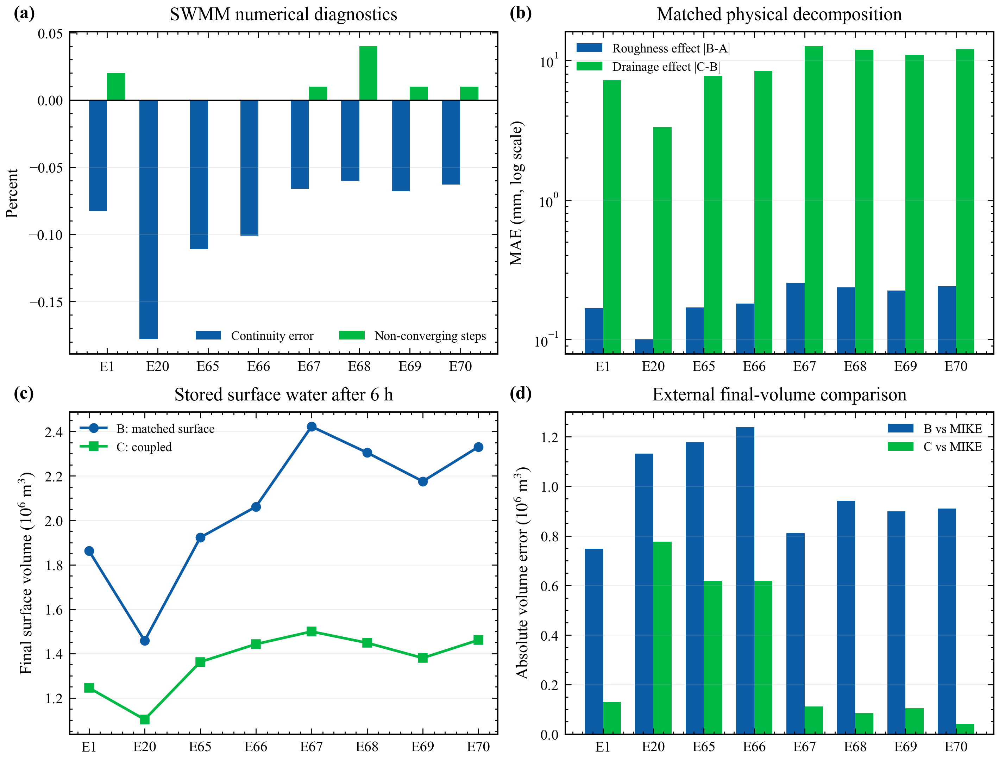
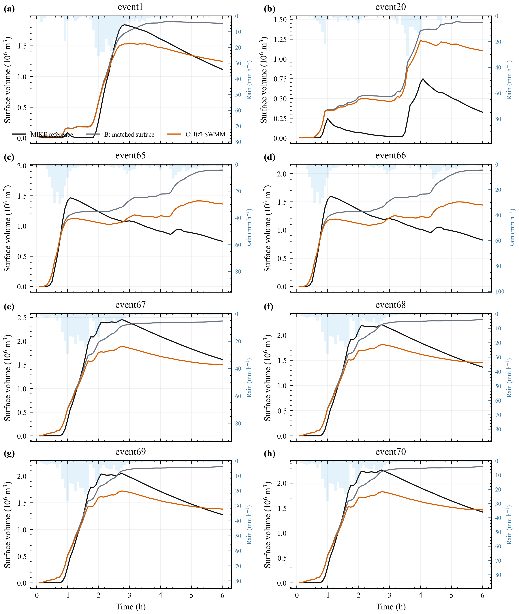
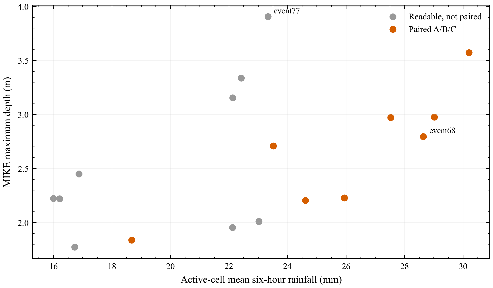

# 固定概化排水管网影响的轻量残差模拟科研报告

## 目录

1. 摘要  
2. 研究背景与问题界定  
3. 数据、物理模型与质量控制  
4. DrainLite 方法与验证设计  
5. 结果及逐图解读  
6. 讨论、结论与下一步工作  

## 摘要

本报告记录一条可审计的研究链：先用匹配的地表对照和 Itzï-SWMM 双向耦合计算得到“同一场降雨、同一地形下，管网使水深发生了多少变化”，再用轻量梯度提升模型模拟这一有符号变化。这里的 DrainLite 不是从降雨直接生成洪水图的独立预报器；它接收当前时刻的无管网 Itzï 水深 B，并预测耦合水深 C 与 B 的差值。八场六小时事件均在 20 米、72 时步、400 x 560 全域网格上计算。

物理结果表明，管网效应 |C-B| 平均为 9.266 毫米，而为匹配耦合设置引入的局部糙率效应 |B-A| 仅为 0.197 毫米。留一事件验证中，B 相对 C 的平均绝对误差为 9.266 毫米；事件排除的时空先验将其降到 3.226 毫米，加入当前水深和降雨后降到 2.217 毫米，完整静态管网模型为 2.169 毫米。五个空间采样种子下，静态管网字段的平均增量为 0.048 +/- 0.002 毫米。该增量较小，但最终模型的错位、块打乱和整组置换均使误差上升，说明正确空间位置确实提供了信息。

## 1. 研究背景与问题界定

城市暴雨积水由地表汇流和地下排水共同决定。地表二维模型回答“雨水如何沿地形和道路传播”，一维管网模型回答“雨水如何经检查井和管道输送并排出”。原 LarNO 工作解决的是大范围、高分辨率洪水场的快速学习问题；本研究关注更具体的缺口：当上游模型没有把可修改的管网作为显式条件时，能否用一个本机可训练的小模型补充指定管网的影响。

这一问题必须严格限定。当前模型使用一个由道路对齐、地形约束和水力规则构造的概化网络，而不是真实城市管网；八场事件共享同一网络；DrainLite 还需要同一时刻的 B 水深。因此本研究证明的是“固定网络上的跨降雨事件残差模拟”，不是“对任意城市管网都能泛化”，也不是已经完成的“降雨到洪水的组合计算 LarNO-DrainLite”。

**Figure 1. Residual learning with an offline archive. The prior requires C-B labels from other historical events at each cell and simulation time. Both the outer test event and each fitting row's own event are excluded from its prior. Current B, rainfall, terrain and fixed network fields enter the estimator; current-event C is used only for held-event scoring.**

## 2. 数据、物理模型与质量控制

### 2.1 计算区域和事件

完整区域为 400 x 560 个 20 米网格，即约 8.0 x 11.2 千米。评价掩膜含 105,527 个活动网格，面积约 42.21 平方千米。每场事件有 72 幅五分钟水深图，总时长六小时。八场配对事件为 event1、event20 和 event65-event70。选择依据是本地存在完整的 A/B/C 匹配计算，而不是根据 DrainLite 表现挑选。完整公共事件严重度背景见图 9 和附表。

### 2.2 概化网络

网络沿 OpenStreetMap 道路几何布置，并使用地形高程设置管底和坡向。最终网络含 2,276 个节点、2,276 条管段和 221 个接收边界。所有节点都有有向路径通往排放口；没有孤立节点、回路、重复端点管段、反坡管段或管顶高于节点地面的情况。这些检查说明网络内部可运行，但不能把它写成深圳真实管网。

**Figure 2. Conceptual-network maps. (a) Terrain, active-mask edge, selected link directions and outfall-connected terminal junctions; these are not surveyed river mouths or actual outfall coordinates. (b) Conduit diameter. (c) Junction degree. OpenStreetMap contributors provided the road geometry. Numeric slope and cover diagnostics are retained in the evidence supplement.**

### 2.3 A/B/C 物理对照

A 是原始地表方案；B 在入口附近采用与耦合运行相同的局部糙率，但不开启管网；C 在 B 的基础上启用 Itzï 25.4 内置的 DrainageSimulation，并由 SWMM 5.2.4 动力波求解管网。这样，B-A 是糙率改变造成的差异，C-B 才是地下管网交换造成的差异。C-B 允许为正，因为满管或局部回流可能让某些地表网格变深。

### 2.4 验收阈值

每场运行必须同时满足：数组为 72 x 400 x 560 且无 NaN/Inf；所有节点可达排放口；SWMM 流量连续性误差绝对值不超过 2%；不收敛步比例不超过 2%；地表-管网合并水量误差绝对值不超过降雨量的 0.5%；SWMM flooding loss、warning 和 error 均为零。

**Table 1. Physical quality of the eight paired events.**

| Event | Rain volume (10^6 m3) | \|B-A\| MAE (mm) | \|C-B\| MAE (mm) | Mean C-B (mm) | Routing continuity (%) | Non-converging (%) | Combined mass error (% rain) | Status |
| --- | --- | --- | --- | --- | --- | --- | --- | --- |
| event1 | 2.079 | 0.168 | 7.200 | -5.952 | -0.083 | 0.020 | -0.100 | Accepted |
| event20 | 1.673 | 0.101 | 3.322 | -2.673 | -0.178 | 0.000 | -0.032 | Accepted |
| event65 | 2.166 | 0.170 | 7.696 | -6.403 | -0.111 | 0.000 | -0.017 | Accepted |
| event66 | 2.305 | 0.181 | 8.431 | -7.086 | -0.101 | 0.000 | -0.015 | Accepted |
| event67 | 2.670 | 0.255 | 12.631 | -10.928 | -0.066 | 0.010 | -0.111 | Accepted |
| event68 | 2.552 | 0.236 | 11.914 | -10.101 | -0.060 | 0.040 | -0.097 | Accepted |
| event69 | 2.422 | 0.224 | 10.912 | -9.420 | -0.068 | 0.010 | -0.101 | Accepted |
| event70 | 2.578 | 0.240 | 12.023 | -10.319 | -0.063 | 0.010 | -0.098 | Accepted |

**Figure 3. 八场物理标签质量。子图 (a) 是数值连续性和不收敛步；子图 (b) 比较管网效应与糙率效应；子图 (c) 比较六小时地表存水量；子图 (d) 把最终水量与 MIKE 参照比较。**

**图 3 逐项解释。** 子图 (a) 的柱越接近零越好；连续性误差有正负号，但验收看绝对值。子图 (b) 用对数纵轴，管网效应柱普遍远高于糙率效应柱，说明结果不是靠入口附近降低糙率“制造”出来的。子图 (c) 中 C 低于 B 表示管网把一部分水从地表系统中输送出去。子图 (d) 只比较最终总体水量，不能替代空间水深检验。

**Figure 4. 八场事件的地表水量过程。灰线为 B，橙线为 C，黑线为 MIKE，蓝色阴影为降雨。**

**图 4 逐项解释。** 每个子图是一场独立降雨，横轴为小时，左轴为活动网格上的地表水量。灰线和橙线之间的垂直距离就是管网对总体存水的影响。降雨停止后，如果橙线下降而灰线继续维持或上升，说明管网正在排空地表。黑线来自 MIKE，但其管网和边界细节不公开，因此只用于判断量级和峰现时间是否明显异常。单个最低点的最大水深可能仍上升，这与全域水量下降并不矛盾。

**Figure 5. Cell-wise temporal maxima for event68. Panels (a-d) show max_t(MIKE), max_t(A), max_t(B) and max_t(C). Panel (e) is max_t(C)-max_t(B); panel (f) is max_t(B)-max_t(A). These differences do not measure instantaneous exchange or max_t(C-B). Supplementary Figure S1 compares the definitions at a common time. Display saturation is separate from untruncated statistics.**

## 3. DrainLite 方法与验证设计

模型预测的是有符号残差 r=C-B，再把它加回 B。时空先验由训练事件逐时逐格平均得到；测试事件从先验中完全排除，训练样本自己的事件也从该样本先验中排除。动态特征包括当前 B 水深、降雨、累积降雨、地形、时间和掩膜感知的 3 x 3、7 x 7 邻域水深。静态特征包括入口、管线、密度、管径、坡度、满流能力和覆土。坐标、排放口距离和目标侧 SWMM 动态状态均不使用。

验证采用八折留一事件法。完整模型与“先验+动态”模型分别用五个随机空间采样种子训练，以检查 0.1 毫米量级的管网增量是否只是抽样偶然性。树数量固定为 140，不再用某一个内部事件挑选。最终模型还要接受网络平移、块打乱、整组置换和静态字段清零。

## 4. 结果及逐图解读

### 4.1 总体精度和模型组成

**Table 2. Whole-event model comparison; uncertainties refer to sampling seeds.**

| Model | Seeds | MAE (mm) | Seed SD | RMSE (mm) | CSI 0.03 m | CSI 0.15 m | Peak-map MAE (mm) | Final-volume error (10^3 m3) |
| --- | --- | --- | --- | --- | --- | --- | --- | --- |
| Matched surface B | 5 | 9.266 | 0.000 | 41.421 | 0.889 | 0.633 | 16.835 | 699.5 |
| Spatiotemporal prior | 5 | 3.226 | 0.000 | 13.621 | 0.898 | 0.867 | 5.403 | 129.7 |
| Dynamic predictors, no prior | 1 | 5.273 | Not estimated | 19.635 | 0.896 | 0.731 | 8.284 | 40.5 |
| Prior + dynamic | 5 | 2.217 | 0.007 | 9.907 | 0.925 | 0.905 | 3.567 | 32.0 |
| Prior + dynamic + masks | 1 | 2.172 | Not estimated | 9.429 | 0.929 | 0.906 | 3.538 | 27.3 |
| Prior + dynamic + hydraulics | 1 | 2.193 | Not estimated | 9.477 | 0.927 | 0.905 | 3.553 | 27.3 |
| Prior + dynamic + all network fields | 5 | 2.169 | 0.008 | 9.558 | 0.929 | 0.906 | 3.516 | 29.1 |

**Figure 6. Held-event fields at maximum C surface volume; each row labels its exact time. All rows share fixed ranges: B depth 0-0.5 m and signed residual/error -200 to 200 mm. Saturation fractions and extrema are reported in the evidence supplement; statistics use untruncated arrays.**

**Figure 7. Performance by predictor group. Circles and error bars show five-sampling-seed means and SD; diamonds denote a single fitted model or a deterministic baseline and have no estimated repeat uncertainty. Panels show MAE, RMSE and CSI. Single-seed subgroup estimates should not be ranked as five-seed averages.**

先验从 9.266 毫米降到 3.226 毫米，说明同一地形和网络产生了很强的重复空间模板。动态变量进一步降到 2.217 毫米，说明事件降雨强度和当时地表状态仍然必要。完整模型为 2.169 毫米；因此管网静态字段有贡献，但不是主要精度来源。

### 4.2 管网信息是否真的被使用

**Table 3. 固定模型推理期扰动，不能等同于重训增益。**

| Inference-only perturbation | Runs | Mean penalty (mm) | SD across runs (mm) |
| --- | --- | --- | --- |
| zero_static_network_fields | 8 | 0.1962 | 0.1074 |
| shift_20m | 32 | 0.0438 | 0.0109 |
| shift_40m | 32 | 0.0617 | 0.0169 |
| shift_80m | 32 | 0.0949 | 0.0290 |
| shift_160m | 32 | 0.1389 | 0.0503 |
| block_shuffle | 80 | 0.1924 | 0.0836 |
| group_permutation | 40 | 0.1610 | 0.0473 |

正确静态字段相对先验+动态的五种子增量为 0.048 +/- 0.002 毫米。清零、块打乱和整组置换的平均惩罚分别为 0.196、0.192 和 0.161 毫米。它们支持“正确对齐有用”，但由于先验仍编码固定网络，不能据此声称可泛化到新管网。

### 4.3 排水真正发生的区域

**Figure 8. 条件误差：湿区、强管网效应区和不同入口距离。**

**图 8 逐项解释。** 子图 (a) 说明把评价限制到 3 厘米或 15 厘米以上积水后，误差会高于全域平均，因为干网格不再稀释结果。子图 (b) 逐步筛选 |C-B| 大于 1、5、10 毫米的网格，阈值越高表示管网改变越强，也越难预测。子图 (c) 按入口距离分组，0-20 米是交换最集中的区域。关键不是完整模型在每组都只有 2 毫米，而是它相对 B 是否持续降低误差，以及在哪些组仍然偏高。

### 4.4 与 MIKE 的外部对照

**Table 4. External comparison with MIKE.**

| Field | MAE (mm) | RMSE (mm) | CSI 0.15 m | Peak-map MAE (mm) | Final-volume error (10^3 m3) |
| --- | --- | --- | --- | --- | --- |
| Matched surface B | 18.023 | 50.905 | 0.467 | 27.083 | 982.1 |
| Coupled label C | 21.258 | 62.509 | 0.311 | 34.608 | 310.6 |
| DrainLite full hybrid | 20.994 | 61.708 | 0.306 | 33.563 | 290.4 |

### 4.5 时间、裁剪和事件覆盖

**Table 5. 历史计算记录与内存修正耗时；规范种子 1907。**

| Quantity | Value | Scope |
| --- | --- | --- |
| Feature / assembly / estimator / postprocess (s) | 3.45 / 1.56 / 18.36 / 0.22 | Canonical seed 1907; mean of eight events |
| B / correction / B+correction / C (s) | 274.03 / 23.64 / 297.67 / 3817.57 | Historical physical runs + in-memory correction; excludes I/O |
| Mean event speed ratio; ratio of means | 13.098; 12.825 | Event-ratio SD 2.841; not integrated deployment timing |
| Residual bound none: MAE / depth-clamped cells | 2.1791 mm / 1.829% | Canonical seed only; fraction over active cell-times |
| Residual bound 500.0: MAE / depth-clamped cells | 2.2104 mm / 1.821% | Canonical seed only; fraction over active cell-times |
| Residual bound 1200.0: MAE / depth-clamped cells | 2.1796 mm / 1.829% | Canonical seed only; fraction over active cell-times |

**Figure 9. 八场配对事件与全部本地可读事件的降雨及外部参照严重度。**

### 4.6 与 LarNO 的关系

![Figure 10. Independent public LarNO comparison for event68 at 3.25 h (frame 39, the MIKE global-depth peak). The top row shows MIKE, LarNO and signed error with ranges reaching the frame extrema, without high-end saturation. The lower maps isolate cells exceeding 0.5 m in either field; the last panel compares domain-maximum depth through time. Event-wide maxima are 2.795 m and 2.826 m. At the displayed time, 9.98% of all-grid LarNO predictions are negative; these are zeroed only for the depth display, not for the signed-error statistics. This is an upstream checkpoint audit, not a DrainLite result.](figures/fig12_larno_reproduction.png)

**Figure 10. Independent public LarNO comparison for event68 at 3.25 h (frame 39, the MIKE global-depth peak). The top row shows MIKE, LarNO and signed error with ranges reaching the frame extrema, without high-end saturation. The lower maps isolate cells exceeding 0.5 m in either field; the last panel compares domain-maximum depth through time. Event-wide maxima are 2.795 m and 2.826 m. At the displayed time, 9.98% of all-grid LarNO predictions are negative; these are zeroed only for the depth display, not for the signed-error statistics. This is an upstream checkpoint audit, not a DrainLite result.**

### 4.7 物理假设的配对敏感性

这一补充实验回答“管网效应是否依赖降雨施加和局部糙率设置”。在 event68 中分别改变有效损失、建筑降雨处理或入口糙率，每种设置都重新计算 B 和 C。八事件训练数据保持原设置，本实验没有重新训练模型，因此不能据此推断模型可适应新的物理参数。

**Figure 11. Event68 physical settings shown as a ratio heatmap. Each cell prints the original measured quantity and its ratio to baseline. Colour compares each column with its own baseline, not different physical units. Exclude changes rainfall volume as well as allocation. No surrogate was retrained under these alternative settings.**

基准平均管网效应为 11.914 毫米；有效损失改为 0 或 2 毫米每小时后分别为 12.993 和 10.874 毫米。最近活动网格接收建筑降雨时为 7.799 毫米，排除建筑降雨时为 3.465 毫米；后者同时减少总降雨输入，不能解释为单纯空间分配差异。入口糙率改成 0.015 后为 11.894 毫米，变化很小。最近邻方案相对 MIKE 的误差升至 35.080 毫米，说明更局地的施雨方式不一定在当前概化地形上更接近 MIKE。这些结果揭示了不确定性来源，不能用来反向挑选参数并声称已经完成校准。

## 5. 讨论、结论与下一步工作

本研究最稳妥的结论是：在一个固定、已检查连通性的概化管网上，管网效应可以用低算力残差模型跨降雨事件模拟；主要信息来自其他训练事件的固定时空响应和当前地表状态，静态管网字段提供小而可检测的附加信息。条件指标证明改进并非只来自大量干网格，最终模型空间破坏对照证明这部分小增量依赖正确位置。

限制同样明确。网络不是真实管网，只有八场事件和一个网络；闭边界、建筑降雨全域重分配和 1 毫米每小时有效损失都是假设；现有物理敏感性还不足以证明 C-B 对这些假设完全稳健；模型需要当前 B 场。下一阶段最有价值的工作不是继续堆叠静态特征，而是构造多套管径、入口密度和排放口布局，做“留一管网”验证，并在没有目标网络时空先验的条件下检验可干预性。随后才能使用无排水标签训练 LarNO 上游模型，形成真正组合计算的 LarNO-DrainLite。

## 附录：公共事件覆盖表

**Table 6. Locally readable public event inventory.**

| Event | Paired A/B/C | Mean 6 h rain (mm) | Maximum local 6 h rain (mm) | MIKE global peak (m) |
| --- | --- | --- | --- | --- |
| event1 | True | 23.52 | 30.00 | 2.708 |
| event20 | True | 18.68 | 26.16 | 1.837 |
| event65 | True | 24.62 | 32.45 | 2.204 |
| event66 | True | 25.95 | 28.69 | 2.228 |
| event67 | True | 30.20 | 38.53 | 3.573 |
| event68 | True | 28.64 | 32.72 | 2.795 |
| event69 | True | 27.53 | 36.29 | 2.971 |
| event70 | True | 29.01 | 32.09 | 2.976 |
| event71 | False | 16.88 | 21.53 | 2.450 |
| event72 | False | 16.00 | 18.28 | 2.223 |
| event73 | False | 16.21 | 17.93 | 2.221 |
| event74 | False | 23.02 | 26.30 | 2.010 |
| event75 | False | 16.73 | 21.35 | 1.773 |
| event76 | False | 22.12 | 29.16 | 1.953 |
| event77 | False | 23.33 | 29.77 | 3.905 |
| event78 | False | 22.13 | 25.28 | 3.154 |
| event80 | False | 22.42 | 24.79 | 3.337 |

## 本轮数据核查与图表解释

### 研究对象和物理模型

本研究的物理标签由本项目的双向耦合一维管网—二维地表水动力配置计算。英文统一采用 “bidirectionally coupled 1D-2D hydrodynamic model”，首次出现时明确二维部分为 Itzï、管网部分为 SWMM。PySWMM 是调用接口，不是第三套物理模型。MIKE 参照来自原论文第 4.1 节说明的 MIKE Plus 2023 一维—二维耦合模拟，已经包含排水影响；其具体管网未公开，不能作为无管网场重复叠加本项目残差。

### 地形、降雨和管网的真实含义

计算矩形为 89.6 平方千米，活动单元约 42.21 平方千米。程序以高程 49.9 米阈值区分屏障，这不能独立证明其余单元全是建筑物。降雨总体积取全部矩形单元的原始降雨之和，事件清单的平均降雨却只取活动单元，两者不能直接相乘。event65 的两种平均值分别为 24.17178 和 24.61517 毫米。这解释了审稿时由面积乘均值产生的差别。576 行逐时段审计已保留原始输入、活动区直接降雨、屏障区转移降雨和按程序重建的注入量；重建不是新增的运行时流量计。

图 2 现在用三个地图分开表达地形、管径和节点连接度，避免两种色标叠加。三角形标的是连接合成出流口的末端节点，不是已知河道排放口。全部 2276 根管段均为正坡，626 根接近设计下限，占 27.50%。这项统计不隐藏，但移到审查材料；它只能说明几何分布，不能证明工程参数已校准。

### 峰值地图与瞬时差值

图 5 的差值必须读作两个独立时间最大值之差 max(C)-max(B)。两边峰值可能发生于不同时间，不能解释成当时从路面流入管道的水量。补图 S1 将其与同一时刻 C(t)-B(t)、max(C-B) 并列。训练使用第二种逐时残差。图 6 改用跨事件固定色标，首列 0 至 0.5 米，其余列正负 200 毫米，行标签给出时刻。超过色标的部分只在显示上饱和，没有进入统计截断；截断比例与 50、100、200 毫米阈值计数见审查材料。

### 管网增益与模型不确定性

五种采样种子的平均增益为 0.047773 毫米，但事件间标准差为 0.037333 毫米，明显大于采样种子的 0.001819 毫米。事件自助重采样区间为 0.023754 至 0.071270 毫米，前提是假设八个事件可交换；当前没有气象日期资料来证明独立性。推理时打乱或清零会制造训练分布以外的输入，其惩罚不能当成重新训练后管网特征的收益。原图 8 已移为表，原图 10 与已有 MIKE 表合并，避免重复展示。

图 7 改用点和误差棒。圆点代表五种种子重复，菱形代表单次训练或确定性基线，单次结果没有“零标准差”的含义。图 8 的条件误差要结合补充材料中的单元时间数量和占比阅读。正残差并不自动等于节点回流，正文不再据此声称改善真实回流预测。

### 耗时、截断和物理敏感性

原图 9 的前三个子图已合入一张紧凑表，只保留事件覆盖散点图。八个速度比先求比再平均为 13.098，两个均值相除为 12.825，是不同统计量。两者都不包括磁盘读写、离线先验生成和真实串联调用。规范种子 MAE 2.179 毫米与五种种子均值 2.169 毫米分别标识，不再混读。非负处理比例也列入同一表。

最后的敏感性图改为有数值标注的热图，每列以自己的基准归一化。颜色比较相对变化，单元格给出原值。排除屏障区降雨会减少总输入，专门在行名提示，不将其效果解释为空间重分配。此处只有 event68 的物理试验，没有多事件交叉情景训练。误差下降、数值连续性和物理真实性是三件不同的事。

### 尚未完成的证据

完整内部时间步的联合水量账本、单入口—单管道—单出流口的实际路由验证、多事件建筑降雨方案、管径和尾水敏感性、粗尺度先验及雨峰平移试验仍待完成。已有 30 分钟累计记录可核查地表收支和交换积分差，不能伪装成每个 SWMM 内部时间步的联合验证。作者身份、单位、资助和第三方再分发授权必须由作者确认，不能自动生成。
