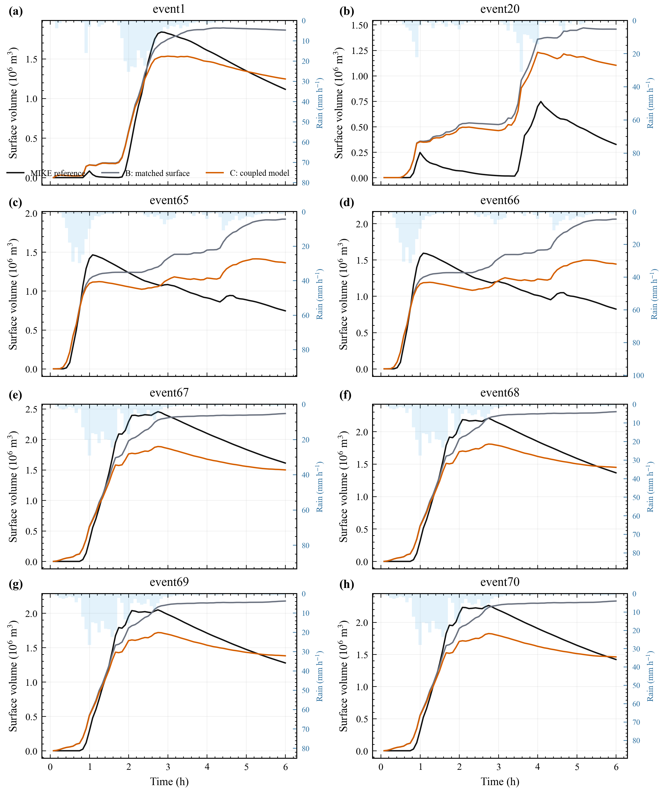
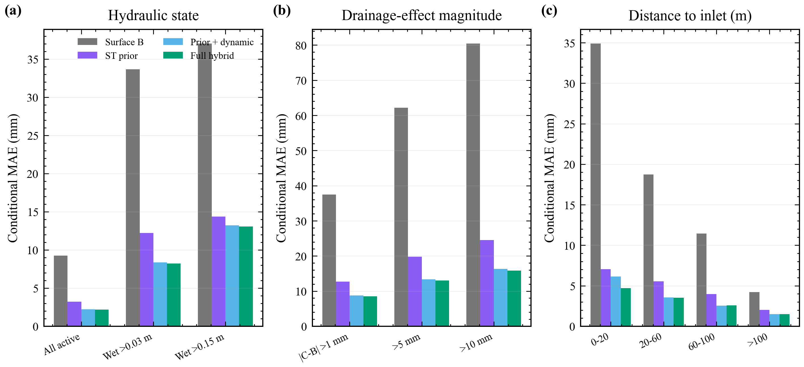

# 固定概化排水管网影响的轻量残差模拟科研报告

## 目录

1. 摘要  
2. 研究背景与问题界定  
3. 数据、物理模型与质量控制  
4. DrainLite 方法与验证设计  
5. 结果及逐图解读  
6. 讨论、结论与下一步工作  

## 摘要

本报告记录一条可审计的研究链：先用匹配的地表对照和 1D/2D coupled hydrodynamic model 双向耦合计算得到“同一场降雨、同一地形下，管网使水深发生了多少变化”，再用轻量梯度提升模型模拟这一有符号变化。这里的 DrainLite 不是从降雨直接生成洪水图的独立预报器；它接收当前时刻的无管网 Itzï 水深 B，并预测耦合水深 C 与 B 的差值。八场六小时事件均在 20 米、72 时步、400 x 560 全域网格上计算。

物理结果表明，管网效应 |C-B| 平均为 9.266 毫米，而为匹配耦合设置引入的局部糙率效应 |B-A| 仅为 0.197 毫米。留一事件验证中，B 相对 C 的平均绝对误差为 9.266 毫米；事件排除的时空先验将其降到 3.226 毫米，加入当前水深和降雨后降到 2.217 毫米，完整静态管网模型为 2.169 毫米。五个空间采样种子下，静态管网字段的平均增量为 0.048 +/- 0.002 毫米。该增量较小，但最终模型的错位、块打乱和整组置换均使误差上升，说明正确空间位置确实提供了信息。

## 1. 研究背景与问题界定

城市暴雨积水由地表汇流和地下排水共同决定。地表二维模型回答“雨水如何沿地形和道路传播”，一维管网模型回答“雨水如何经检查井和管道输送并排出”。原 LarNO 工作解决的是大范围、高分辨率洪水场的快速学习问题；本研究关注更具体的缺口：当上游模型没有把可修改的管网作为显式条件时，能否用一个本机可训练的小模型补充指定管网的影响。

这一问题必须严格限定。当前模型使用一个由道路对齐、地形约束和水力规则构造的概化网络，而不是真实城市管网；八场事件共享同一网络；DrainLite 还需要同一时刻的 B 水深。因此本研究证明的是“固定网络上的跨降雨事件残差模拟”，不是“对任意城市管网都能泛化”，也不是已经完成的“降雨到洪水的组合计算 LarNO-DrainLite”。

**Figure 1. Residual learning with an offline archive. The prior requires C-B labels from other historical events at each cell and simulation time. Both the outer test event and each fitting row's own event are excluded from its prior. Current B, rainfall, terrain and fixed network fields enter the estimator; current-event C is used only for held-event scoring.**

## 2. 数据、物理模型与质量控制

### 2.1 计算区域和事件

完整区域为 400 x 560 个 20 米网格，即约 8.0 x 11.2 千米。评价掩膜含 105,527 个活动网格，面积约 42.21 平方千米。每场事件有 72 幅五分钟水深图，总时长六小时。八场配对事件为 event1、event20 和 event65-event70。选择依据是本地存在完整的 A/B/C 匹配计算，而不是根据 DrainLite 表现挑选。完整公共事件严重度背景见图 9 和附表。

### 2.2 概化网络

网络沿 OpenStreetMap 道路几何布置，并使用地形高程设置管底和坡向。最终网络含 2,276 个节点、2,276 条管段和 221 个接收边界。所有节点都有有向路径通往排放口；没有孤立节点、回路、重复端点管段、反坡管段或管顶高于节点地面的情况。这些检查说明网络内部可运行，但不能把它写成深圳真实管网。

**Figure 2. Conceptual-network maps. (a) Terrain, active-mask edge, selected link directions and outfall-connected terminal junctions; these are not surveyed river mouths or actual outfall coordinates. (b) Conduit diameter. (c) Junction degree. OpenStreetMap contributors provided the road geometry. Numeric slope and cover diagnostics are retained in the evidence supplement.**

### 2.3 A/B/C 物理对照

A 是原始地表方案；B 在入口附近采用与耦合运行相同的局部糙率，但不开启管网；C 在 B 的基础上采用一维/二维耦合水动力模型，开启地表与管网之间的双向水量交换。这样，B-A 是糙率改变造成的差异，C-B 才是地下管网交换造成的差异。C-B 允许为正，因为满管或局部回流可能让某些地表网格变深。

### 2.4 验收阈值

每场运行必须同时满足：数组为 72 x 400 x 560 且无 NaN/Inf；所有节点可达排放口；管网流量连续性误差绝对值不超过 2%；不收敛步比例不超过 2%；地表-管网合并水量误差绝对值不超过降雨量的 0.5%；未返回地表的管网溢流损失、运行警告和错误记录均为零。

**Table 1. Magnitude of the paired physical responses.**

| Event | Rain volume (10^6 m3) | Roughness effect (mm) | Drainage effect (mm) | Final B-C volume (10^6 m3) |
| --- | --- | --- | --- | --- |
| event1 | 2.079 | 0.168 | 7.200 | 0.617 |
| event20 | 1.673 | 0.101 | 3.322 | 0.355 |
| event65 | 2.166 | 0.170 | 7.696 | 0.560 |
| event66 | 2.305 | 0.181 | 8.431 | 0.619 |
| event67 | 2.670 | 0.255 | 12.631 | 0.923 |
| event68 | 2.552 | 0.236 | 11.914 | 0.857 |
| event69 | 2.422 | 0.224 | 10.912 | 0.796 |
| event70 | 2.578 | 0.240 | 12.023 | 0.870 |

**Figure 3. Paired physical responses. (a) Mean absolute drainage and roughness effects. (b) Final surface storage. (c) Final-volume discrepancy relative to MIKE. Numerical diagnostics are retained in the supplement; local node-balance validation remains unresolved.**

**图 3 逐项解释。** 三个子图只展示关键结果：糙率与管网作用的量级差、最终地表储水量、相对 MIKE 的最终体积差。数值诊断移至补充材料，不表示其问题已消失。

**Figure 4. 八场事件的地表水量过程。灰线为 B，橙线为 C，黑线为 MIKE，蓝色阴影为降雨。**

**图 4 逐项解释。** 每个子图是一场独立降雨，横轴为小时，左轴为活动网格上的地表水量。灰线和橙线之间的垂直距离就是管网对总体存水的影响。降雨停止后，如果橙线下降而灰线继续维持或上升，说明管网正在排空地表。黑线来自 MIKE，但其管网和边界细节不公开，因此只用于判断量级和峰现时间是否明显异常。单个最低点的最大水深可能仍上升，这与全域水量下降并不矛盾。

**Figure 5. Cell-wise temporal maxima for event68. Panels (a-d) show max_t(MIKE), max_t(A), max_t(B) and max_t(C). Panel (e) is max_t(C)-max_t(B); panel (f) is max_t(B)-max_t(A). These differences do not measure instantaneous exchange or max_t(C-B). Supplementary Figure S1 compares the definitions at a common time. Display saturation is separate from untruncated statistics.**

## 3. DrainLite 方法与验证设计

模型预测的是有符号残差 r=C-B，再把它加回 B。时空先验由训练事件逐时逐格平均得到；测试事件从先验中完全排除，训练样本自己的事件也从该样本先验中排除。动态特征包括当前 B 水深、降雨、累积降雨、地形、时间和掩膜感知的 3 x 3、7 x 7 邻域水深。静态特征包括入口、管线、密度、管径、坡度、满流能力和覆土。坐标、排放口距离和目标侧管网动态状态均不使用。

验证采用八折留一事件法。完整模型与“先验+动态”模型分别用五个随机空间采样种子训练，以检查 0.1 毫米量级的管网增量是否只是抽样偶然性。树数量固定为 140，不再用某一个内部事件挑选。最终模型还要接受网络平移、块打乱、整组置换和静态字段清零。

## 4. 结果及逐图解读

### 4.1 总体精度和模型组成

**Table 2. Whole-event model comparison; uncertainties refer to sampling seeds.**

| Model | Seeds | MAE (mm) | Seed SD | RMSE (mm) | CSI 0.03 m | CSI 0.15 m | Peak-map MAE (mm) | Final-volume error (10^3 m3) |
| --- | --- | --- | --- | --- | --- | --- | --- | --- |
| Matched surface B | 5 | 9.266 | 0.000 | 41.421 | 0.889 | 0.633 | 16.835 | 699.5 |
| Spatiotemporal prior | 5 | 3.226 | 0.000 | 13.621 | 0.898 | 0.867 | 5.403 | 129.7 |
| Dynamic predictors, no prior | 1 | 5.273 | Not estimated | 19.635 | 0.896 | 0.731 | 8.284 | 40.5 |
| Prior + dynamic | 5 | 2.217 | 0.007 | 9.907 | 0.925 | 0.905 | 3.567 | 32.0 |
| Prior + dynamic + masks | 1 | 2.172 | Not estimated | 9.429 | 0.929 | 0.906 | 3.538 | 27.3 |
| Prior + dynamic + hydraulics | 1 | 2.193 | Not estimated | 9.477 | 0.927 | 0.905 | 3.553 | 27.3 |
| Prior + dynamic + all network fields | 5 | 2.169 | 0.008 | 9.558 | 0.929 | 0.906 | 3.516 | 29.1 |

**Figure 6. Held-event fields at maximum C surface volume; each row labels its exact time. All rows share fixed ranges: B depth 0-0.5 m and signed residual/error -200 to 200 mm. Saturation fractions and extrema are reported in the evidence supplement; statistics use untruncated arrays.**

先验从 9.266 毫米降到 3.226 毫米，说明同一地形和网络产生了很强的重复空间模板。动态变量进一步降到 2.217 毫米，说明事件降雨强度和当时地表状态仍然必要。完整模型为 2.169 毫米；因此管网静态字段有贡献，但不是主要精度来源。

### 4.2 管网信息是否真的被使用

正确静态字段相对先验+动态的五种子增量为 0.048 +/- 0.002 毫米。清零、块打乱和整组置换的平均惩罚分别为 0.196、0.192 和 0.161 毫米。它们支持“正确对齐有用”，但由于先验仍编码固定网络，不能据此声称可泛化到新管网。

### 4.3 排水真正发生的区域

**Figure 7. 条件误差：湿区、强管网效应区和不同入口距离。**

**图 8 逐项解释。** 子图 (a) 说明把评价限制到 3 厘米或 15 厘米以上积水后，误差会高于全域平均，因为干网格不再稀释结果。子图 (b) 逐步筛选 |C-B| 大于 1、5、10 毫米的网格，阈值越高表示管网改变越强，也越难预测。子图 (c) 按入口距离分组，0-20 米是交换最集中的区域。关键不是完整模型在每组都只有 2 毫米，而是它相对 B 是否持续降低误差，以及在哪些组仍然偏高。

### 4.4 与 MIKE 的外部对照

**Table 3. External comparison with MIKE.**

| Field | MAE (mm) | RMSE (mm) | CSI 0.15 m | Peak-map MAE (mm) | Final-volume error (10^3 m3) |
| --- | --- | --- | --- | --- | --- |
| Matched surface B | 18.023 | 50.905 | 0.467 | 27.083 | 982.1 |
| Coupled label C | 21.258 | 62.509 | 0.311 | 34.608 | 310.6 |
| DrainLite full hybrid | 20.994 | 61.708 | 0.306 | 33.563 | 290.4 |

### 4.5 时间、裁剪和事件覆盖

**Table 4. Computational cost from recorded physical runs and in-memory correction.**

| Computation | Mean time (s) | SD across events (s) |
| --- | --- | --- |
| Surface-only B | 274.0 | 42.3 |
| DrainLite correction | 23.6 | 0.3 |
| B + correction | 297.7 | 42.3 |
| Coupled model C | 3817.6 | 436.0 |

Disk I/O and offline preparation are excluded; this is not an integrated deployment benchmark.

### 4.6 与 LarNO 的关系

![Figure 8. Independent LarNO comparison for event68 at 3.25 h (frame 39, the MIKE global-depth peak). The top row shows MIKE, LarNO and signed error with ranges reaching the frame extrema, without high-end saturation. The lower maps isolate cells exceeding 0.5 m in either field; the last panel compares domain-maximum depth through time. Event-wide maxima are 2.795 m and 2.826 m. At the displayed time, 9.98% of all-grid LarNO predictions are negative; these are zeroed only for the depth display, not for the signed-error statistics. This is an independent benchmark comparison, not a DrainLite result.](figures/fig12_larno_reproduction.png)

**Figure 8. Independent LarNO comparison for event68 at 3.25 h (frame 39, the MIKE global-depth peak). The top row shows MIKE, LarNO and signed error with ranges reaching the frame extrema, without high-end saturation. The lower maps isolate cells exceeding 0.5 m in either field; the last panel compares domain-maximum depth through time. Event-wide maxima are 2.795 m and 2.826 m. At the displayed time, 9.98% of all-grid LarNO predictions are negative; these are zeroed only for the depth display, not for the signed-error statistics. This is an independent benchmark comparison, not a DrainLite result.**

### 4.7 物理假设的配对敏感性

这一补充实验回答“管网效应是否依赖降雨施加和局部糙率设置”。在 event68 中分别改变有效损失、建筑降雨处理或入口糙率，每种设置都重新计算 B 和 C。八事件训练数据保持原设置，本实验没有重新训练模型，因此不能据此推断模型可适应新的物理参数。

![Figure 9. Time-dependent sensitivity of the paired hydrodynamic simulations for event68. Panels (a,b) show the active-cell mean absolute depth difference |C-B|; panels (c,d) show the concurrent difference in surface storage B-C, not cumulative pipe discharge. Left panels compare rainfall allocation; right panels compare effective loss and inlet-neighbourhood roughness. Exclusion removes rainfall volume as well as changing its allocation. The n=0.015 and baseline curves nearly overlap. All curves use the original 72-frame simulations, with matching vertical scales across each row; the residual estimator was not retrained.](figures/fig13_physical_sensitivity.png)

**Figure 9. Time-dependent sensitivity of the paired hydrodynamic simulations for event68. Panels (a,b) show the active-cell mean absolute depth difference |C-B|; panels (c,d) show the concurrent difference in surface storage B-C, not cumulative pipe discharge. Left panels compare rainfall allocation; right panels compare effective loss and inlet-neighbourhood roughness. Exclusion removes rainfall volume as well as changing its allocation. The n=0.015 and baseline curves nearly overlap. All curves use the original 72-frame simulations, with matching vertical scales across each row; the residual estimator was not retrained.**

基准平均管网效应为 11.914 毫米；有效损失改为 0 或 2 毫米每小时后分别为 12.993 和 10.874 毫米。最近活动网格接收建筑降雨时为 7.799 毫米，排除建筑降雨时为 3.465 毫米；后者同时减少总降雨输入，不能解释为单纯空间分配差异。入口糙率改成 0.015 后为 11.894 毫米，变化很小。最近邻方案相对 MIKE 的误差升至 35.080 毫米，说明更局地的施雨方式不一定在当前概化地形上更接近 MIKE。这些结果揭示了不确定性来源，不能用来反向挑选参数并声称已经完成校准。

## 5. 讨论、结论与下一步工作

本研究最稳妥的结论是：在一个固定、已检查连通性的概化管网上，管网效应可以用低算力残差模型跨降雨事件模拟；主要信息来自其他训练事件的固定时空响应和当前地表状态，静态管网字段提供小而可检测的附加信息。条件指标证明改进并非只来自大量干网格，最终模型空间破坏对照证明这部分小增量依赖正确位置。

限制同样明确。网络不是真实管网，只有八场事件和一个网络；闭边界、建筑降雨全域重分配和 1 毫米每小时有效损失都是假设；现有物理敏感性还不足以证明 C-B 对这些假设完全稳健；模型需要当前 B 场。下一阶段最有价值的工作不是继续堆叠静态特征，而是构造多套管径、入口密度和排放口布局，做“留一管网”验证，并在没有目标网络时空先验的条件下检验可干预性。随后才能使用无排水标签训练 LarNO 上游模型，形成真正组合计算的 LarNO-DrainLite。

## 本轮论文表达与图表调整

正文和图例统一采用一维/二维耦合水动力模型（1D/2D coupled hydrodynamic model），简称耦合模型。具体软件与版本保留在补充材料，主文不再按调用接口拆解模型。LarNO 是模型名称，不再加 Public；其预训练权重来自原作者，来源与本项目方法明确区分。

原图 7 与已有性能表重复，删除图而保留表 2 的均值、标准差和重复次数。原图 9 的 17 个事件转入补充材料清单，保留每个事件的降雨、参考最大水深和是否参与配对计算。正文因此保留 9 幅图、4 张表。图 6 使用相同数据和色标，仅压缩行间空白。

### 敏感性过程线如何阅读

最后一图的上排表示同一时刻有无管网的平均绝对水深差，下排表示两种模拟的地表储水量之差，不是累计排水量。左列比较降雨分配，右列比较损失率和入口附近糙率；每行共享纵轴范围。黑色曲线为基准，其他曲线何时偏离，表示相应假设何时开始影响响应。排除屏障区降雨减少总输入，不能把其较小响应只归因于空间分配。糙率试验与基准接近重合是原计算结果，不人为拉开显示。

### 为什么分析 event68

Event 68 provides a diagnostic case with an active-cell mean six-hour rainfall of 28.64 mm (rank 3 among the 17 readable events), an external-reference maximum depth of 2.795 m, and a baseline mean absolute drainage response of 11.914 mm, above the eight-event mean of 9.266 mm. Its substantial drainage response makes changes in the physical assumptions readily measurable. These characteristics justify examining it as a high-response case, not treating it as representative of all storms. The sensitivity runs were available for this event only; a prospective event-selection rule was not recorded.

该事件用于放大观察有明显排水响应情况下的配置差异，不意味着它代表全部降雨。未记录事先确定的选择规则，因此不把本次解释写成预注册选择。第 3.7 节从论文的比较目标出发解释 LarNO 与 DrainLite 的区别，不再围绕检查点操作展开。此前列出的物理验证缺口没有因这次排版修改而消失。

### 保留的数据口径与证据边界

矩形计算区为 89.6 平方千米，活动区约 42.21 平方千米。原始降雨体积取矩形全域之和，而事件清单的平均降雨针对活动区；两者不能直接相乘。49.9 米地形阈值是屏障掩膜代理，不是独立核实的建筑清单。576 个时段的降雨分项核查及 30 分钟累计收支记录保留在证据补充材料中，后者不等于全部内部求解时间步的联合账本。

管网没有非正坡度管段，但 626 根、约 27.5% 接近设计坡度下限。221 个合成出流口没有独立坐标记录，地图表示与之相连的末端节点，不是真实受纳河道口。网络增益约 0.047773 毫米，事件间标准差约 0.037333 毫米，不能与采样种子标准差约 0.001819 毫米混淆。正残差也不自动等于节点回灌，可能包含地表水重新分布。原图 5 的独立时刻峰值之差不应解释为瞬时交换；图 6 的色标显示截断不影响原数组统计。

## 数值误差核查后的修正判断

连续性误差是进水、出水和存水的数值收支残差，不是管网断开。离散求解不要求其恰好为零，但需要证明误差足够小且不影响研究结论。未收敛步比例则反映迭代判据未满足的时间步，两者不能混为一谈。

八场事件的全网连续性误差为 -0.178% 至 -0.060%，未收敛步报告为 0.00% 至 0.04%。然而 event68 的 N01520 局部误差为进水量的 63.01%，约对应 114 立方米进水中的 71.8 立方米收支差，不能因全网平均较小而忽略。其入流表中的 170.331% 使用出水量作分母，不能与 63.01% 直接比较。

因此，现阶段不能宣称管网数值质量已经全面验证。原始标签与训练结果未篡改，但其局部可信度仍须通过节点收支和减小时间步重算检验。正文表格保留物理效应、预测精度、外部对比和计算代价四类关键结果；过程性阈值、扰动清单和裁剪诊断移入补充材料，完整保留。
